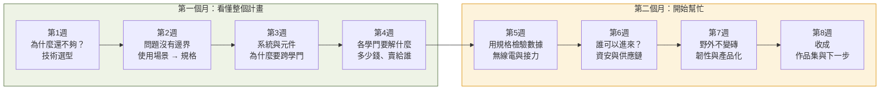
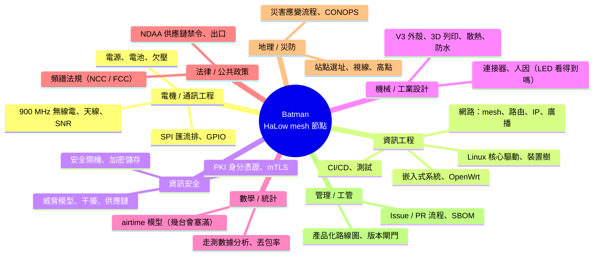

# Batman 八週說明 — 給高中生的專案導覽（總覽）

> 給誰看：**爸爸（帶課的人）** 與 **高中生（學的人）**。
> 目的：用 8 次、每次 30 分鐘，由上而下把「這個計畫在做什麼、為什麼、牽涉哪些學門」講清楚，
> 並讓學生留下自己的筆記、動手紀錄，最後整理成**自主學習成果**（大學申請、面試可用）。
> 第 5 週起（第二個月），學生開始用高中生做得到的方式**實際幫上忙**。

---

## 一句話說這個計畫

> **當手機基地台倒了、山裡沒訊號，一群背著「長距離 Wi-Fi」的小電腦（哨站）
> 自己接力傳話，不靠任何中央。** 這個 repo 記錄了把它從「插上去不會動」做到
> 「燒一張卡就能用、壞了自己會說為什麼、外人混不進來」的全部過程。

| | 內容 |
|---|---|
| 硬體 | Raspberry Pi 4（英國）+ Seeed WM1302 轉接板（**中國深圳**）+ Wio-WM6108 無線電卡（模組 Quectel，**中國上海**；晶片 Morse Micro，**澳洲**） |
| 無線電 | Wi-Fi HaLow（IEEE 802.11ah，900 MHz 頻段）— 低頻、穿透好、距離遠、速度慢 |
| 軟體 | OpenMANET（開源，OpenWrt 為底）+ batman-adv（德國 Freifunk 社群的網狀路由） |
| 現況 | 兩台節點 manet01 / manet02 已成網、走測過 1 km、做過 12 小時壓力測試、正在做產品化與資安 |

---

## 八週地圖（每週 30 分鐘）



| 週 | 主題 | 核心問題 | 方法論 | 主要學門 | 檔案 |
|---|---|---|---|---|---|
| 1 | 有了無線電、Meshtastic 為什麼還不夠？ | HaLow 為什麼被發明？台灣民防圈缺什麼？民用選型被什麼綁住？ | 加權決策矩陣 | 災防、法規、供應鏈 | [week1.md](week1.md) |
| 2 | 問題沒有邊界：用使用場景收斂，再用規格開始解 | 問題一開始沒邊界，怎麼收斂？規格是什麼、為什麼要有？ | 使用場景 → 邊界 → 開規格 | 需求工程、系統工程 | [week2.md](week2.md) |
| 3 | 系統與元件：為什麼一個科系解決不了 | 一條規格靠什麼一起做到？故障為什麼多在介面？ | 黑箱／白箱、介面清單、規格→元件連線 | 系統工程 | [week3.md](week3.md) |
| 4 | 各學門要解什麼；多少錢、賣給誰 | 七個學門的人桌上各擺什麼問題？一台多少錢？目標市場是哪一層？ | 學門卡、現在／閘門／延後分堆、成本與目標市場 | 七個學門 + 經濟管理 | [week4.md](week4.md) |
| 5 | 用規格檢驗真實數據：無線電與接力 | 走測數據有沒有達到第 2 週的規格？沒有總機路怎麼決定？ | 量測對規格、時間預算 | 通訊、網路、數學 | week5.md（待寫） |
| 6 | 誰可以進來？資安與供應鏈 | 共用鑰匙有什麼問題？密碼擋不住什麼？零件從哪來？ | 威脅分層、角色扮演攻防 | 資安、法規 | week6.md（待寫） |
| 7 | 野外不變磚：韌性與產品化 | 沒螢幕的機器怎麼說它哪裡壞？外殼、電源、開發流程 | 失效模式、閘門 | 嵌入式、機械、工管 | week7.md（待寫） |
| 8 | 收成 | 我學到什麼？我能貢獻什麼？哪些科系在做這些事？ | 作品集整理 | 全部 | week8.md（待寫） |

每週結構固定（方便養成習慣）：

```
 5 分鐘  回顧上週筆記 + 今天的情境
12 分鐘  圖 + 白話說明（爸爸講，學生打斷發問）
 8 分鐘  作業起頭（學生做，爸爸看；課後不限時，寫成作業檔）
 5 分鐘  作業檔第 2 欄：「AI 之前，我先想」
```

---

## 帶課原則（給爸爸）

1. **從場景切入，不從技術切入。** 前四週幾乎不出現技術名詞；講的是選型、規格、系統、學門。技術數據從第 5 週才進來，而且是拿來「對規格」。
2. **每週一個方法論、每週的產出接著上週用。** 第 1 週的缺口 → 第 2 週開成規格 → 第 3 週連到元件 → 第 4 週分到學門 → 第 8 週變成選系對照表。
3. **事實與推論分開講。** 教材裡標了 `事實`（repo 裡量到、寫到的）與 `推論`（合理猜測、待驗證）。讓孩子習慣問「這是量到的還是猜的？」
4. **產地標示。** 牽涉到的零件、軟體、公司，教材都標了來源國（尤其是中國），因為第 1 週的選型與第 6 週的供應鏈議題會用到，也是這個專案真正面對的風險（`docs/productization.md` §(d)）。
5. **動手題可以不用碰硬體。** 每週都有「只要瀏覽器 + AI」就能做的版本；有節點在旁邊時才做「上機版」，且只用**唯讀**指令，**manet02 不碰**（專案自己的規矩）。
6. **作業是文件，不是回答。** 每週一份作業檔（[notes-template.md](notes-template.md)），含產出物、與 AI 的互動紀錄、不同意 AI 的地方、這週的發現與興趣。四週後整理成學習歷程，可上傳供大學申請審查。
7. **第二個月的協助任務**在 [month2-tasks.md](month2-tasks.md)，每張任務卡都對應一張真實的 GitHub issue，做完可以真的變成一個 PR（作品集裡有「我對開源專案的貢獻」）。

## 作業與 AI：不限制怎麼用，但題目抄不了

我們不限制學生怎麼用 AI。所以作業不是靠「禁止」來防抄，而是**題目設計成 AI 給的答案沒辦法直接交**：

| 抄不了的設計 | 怎麼做 | 例子 |
|---|---|---|
| 要有「AI 之前」 | 每份作業第一欄是「還沒開 AI 之前我怎麼想」，之後不能改 | 第 1 週先寫自己親身經歷的沒訊號場景 |
| 要跟 AI 比對 | 請 AI 做同一題，**並排找差異、解釋為什麼不同** | 第 2 週：AI 開的規格和我開的，哪條誰開得好 |
| 要不同意 AI 一次 | 每份作業至少寫一條「AI 錯了／沒證據／跟我的情況不合」，並說怎麼發現的 | 第 4 週：批改 AI 幫我寫的學門卡，對照專案文件找錯 |
| 要有個人條件 | 題目綁學生自己的地方、自己的權重、自己選的例子 | 第 3 週：自己挑一個生活中的系統來比 |
| 要站隊 | 延伸思考題沒有標準答案，要選邊並說理由 | 「只能讀一個系你選哪個」 |

作業沒有時間上限，但**產出要文件化**：用 [notes-template.md](notes-template.md) 的八個欄位寫成一份檔，其中「與 AI 的互動紀錄」與「我不同意 AI 的地方」是必填。四份作業檔最後整理成學習歷程，可上傳供大學申請審查。

教材裡建議的 AI 用法（學生可自由加）：

| 用法 | 做什麼 | 例子 |
|---|---|---|
| 對照組 | 請 AI 做同一題，跟自己的比 | 兩張決策矩陣並排 |
| 反對派 | 請 AI 替你不選的方案辯護，記錄你被說服或沒被說服的點 | 替 Meshtastic 辯護 |
| 利害關係人 | 請 AI 扮救難隊員、驗收工程師、某系教授、採購，只問問題 | 「這條規格要怎麼量？」 |
| 模擬器 | 請 AI 給變化情境或反方立場，學生自己推演後果 | 「夜間、下雨、多一隊沒受訓的志工」會改掉哪些規格 |
| 被批改的對象 | 請 AI 寫一版，學生當老師改它 | 批改 AI 寫的學門卡 |

- 可以用 Claude（美國 Anthropic）、ChatGPT（美國 OpenAI）、Gemini（美國 Google）等。**不要**把節點的 IP、密碼、金鑰、家裡位置貼給任何 AI。
- 每週另有一節「AI 延伸學習」（選做），用同樣的用法把該週主題往外延伸。

## 這個計畫牽涉的學門（選系參考的骨架）



第 8 週有完整對照表（學門 → 台灣常見科系 → 本專案哪裡用到）。

## 檔案

| 檔 | 用途 |
|---|---|
| `week1.md` … `week8.md` | 每週教材（圖 + 白話 + 題目） |
| `notes-template.md` | 每週作業檔模板（含 AI 互動紀錄）+ 學習歷程整理格式 |
| `month2-tasks.md` | 第二個月協助任務卡（對應真實 issue） |
| `index.html` | 網頁版（圖為主、字為輔，明亮溫暖）；瀏覽器直接開，或發布成可分享的頁面 |

> 圖用 Mermaid 畫，GitHub 網頁直接看得到；本機看不到圖的話用 VS Code 裝 Mermaid 外掛，或開網頁版說明檔。
