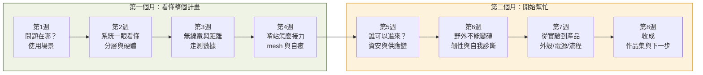
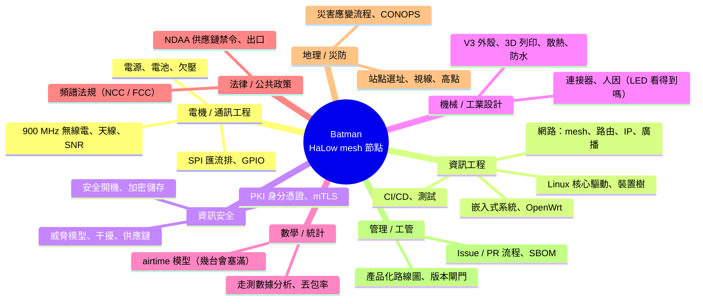

# Batman 八週說明 — 給高中生的專案導覽（總覽）

> 給誰看：**爸爸（帶課的人）** 與 **高中生（學的人）**。
> 目的：用 8 次、每次 30 分鐘，由上而下把「這個計畫在做什麼、為什麼、牽涉哪些學門」講清楚，
> 並讓學生留下自己的筆記、動手紀錄，最後整理成**自主學習成果**（大學申請、面試可用）。
> 第 5 週起（第二個月），學生開始用高中生做得到的方式**實際幫上忙**。

---

## 一句話說這個計畫

> **當手機基地台倒了、山裡沒訊號，一群背著「長距離 Wi-Fi」的小電腦（哨站）
> 自己接力傳話，不靠任何中央。** 這個 repo 記錄了把它從「插上去不會動」做到
> 「燒一張卡就能用、壞了自己會說為什麼、外人混不進來」的全部過程。

| | 內容 |
|---|---|
| 硬體 | Raspberry Pi 4（英國）+ Seeed WM1302 轉接板（**中國深圳**）+ Wio-WM6108 無線電卡（模組 Quectel，**中國上海**；晶片 Morse Micro，**澳洲**） |
| 無線電 | Wi-Fi HaLow（IEEE 802.11ah，900 MHz 頻段）— 低頻、穿透好、距離遠、速度慢 |
| 軟體 | OpenMANET（開源，OpenWrt 為底）+ batman-adv（德國 Freifunk 社群的網狀路由） |
| 現況 | 兩台節點 manet01 / manet02 已成網、走測過 1 km、做過 12 小時壓力測試、正在做產品化與資安 |

---

## 八週地圖（每週 30 分鐘）



| 週 | 主題 | 核心問題 | 主要學門 | 檔案 |
|---|---|---|---|---|
| 1 | 問題在哪？ | 沒有訊號時，人會怎樣？現有方案為什麼不夠？ | 社會/災防、系統思考 | [week1.md](week1.md) |
| 2 | 系統一眼看懂 | 一台哨站裡有哪幾層？管理掛了為什麼還要能傳？ | 資工、電機 | [week2.md](week2.md) |
| 3 | 無線電與距離 | 為什麼 800 m 比 1 km 還差？ | 通訊、物理、地理、法律 | [week3.md](week3.md) |
| 4 | 哨站怎麼接力 | 沒有總機，路是誰決定的？一個範圍塞得下幾台？ | 網路、數學 | [week4.md](week4.md) |
| 5 | 誰可以進來？ | 一把大家共用的鑰匙有什麼問題？密碼擋得住干擾嗎？ | 資安、法律/政策 | [week5.md](week5.md) |
| 6 | 野外不能變磚 | 沒有螢幕的機器怎麼「說」它哪裡壞了？ | 嵌入式、人機互動 | [week6.md](week6.md) |
| 7 | 從實驗到產品 | 外殼、電池、對講機接頭、開發流程 | 機械、電機、工管 | [week7.md](week7.md) |
| 8 | 收成 | 我學到什麼？我能貢獻什麼？哪些科系在做這些事？ | 全部 | [week8.md](week8.md) |

每週結構固定（方便養成習慣）：

```
 5 分鐘  回顧上週筆記 + 今天的情境
12 分鐘  圖 + 白話說明（爸爸講，學生打斷發問）
 8 分鐘  思考題 / AI 動手題（學生做，爸爸看）
 5 分鐘  寫筆記：三句話 + 一個問題
```

---

## 帶課原則（給爸爸）

1. **從場景切入，不從技術切入。** 每週第一張圖都是「人在哪、發生什麼事」，技術名詞最後才出現。
2. **事實與推論分開講。** 教材裡標了 `事實`（repo 裡量到、寫到的）與 `推論`（合理猜測、待驗證）。讓孩子習慣問「這是量到的還是猜的？」
3. **產地標示。** 牽涉到的零件、軟體、公司，教材都標了來源國（尤其是中國），因為第 5 週的供應鏈議題會用到，也是這個專案真正面對的風險（`docs/productization.md` §(d)）。
4. **動手題可以不用碰硬體。** 每週都有「只要瀏覽器 + AI」就能做的版本；有節點在旁邊時才做「上機版」，且只用**唯讀**指令，**manet02 不碰**（專案自己的規矩）。
5. **筆記是產出，不是作業。** 用 [notes-template.md](notes-template.md)，每週 10 行以內。第 8 週把 7 份筆記整理成自主學習計畫成果。
6. **第二個月的協助任務**在 [month2-tasks.md](month2-tasks.md)，每張任務卡都對應一張真實的 GitHub issue，做完可以真的變成一個 PR（作品集裡有「我對開源專案的貢獻」）。

## 使用 AI 的規矩

- 可以用 Claude（美國 Anthropic）、ChatGPT（美國 OpenAI）、Gemini（美國 Google）等。**不要**把節點的 IP、密碼、金鑰、位置貼給任何 AI。
- 每個 AI 動手題都給了可直接貼上的提示語，但要求 AI **列出資料來源**，並自己判斷「這是事實還是 AI 的推論」。
- AI 給的答案要寫進筆記時，標 `AI 說：`，自己驗證過的才拿掉這個標籤。

## 這個計畫牽涉的學門（選系參考的骨架）



第 8 週有完整對照表（學門 → 台灣常見科系 → 本專案哪裡用到）。

## 檔案

| 檔 | 用途 |
|---|---|
| `week1.md` … `week8.md` | 每週教材（圖 + 白話 + 題目） |
| `notes-template.md` | 學生每週筆記模板 + 最終自主學習成果格式 |
| `month2-tasks.md` | 第二個月協助任務卡（對應真實 issue） |

> 圖用 Mermaid 畫，GitHub 網頁直接看得到；本機看不到圖的話用 VS Code 裝 Mermaid 外掛，或開網頁版說明檔。
