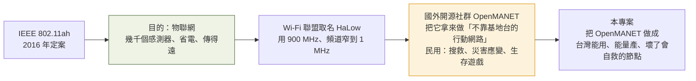
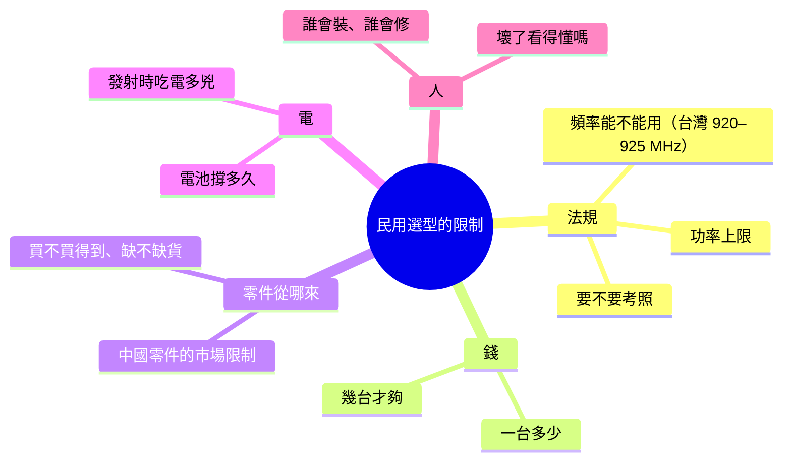

# 第 1 週 — 有了無線電、有了 Meshtastic，為什麼還不夠？

> 核心問題：**別人為什麼發明 HaLow？台灣民防圈已經在用 mesh 了，缺什麼？民用技術選型會被什麼綁住？**
> 這週的方法論：**加權決策矩陣**（工程師選方案的標準作法）。

## 5 分鐘 — 情境

台灣的民防社群已經在做「沒有基地台也能傳訊息」這件事了：

- 「臺灣鏈網 Meshtastic Taiwan Community」2024 年 2 月成立，報導稱社群近兩萬人、估計超過一千台裝置在運作，遍布台北、台中、高雄、花蓮（`事實`，中央廣播電臺 2025 年報導）。
- 黑熊學院把 Meshtastic 列為大型災難時的通訊備援選項之一，並在演練中實際操作（`事實`，自由評論網、黑熊學院文章）。

問學生：**這麼多人已經在用了，爸爸為什麼還要花一年做另一套？** 先讓他猜。

## 12 分鐘 — 三個問題

### 問題一：HaLow 原本是為了什麼發明的？

- `事實`：802.11ah 設計目標是「長距離、低耗電、大量裝置」，適合工廠、農場、城市感測器，不是為了救災。
- `事實`：OpenMANET 是開源、以 Raspberry Pi 為基礎的行動網路（MANET）計畫，官方文件寫明民用場景是搜救、災害應變、生存遊戲。
- 這是一種常見的工程現象：**技術再利用**。一個為了 A 發明的東西，被拿去做 B。大部分重要產品都是這樣來的（GPS 原本是軍用、網際網路原本是軍事研究網）。

### 問題二：有無線電、有 Meshtastic，缺什麼？

| 方案 | 能傳什麼 | 靠不靠基地台 | 分不分得出「誰在講」 | 卡在哪 |
|---|---|---|---|---|
| 對講機 | 聲音 | 不靠 | 靠耳朵認人 | 沒有位置、文字、照片；要考照、要中繼台 |
| 手機 | 什麼都能 | **靠** | 分得出 | 基地台停電、倒塌、塞爆就全掛 |
| **Meshtastic**（LoRa） | 短文字、位置 | 不靠 | **分不出** | 速度太慢，傳不了語音與檔案；全網共用一把鑰匙 |
| **HaLow mesh**（本專案） | 位置、語音、檔案、小影像 | 不靠 | 目標：每台一張身分證 | 貴、耗電、還在開發、法規待確認 |

關於「共用一把鑰匙」，Meshtastic 官方文件自己寫（`事實`）：頻道用預共享金鑰加密，**沒有身分驗證**，任何拿到金鑰的人都能冒充別人發訊息。本專案的資安文件用的就是這個批評（`docs/threat-model.md`）。

所以缺口是：**位置＋語音＋檔案、不靠基地台、分得出誰是誰、踢得掉一台。** 這一句在第 2 週會變成規格。

### 問題三：民用選型會被什麼綁住？

零件產地（本專案文件記載，`事實`）：

| 零件 | 公司 | 國家 |
|---|---|---|
| 無線電模組 FGH100M | Quectel 移遠 | **中國**（上海） |
| 無線電晶片 MM6108 | Morse Micro | 澳洲 |
| 轉接板 WM1302、無線電卡 Wio-WM6108 | Seeed 矽遞 | **中國**（深圳） |
| 小電腦 Raspberry Pi 4 | Raspberry Pi | 英國 |
| Meshtastic 常見硬體 | Heltec、LILYGO | **中國** |

`事實`：本專案文件（`docs/productization.md`）指出 Quectel 是中國公司，可能因美國 NDAA 法案而不能賣給美國政府與公共安全單位，列為架構級風險。`推論`：對台灣民防用途，產地是否構成問題，取決於使用單位的採購規定，這也是值得學生去查的題目。

## 8 分鐘 — 方法論：加權決策矩陣

工程師選方案不是憑感覺，是先訂「評什麼」與「多重要」，再打分。

| 準則 | 權重（1–5） | 對講機 | Meshtastic | HaLow mesh | 衛星 |
|---|---|---|---|---|---|
| 不靠基地台 | | | | | |
| 能傳位置 | | | | | |
| 能傳語音 | | | | | |
| 分得出誰是誰 | | | | | |
| 一台的價格 | | | | | |
| 電池撐多久 | | | | | |
| 台灣合法 | | | | | |
| 誰都會用 | | | | | |
| **加權總分** | | | | | |

**作業（學生做，爸爸看）**
1. 自己補兩個準則、自己填權重（理由要寫在旁邊），每格打 1–5 分。
2. 算加權總分，看誰贏。
3. **AI 進場（扮反對派，不給答案）**：把整張表貼給 AI，指令是「你是反對這個結論的工程師。找出我權重裡最主觀的一項，用一段話攻擊它。不要幫我改。」學生決定改不改，並在筆記寫下「我接受／不接受，因為」。

## 延伸思考（沒有標準答案，要站隊並說理由）

1. 如果台灣合法的發射功率只有美國的一半，射程縮短，你的矩陣會翻盤嗎？「夠遠」到底是多遠？
2. Meshtastic 便宜、兩萬人在用；HaLow 貴、只有兩台。一個民防團體有限的錢應該投哪邊？「先用起來」和「用對的」怎麼取捨？

## 5 分鐘 — 筆記

- HaLow 原本為了 ___ 發明，被拿來做 ___。
- 台灣民防圈現在用 ___，它缺 ___。
- 我的矩陣裡最重要的準則是 ___，AI 攻擊了 ___，我 ___。
- 一個我還不懂的問題：___

## 這週碰到的學門

`災害防救與公共政策`、`技術史`、`法規（頻譜）`、`供應鏈管理`、`決策分析`。

## 資料來源

- OpenMANET 官方文件：<https://openmanet.github.io/docs/>
- 802.11ah 設計目標（學術綜述）：<https://www.ncbi.nlm.nih.gov/pmc/articles/PMC9738663/>
- 中央廣播電臺〈當網路中斷 2萬台灣人用Meshtastic織起另一張通訊「網」〉：<https://www.rti.org.tw/news?uid=3&pid=212793>
- 黑熊學院〈發生大型災難，我有哪些通訊備援選擇？〉（自由評論網）：<https://talk.ltn.com.tw/article/breakingnews/5330898>
- 臺灣鏈網社群：<https://meshtw.github.io/>
- Meshtastic 官方〈加密的已知限制〉：<https://meshtastic.org/docs/about/overview/encryption/limitations/>
- 本專案：`docs/threat-model.md`、`docs/productization.md`、`docs/hardware.md`

---
← 總覽 [README.md](README.md) · 下一週 [week2.md](week2.md) →
