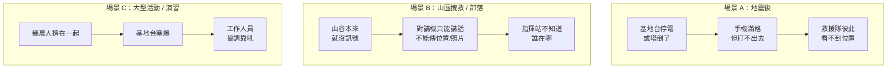
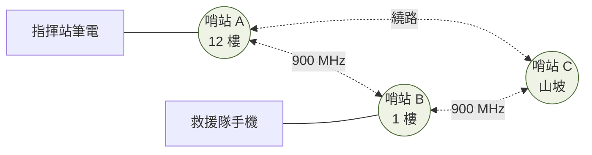

# 第 1 週 — 問題在哪？（使用場景分析）

> 核心問題：**沒有訊號的時候，人會怎樣？現有的辦法為什麼不夠？**
> 這週完全不講技術。目標是讓學生自己說出「所以需要一個不靠中央的網」。

## 5 分鐘 — 情境

想像三個場景（挑學生最有感的一個講）：



問學生：**你參加過的活動裡，如果那天完全沒訊號，會發生什麼事？** 先讓他講，不要急著給答案。

## 12 分鐘 — 現有方案為什麼不夠

| 現有方案 | 好處 | 卡在哪 | 產地備註 |
|---|---|---|---|
| 手機 / 4G 5G | 快、大家都有 | **靠基地台**；基地台倒了、停電了、塞爆了就全掛 | — |
| 對講機（無線電） | 不靠基地台、便宜、耐用 | **只有聲音**：沒有位置、沒有文字、沒有照片；範圍靠中繼台 | 專案裡沿用的 K 頭耳麥標準來自 Kenwood（日本），現有配件品牌 ADI（台灣） |
| Meshtastic（LoRa 小網） | 便宜、省電、自己接力 | 速度極慢（幾百 bps 等級，只夠傳短訊）；**全網共用一把鑰匙**（第 5 週會講為什麼這是大洞） | 開源專案；常見硬體來自中國廠商（例如 Heltec、LILYGO）|
| 衛星（星鏈等） | 哪裡都有 | 貴、要看得到天空、要有人付月費、受制於一家公司 | Starlink 為美國 SpaceX |

專案文件裡對 Meshtastic 的批評（`事實`，見 `docs/threat-model.md`）：每個人拿同一把鑰匙 → 分不出是誰、踢不掉一個人、壞人混進來沒人知道。

### 所以這個計畫要做的東西

> 一群**背著長距離 Wi-Fi 的小電腦**（我們叫它「哨站」），彼此接力傳話，
> **沒有基地台、沒有總機**。任何一台壞了，其他台自動繞路。
> 上面可以跑：地圖上看到隊友位置（TAK）、對講（PTT）、傳檔案。



### 誰會用它（四種人）

專案文件 `docs/personas-and-roles.md` 定義了四種使用者（`事實`）：

| 角色 | 他在乎什麼 | 他看到的東西 |
|---|---|---|
| ① 現場人員（救援隊員、士兵） | 我有沒有連上？隊友在哪？ | 手機地圖 App + 節點上一顆綠燈 |
| ② 網管 / 通訊官 | 哪台掛了？有沒有人在干擾？ | 任何一台節點都能開的「全網健康表」 |
| ③ 佈署者 | 燒卡、發身分證、報廢 | 燒卡流程 + 現場註冊工具 |
| ④ 開發者（爸爸現在的角色） | 為什麼會壞？怎麼變成產品？ | SSH、測試腳本、GitHub |

> **設計原則（整個專案最重要的一句話）**：
> 「**管理系統絕不能變成送信的必要條件**」— 儀表板掛了，網路照傳。
> （來源：`docs/roadmap.md` 核心原則）

## 8 分鐘 — 思考題 / AI 動手題

**思考題（擇一，口頭回答）**
1. 對講機「只有聲音」到底少了什麼？列三個「有位置資訊才能做到的事」。
2. 「一群哨站接力」和「一座大基地台」，哪個比較容易被一次弄壞？為什麼？

**AI 動手題（瀏覽器 + AI）**
把這段貼給 AI：

```
我是台灣的高中生。請用高中生看得懂的方式，整理台灣過去 30 年內因為地震或颱風
造成「行動電話基地台大規模停擺」的真實案例：時間、地點、大概停擺多久、當時救災
單位用什麼方式通訊。每一條請附資料來源網址，並標明哪些是有紀錄的事實、哪些是
你的推測。
```

把 AI 的答案拿 2 條去查來源是不是真的存在。**查得到的寫「事實」，查不到的寫「AI 說，未驗證」。**

## 5 分鐘 — 筆記

用 [notes-template.md](notes-template.md)，這週寫：
- 我選的場景是 ___，那天如果沒訊號，最糟的事是 ___。
- 現有方案裡最接近的是 ___，它卡在 ___。
- 一個我還不懂的問題：___

## 這週碰到的學門

`災害防救 / 公共政策`、`系統思考`、`社會學（誰在用）`。技術還沒開始。

---
← 總覽 [README.md](README.md) · 下一週 [week2.md](week2.md) →
