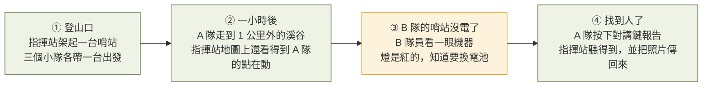
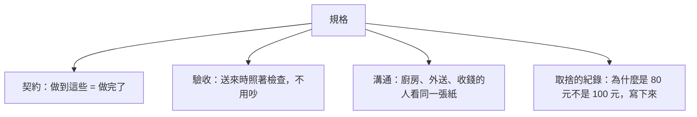
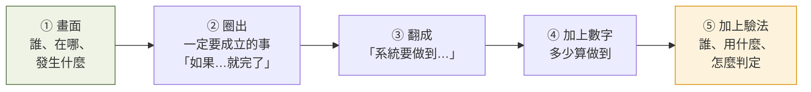

# 第 2 週 — 從畫面到規格：試著「開規格」

> 核心問題：**工程師動手之前在做什麼？「規格」是什麼？為什麼要有？**
> 這週的方法論：**畫面 → 一定要成立的事 → 系統要做到 → 多少算做到 → 怎麼驗**（五步開規格）。
> 這個技能學校不教，但每個做產品的人都要會。這週**不講任何技術名詞**。

## 5 分鐘 — 回顧 + 情境

回顧：上週的缺口是「位置＋語音＋檔案、不靠基地台、分得出誰是誰、踢得掉一台」。這句話很像需求，但工程師拿到它**還是不知道要做什麼**。多遠？多久更新一次？誰來判定做到了？

今天的情境，用四格畫面講一次山區搜救：

問學生：**這四格裡，哪些事「如果沒發生，整個行動就完了」？** 請他圈出來。

## 12 分鐘 — 五步開規格（用上面的畫面實跑）

### 什麼是規格、為什麼要有

生活例子：幫全班訂便當。

| 你說的話 | 便當店聽到的 | 結果 |
|---|---|---|
| 「要好吃」 | ？ | 每個人對好吃定義不同，一定有人抱怨 |
| 「不辣、12 點前送到校門口、每個 80 元以內、40 個、素食 3 個」 | 清楚 | 送到就能當場檢查有沒有做到 |

第二行就是規格。它做了四件事：

本專案有 30 幾份文件、幾十張任務單，全部掛在「規格是什麼」底下。沒有規格，就沒有「做完」這件事。

### 五步

用第 ② 格「A 隊走到 1 公里外，指揮站還看得到點在動」跑一次：

| 步 | 寫出來的東西 |
|---|---|
| ① 畫面 | A 隊在 1 公里外的溪谷，指揮站在登山口，中間有樹和坡 |
| ② 一定要成立 | 指揮站的地圖上，A 隊的點要一直在動；不動就等於失蹤 |
| ③ 系統要做到 | 兩台哨站相隔 1 公里、有視線時，位置要持續傳回指揮站 |
| ④ 多少算做到 | 位置每 10 秒更新一次；10 分鐘內中斷不超過 1 次、每次不超過 30 秒 |
| ⑤ 怎麼驗 | 兩台拉開 1 公里，一個人走 10 分鐘，指揮站錄下地圖畫面，數中斷次數 |

再用第 ③ 格「哨站沒電了，隊員看一眼就知道」跑一次：

| 步 | 寫出來的東西 |
|---|---|
| ② 一定要成立 | 隊員不用懂技術，看機器就知道它還能不能用 |
| ③ 系統要做到 | 機器要用一個不需要說明書的方式告訴人「我好／我快不行／我壞了」 |
| ④ 多少算做到 | 三種狀態用燈區分；沒看過說明書的人 10 秒內說得出是哪一種 |
| ⑤ 怎麼驗 | 找 5 個沒看過機器的人，各看 3 種燈號，答對率要 100% |

注意兩件事：
- **④ 的數字是「訂」出來的，不是量出來的。** 10 秒、1 次、30 秒是我們決定「這樣才夠用」。訂太嚴做不到、訂太鬆沒用，這就是取捨，要把理由寫下來。
- **⑤ 決定了④能不能訂。** 想不出怎麼驗的規格，是壞規格。

### 專案裡真實的例子（`事實`）

`docs/field-resilience.md` 開頭用兩句「操作員看得到的話」寫需求，然後才往下拆：

> N1「它在野外開機了，卻一直沒有加入網路，沒人知道為什麼。」
> N2「它加入了，然後不明原因掉線，之後開不了機或一直重開，再也回不來。」

專案的作法跟這週教的一樣：先寫人會遇到的畫面，再翻成「機器要在 60 秒內自己說出原因」「壞掉的那份系統不能拖垮整台」這類可驗的句子。

### 分兩堆：一定要、最好有

開出來的規格會太多。最後一步是分堆：**沒有它整個行動就失敗** 的放「一定要」，其他放「最好有」。本專案的任務單用標籤做同一件事（現在能做、要等硬體、要等自己編系統）。

## 8 分鐘 — 作業：自己開規格

1. 從第 1 週的三個場景（地震後、山區搜救、大型活動）挑一個，**畫四格**（手畫拍照、或用 Mermaid）。
2. 圈出「一定要成立的事」，至少 3 件。
3. 用五步表，開出 **5 條規格**，每條都有④數字和⑤驗法。
4. 分「一定要／最好有」。

**AI 進場（兩輪，都不給答案）**
- 第一輪，AI 扮**驗收工程師**：「我是負責驗收的工程師。以下是規格，請對每一條只問我三個問題：怎麼量？在哪裡量？多少算過？不要幫我改寫。」答不出來的那條，學生自己重寫。
- 第二輪，AI 扮**山區搜救隊員**：「你是常上山的搜救隊員，沒有技術背景。以下是規格，請告訴我哪一條對你在山上完全沒差，哪一條你最在乎，為什麼。」學生據此調整「一定要／最好有」。

## 延伸思考

1. 「管理系統掛掉，網路還要能傳」是本專案最重要的一條原則。它是規格還是設計決定？你能把它改寫成一條有數字、有驗法的句子嗎？
2. 如果把第②格的規格訂成「1 公里、完全不中斷」，會付出什麼代價？（提示：想想電池、天線大小、價格。）誰有資格決定「夠好了」？

## 5 分鐘 — 筆記

- 規格是 ___，沒有它就沒有 ___。
- 我開的 5 條裡，最難寫「怎麼驗」的是 ___，因為 ___。
- 驗收工程師問倒我的問題：___
- 搜救隊員最在乎的一條：___

## 這週碰到的學門

`需求工程`、`系統工程`、`工業工程（驗收與品質）`、`人因（不用說明書就懂）`。

---
← [week1.md](week1.md) · [README.md](README.md) · [week3.md](week3.md) →
