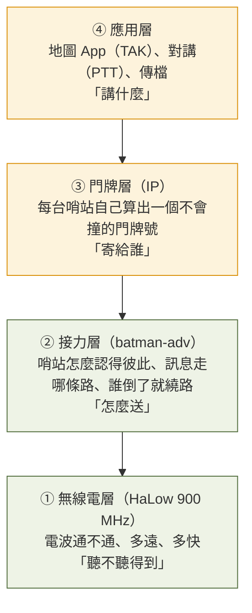
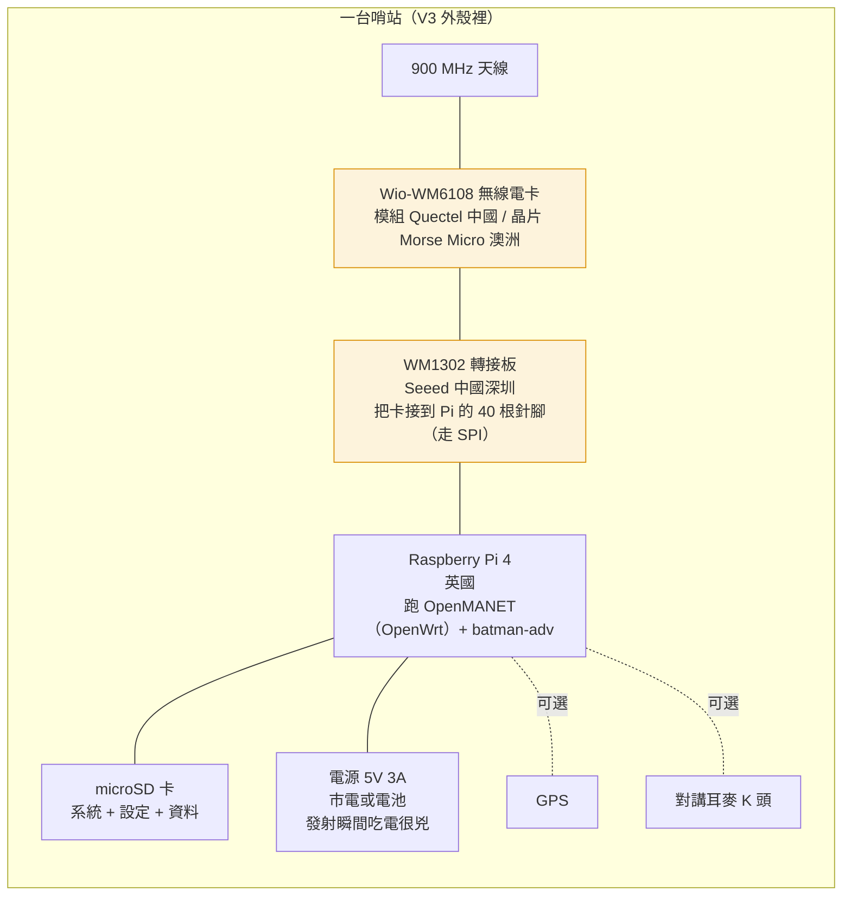

# 第 2 週 — 系統一眼看懂（分層與硬體）

> 核心問題：**一台哨站裡面有哪幾層？為什麼「管理掛了」網路還要能傳？**
> 這週給一張「整個系統的地圖」，之後每週只是放大其中一格。

## 5 分鐘 — 回顧 + 情境

回顧上週：哨站接力、沒有總機、四種使用者。
今天的情境：你是通訊官，站在 12 樓的哨站前面，桌上一台盒子、一根天線。**它裡面到底在做什麼？**

## 12 分鐘 — 四層心智模型

專案自己的比喻（`docs/roadmap.md`）：把網路想成一群**背著無線電、彼此接力傳話的哨站**。傳話分四層：



白話：
- ① 先要**聽得到**（第 3 週）。
- ② 聽得到之後，要**認得彼此、決定路線**（第 4 週）。
- ③ 每台要有**門牌**才能寄信；這裡不能有「中央發號櫃台」，否則櫃台倒了全網沒門牌。
- ④ 最上面才是人真正用的東西。

### 資料面 vs 控制面（電信業的做法）

| | 是什麼 | 規則 |
|---|---|---|
| **資料面** | 哨站接力送信 | **永遠自己運作**，管理系統掛掉也照傳 |
| **控制面** | 看儀表板、改設定 | 可有可無；掛了只是「看不到」，網路照跑 |

> 追問學生：學校的 Wi-Fi 如果「管理伺服器」壞了，你的手機還能上網嗎？（很多學校不行。這就是有中央的代價。）

### 硬體堆疊（一台哨站拆開）



`事實`（`docs/hardware.md`）：無線電卡走的是 **SPI**（一種 4 條線的簡單匯流排），不是常見的 SDIO。好處：Pi 本身的 2.4/5 GHz Wi-Fi 還空著，可以當「給手機連的熱點」。

### 這個 repo 的地圖（之後動手都會用到）

| 資料夾 | 裝什麼 | 白話 |
|---|---|---|
| `README.md` | 專案入口 | 第一個發現：驅動程式為什麼裝不起來 |
| `docs/` | 30 幾份設計與紀錄 | 專案的「大腦」 |
| `docs/roadmap.md` | 路線圖 | 缺什麼、先做什麼 |
| `docs/field-test-log.md` | 走測紀錄 | 真實數據（第 3 週用） |
| `scripts/` | 小工具 | LED 燈、健康檢查、畫圖 |
| `deploy/` | 燒卡與第一次開機自動設定 | 「燒一張卡就能用」的部分 |
| `patches/` | 驅動修補 | 讓無線電卡在一般 Linux 上能動 |
| GitHub Issues #75 | 母單 | 整棵任務樹（第 7 週用） |

## 8 分鐘 — 思考題 / AI 動手題

**思考題**
1. 四層裡，哪一層壞了最慘？哪一層壞了「其實還好」？為什麼？
2. 「每台自己算門牌」會不會兩台算到一樣？你會怎麼避免？（專案的答案在 `docs/roadmap.md` 名詞速查的 DAD、以及 `docs/golden-image.md` 的兩段式定址；先讓他自己想。）

**AI 動手題（瀏覽器 + AI）**
1. 開 GitHub 上的 `README.md`，找到「Status」段落，數一數有幾個 ✅、幾個 ⏳。把 ⏳ 的那幾行貼給 AI：
   ```
   這是一個 Raspberry Pi 網狀網路專案的進度。請用高中生聽得懂的話解釋這幾行
   「還沒完成」的事各是什麼意思，以及為什麼它們可能很難。不要用縮寫；每個
   專有名詞第一次出現時給中文全名。
   ```
2. 把上面「四層心智模型」的 Mermaid 原始碼貼給 AI，請它「用寄信/郵局的比喻重講一次」，看跟爸爸講的有沒有不同。

**上機版（有節點在旁邊、爸爸在場、只讀不改）**
- 用手機連節點的熱點，開 `http://<節點名>.local/`，看到綠/黃/紅橫幅。這就是「控制面」；把它關掉，網路還在。

## 5 分鐘 — 筆記

- 四層我用自己的話各一句：① ___ ② ___ ③ ___ ④ ___
- 資料面/控制面的比喻，我想到的例子：___
- 硬體裡來自中國的零件有：___（第 5 週會回來談）

## 這週碰到的學門

`資訊工程（作業系統、網路分層）`、`電機工程（匯流排、電源）`、`系統架構`。

---
← [week1.md](week1.md) · [README.md](README.md) · [week3.md](week3.md) →
