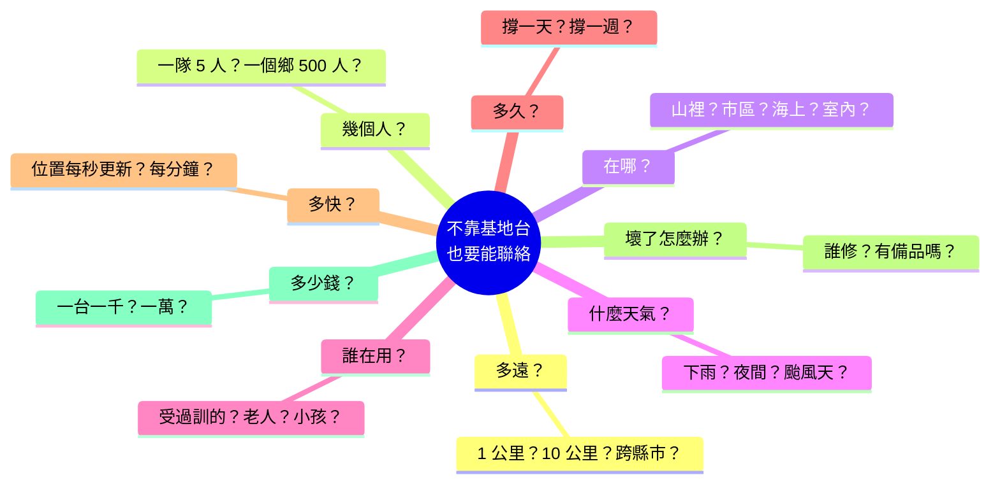
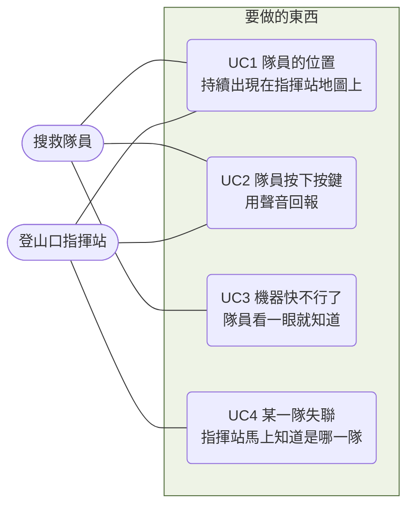

# 第 2 週 — 問題沒有邊界：用使用場景收斂，再用規格開始解

> 核心問題：**上週說「要解這個問題」。可是問題一開始沒有邊界，工程師要從哪裡下手？**
> 這週的方法論：**發散的問題 → 使用場景（use case）收斂 → 邊界 → 規格**。
> 「開規格」這個技能學校不教，但每個做產品的人都要會。這週不講技術名詞。

## 5 分鐘 — 回顧 + 情境

上週的結論是一句話：**「不靠基地台、能傳位置＋語音＋檔案、分得出誰是誰。」**

現在假設你把這句話交給一個工程師，叫他開始做。他會反問你：

每一個問題都合理，每一個都會改變要做的東西。**這就是「沒有邊界的問題」：** 不是不知道怎麼解，是不知道要解到哪裡。工程做不了沒有邊界的事。

問學生：**如果只能先回答其中三個，你選哪三個？為什麼？**

## 12 分鐘 — 收斂兩步，然後才有規格

### 第一步收斂：使用場景（use case）

使用場景是一個很具體的畫面：**誰、在哪、要完成什麼事、成功長什麼樣、失敗會怎樣。**
它把上面那團問號，變成幾個可以逐一看的小格子。

拿第 1 週的「山區搜救」切一次：

每一格再補兩句：

| 使用場景 | 成功的畫面 | 失敗會怎樣 |
|---|---|---|
| UC1 位置 | A 隊走到溪谷，指揮站地圖上的點還在動 | 點不動 = 分不清是失聯還是靜止，得派人去找 |
| UC2 語音 | 找到人，按下按鍵，指揮站聽得清楚 | 聽不清楚 = 位置報錯，救援跑錯地方 |
| UC3 機器狀態 | 隊員看一眼燈，知道該換電池 | 不知道 = 機器默默死掉，整隊消失 |
| UC4 失聯偵測 | 指揮站畫面上 B 隊變紅色 | 不知道誰失聯 = 全部召回重數人頭 |

注意：切出使用場景之後，上面九個問號有一半自動有了答案。「誰在用」= 受過訓的隊員；「在哪」= 山區；「幾個人」= 三隊。**收斂就是這樣發生的：不是回答每個問題，是決定先看哪幾個畫面。**

### 第二步收斂：邊界

使用場景列出來，會自然冒出「這次不做」的清單：

| 這次不做 | 為什麼先不做 |
|---|---|
| 不傳影片 | 四個場景都不需要；要做的話電池、速度全部要翻倍 |
| 不跨縣市 | 場景是一座山、一個登山口 |
| 不給沒受訓的人用 | 使用者是隊員，可以要求他們上一堂課 |

「不做什麼」是規格的第一行。**沒有邊界，任何東西都做不完。**

### 為什麼還需要規格

有了四個使用場景和邊界，工程師還是會問：UC1 的「持續出現」是多遠、多久更新一次？UC3 的「看一眼就知道」是幾秒？**做到什麼程度算做到？** 這個「程度」就是規格。

規格做四件事，全部是「工程」這個活動不可缺的：

| 規格的作用 | 白話 | 沒有它會怎樣 |
|---|---|---|
| 契約 | 做到這些 = 做完了 | 永遠有人說「還不夠」 |
| 驗收 | 拿著它去測，過就是過 | 用感覺判斷，吵不完 |
| 溝通 | 做天線的、寫軟體的、做外殼的看同一張紙 | 各做各的，拼起來對不上（第 3 週的主題） |
| 取捨的紀錄 | 為什麼是 1 公里不是 5 公里，寫下來 | 三個月後沒人記得為什麼這樣決定 |

### 開規格：從使用場景到句子

用 UC1 跑一次：

| 步 | 寫出來的東西 |
|---|---|
| 成功的畫面 | A 隊在 1 公里外的溪谷，指揮站地圖上的點還在動 |
| 一定要成立 | 點要一直在動；不動就等於失蹤 |
| 系統要做到 + 數字 | 兩台相隔 1 公里、有視線時，位置每 10 秒更新一次；10 分鐘內中斷不超過 1 次、每次不超過 30 秒 |
| 怎麼驗 | 兩台拉開 1 公里，一個人走 10 分鐘，指揮站錄下地圖畫面，數中斷次數 |

用 UC3 跑一次：

| 步 | 寫出來的東西 |
|---|---|
| 成功的畫面 | 隊員看一眼機器，知道該換電池 |
| 一定要成立 | 不用懂技術、不用說明書，看得出「好／快不行／壞了」 |
| 系統要做到 + 數字 | 三種狀態用燈區分；沒看過機器的人 10 秒內說得出是哪一種 |
| 怎麼驗 | 找 5 個沒看過機器的人，各看 3 種燈號，答對率要 100% |

兩件事要講清楚：
- **數字是「訂」出來的，不是量出來的。** 10 秒、1 次、30 秒是我們決定「這樣才夠救人」。訂太嚴做不到、訂太鬆沒用。理由要寫下來。
- **想不出怎麼驗的規格，是壞規格。** 這一欄逼你把模糊的話變具體。

### 專案裡真實的例子（`事實`）

`docs/field-resilience.md` 開頭先寫兩個「操作員看得到的畫面」，才往下開規格：

> N1「它在野外開機了，卻一直沒有加入網路，沒人知道為什麼。」
> N2「它加入了，然後不明原因掉線，之後開不了機或一直重開，再也回不來。」

然後翻成可驗的句子，例如「60 秒沒加入就寫下一行短診斷、5 分鐘寫完整診斷」「每一次重開都要留下原因」。跟這週的路一模一樣：畫面 → 一定要成立 → 數字 → 驗法。

### 分兩堆

規格會開太多。最後分堆：**沒有它整個行動就失敗**的放「一定要」，其他放「最好有」。本專案的任務單用標籤做同一件事。

## 8 分鐘 — 作業：自己收斂、自己開規格

1. 從第 1 週的三個場景挑一個，**切出 4 個使用場景**，畫成上面那種圖（角色在外、場景在框裡）。
2. 每個使用場景寫「成功的畫面」「失敗會怎樣」。
3. 列 **3 條「這次不做」**，各一句理由。
4. 挑 2 個使用場景，開出 **5 條規格**，每條有數字和驗法。
5. 分「一定要／最好有」。

**AI 進場（兩輪，都不給答案）**
- 第一輪，AI 扮**驗收工程師**：「我是負責驗收的工程師。以下是規格，請對每一條只問我三個問題：怎麼量？在哪裡量？多少算過？不要幫我改寫。」答不出來的那條，學生自己重寫。
- 第二輪，AI 扮**山區搜救隊員**：「你是常上山的搜救隊員，沒有技術背景。以下是規格，請告訴我哪一條對你在山上完全沒差，哪一條你最在乎，為什麼。」學生據此調整「一定要／最好有」。

## AI 延伸學習（配合主題往外走，仍不是問答）

- **AI 當模擬器**：「以下是我的四個使用場景和邊界。請給我三個變化：夜間、下大雨、多來一個沒受訓的志工隊。每個變化只描述畫面，不要告訴我該改什麼。」學生自己判斷哪些使用場景、哪些規格會變，寫下來。
- **AI 扮另一個團體**：「你是某個城市社區的防災志工隊隊長，不是搜救隊。請用你的立場寫出你們最需要的三個使用場景。」學生比較兩邊的使用場景差在哪、規格會不會衝突。這一題會在第 4 週「目標市場」用到。

## 延伸思考

1. 「管理系統掛掉，網路還要能傳」是本專案最重要的一條原則。它是使用場景、邊界、還是規格？你能把它改寫成一條有數字、有驗法的句子嗎？
2. 邊界是誰定的？如果搜救隊員說「我們也要傳影片」，工程師該答應嗎？誰有資格說「這次不做」？

## 5 分鐘 — 筆記

- 沒有邊界的問題是 ___；收斂的第一步是 ___。
- 我切出的 4 個使用場景：___。我決定不做的 3 件事：___。
- 規格是 ___；沒有它就沒有 ___。
- 驗收工程師問倒我的問題：___；搜救隊員最在乎的一條：___。

## 這週碰到的學門

`需求工程`、`系統工程`、`工業工程（驗收與品質）`、`人因（不用說明書就懂）`。

---
← [week1.md](week1.md) · [README.md](README.md) · [week3.md](week3.md) →
