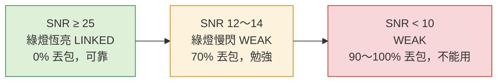
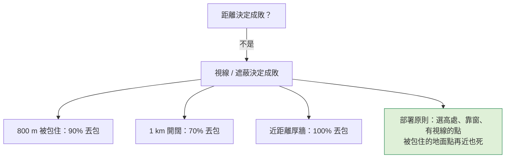

# 第 3 週 — 無線電與距離（走測數據）

> 核心問題：**為什麼 800 公尺比 1 公里還差？**
> 這週用專案真實量到的數字講「電波」，不推公式。

## 5 分鐘 — 回顧 + 情境

回顧：四層裡的第 ① 層「聽不聽得到」。
情境：爸爸把一台哨站放在 12 樓，另一台裝在背包裡走出去。走到哪裡會斷？

## 12 分鐘 — HaLow 是什麼、走測看到什麼

### HaLow：低頻、遠、慢

| | 一般 Wi-Fi（2.4 / 5 GHz） | Wi-Fi HaLow（802.11ah，900 MHz） |
|---|---|---|
| 頻率 | 高 | 低（約 1/3 ～ 1/6） |
| 穿牆、繞障礙 | 差 | **好**（波長長） |
| 距離 | 幾十公尺 | **幾百公尺到公里級** |
| 速度 | 幾百 Mbps | **幾 Mbps**（專案量到 2.9 ～ 4.1 Mbps） |
| 適合 | 看影片 | 位置、文字、語音、小檔案 |

`事實`：本專案用的頻道 923 MHz / 2 MHz 頻寬（後來改 922 MHz / 4 MHz），發射功率約 27 dBm（`docs/hardware.md`、`docs/field-test-log.md`）。

### 兩個數字就夠：訊號強度與 SNR

- **dBm**：收到的訊號多強。-40 很強，-90 快聽不到。（負得越多越弱。）
- **SNR（訊噪比）**：訊號比背景雜音大多少（dB）。**這才是能不能用的關鍵。**



（`事實`：門檻來自 `docs/field-test-log.md` 的「SNR → 可用性對照」表，是本專案實測，不是教科書數字。）

### 走測結果（真實數據，2 MHz，節點 1 在 12 樓）

| # | 情境 | 訊號 | SNR | 丟包 | 燈 |
|---|---|---|---|---|---|
| 1 | 視線內 5 m，市電 | -47 dBm | 47 | 0% | LINKED |
| 3 | 同上，改用電池 | -46 dBm | 50 | 0% | LINKED，但**速度掉 3～4 倍** |
| 7 | 同棟 1 樓 vs 12 樓 | -70 dBm | 25～29 | 0% | LINKED，可靠 |
| 5 | **1 km**，較開闊 | -87 dBm | 12～14 | 70% | WEAK |
| 6 | **800 m**，被建築包住 | -92 dBm | 6～13 | 90% | WEAK |
| 4 | 近距離但被厚牆擋 | -88 dBm | 8 | 100% | WEAK |

### 這週最重要的一課



另外兩個發現（`事實`）：
- 換一根比較好的天線，訊號 +5 dB。近距離看不出差別，**差別在射程**（推估多撐約 1.8 倍距離 — 這是 `推論`，來自 dB 換算，未實走驗證）。
- 用電池時「連得上、不當機、但跑不快」：發射瞬間電壓被拉低，功率放大器表現變差。Pi 的欠壓偵測**抓不到**這件事 → 教訓：測電池要看「負載下的速度」，不是只看警告燈。

### 合法嗎？（法律進來了）

`事實`（`docs/hardware.md`）：這張卡是**美國頻段**（902～928 MHz）；文件寫到台灣的免執照 ISM 分配是 **920～925 MHz**，是美國範圍的子集；OpenMANET 又把功率推到約 27 dBm，**可能超過當地上限**。
`推論`：在台灣要合法使用，頻道與功率都可能需要限制 — **這正是第二個月的協助任務 C（查 NCC 規範）。**

## 8 分鐘 — 思考題 / AI 動手題

**思考題**
1. 「訊號 -87 dBm」和「SNR 12」哪個更能告訴你能不能用？為什麼要看「比背景大多少」？
2. 如果只有兩台哨站，你家、學校、常去的地方，你會放哪兩個點？畫在地圖上，說出理由（高？視線？有電？）。

**AI 動手題**
1. 貼給 AI：
   ```
   請用高中物理（波長、繞射）解釋為什麼 900 MHz 的無線電比 2.4 GHz 的 Wi-Fi
   更能穿牆、繞過障礙，但速度比較慢。用生活比喻，並附兩個可查的資料來源。
   ```
2. 用 Google 地圖找你家附近 1 km 內最高、四周開闊的三個地點，截圖存進筆記。第 7 週的走測任務會用到。
3. 進階：把上面走測表貼給 AI，請它「找出哪一列證明了『距離不是關鍵』」，看它答得對不對（正確答案：5 vs 6）。

**上機版（只讀）**
- 節點上 `meshtest`（專案自己的六層健康報告），看 SNR 那一行。

## 5 分鐘 — 筆記

- SNR 是 ___；可靠門檻大約 ___。
- 800 m 比 1 km 差，因為 ___。
- 我的三個候選站點：___（附截圖）
- 合法性問題：___（待第二個月查）

## 這週碰到的學門

`通訊工程（無線電、天線）`、`物理（電磁波）`、`地理 / GIS（選址）`、`法律（頻譜管理）`、`電機（電源）`。

---
← [week2.md](week2.md) · [README.md](README.md) · [week4.md](week4.md) →
