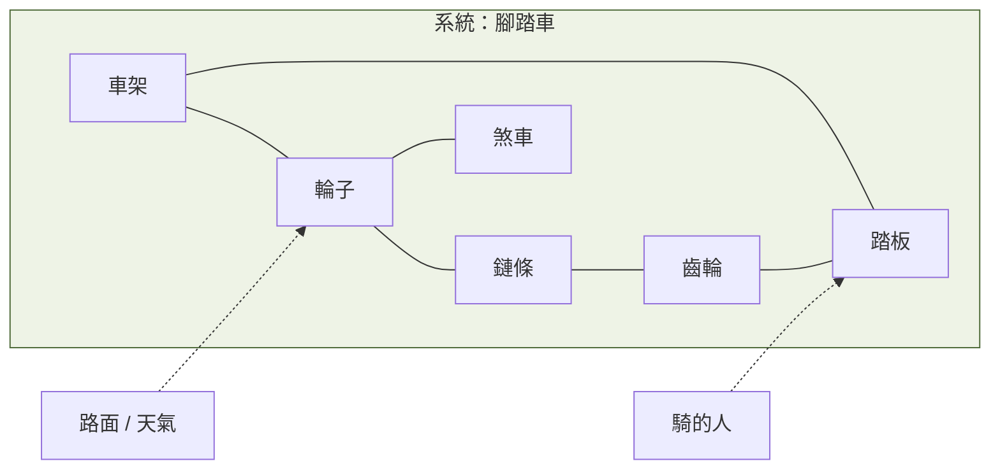
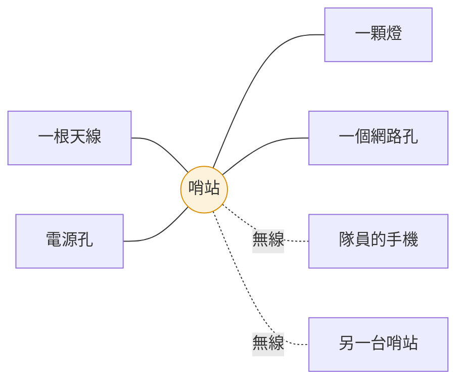
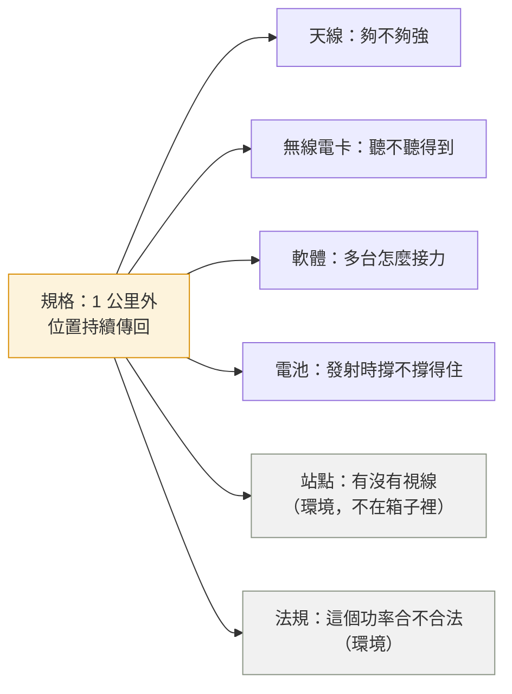

# 第 3 週 — 什麼是系統、什麼是元件：為什麼一個科系解決不了

> 核心問題：**上週開的規格，要靠什麼東西一起做到？為什麼這案子要跨學門？**
> 這週的方法論：**黑箱／白箱、元件與介面清單、「規格 → 元件」連線圖**。
> 先用腳踏車講，再套到哨站。技術名詞盡量不出現。

## 5 分鐘 — 回顧 + 情境

回顧：上週開了 5 條規格，例如「1 公里外的位置要持續傳回來」「看一眼燈就知道機器好不好」。

今天的問題：**這條規格是「誰」做到的？** 天線？電池？軟體？答案是「一起」，而這正是麻煩的開始。

## 12 分鐘 — 系統與元件，先用腳踏車

### 一台腳踏車



| 名詞 | 白話 | 腳踏車例子 |
|---|---|---|
| **系統** | 一群東西湊在一起，為了同一個目的 | 整台腳踏車，目的是「把人載到目的地」 |
| **元件** | 系統裡可以拆下來的一塊 | 輪子、鏈條、煞車 |
| **介面** | 兩個元件碰在一起的地方 | 鏈條要咬得住齒輪；煞車皮要對得到輪框 |
| **邊界** | 系統到哪裡為止 | 車是系統；騎的人、路、天氣是「環境」 |
| **系統性質** | 整台才有、單一零件沒有的性質 | 「好騎」「安全」不是任何一個零件的性質 |

三個觀察，之後全部會用到：

1. **故障多半在介面。** 鏈條掉了：鏈條沒壞、齒輪沒壞，是兩個「對不上」。
2. **系統性質是湧現出來的。** 你買最貴的輪子、最貴的煞車，裝在一起不保證好騎。
3. **一條需求牽很多元件。** 「騎上坡不會累」要靠齒輪比、車重、輪胎、騎的人的腿，四樣一起。

### 套到哨站：先黑箱、再白箱

**黑箱**：站在外面，只看得到什麼？



**白箱**：打開來。

```mermaid
flowchart TB
  subgraph Node[哨站]
    ANT[天線] --- RADIO[無線電卡<br/>負責「聽與說」]
    RADIO --- HAT[轉接板<br/>把無線電卡接上小電腦]
    HAT --- PI[小電腦 Raspberry Pi<br/>負責「想」]
    PI --- SD[記憶卡<br/>系統、設定、紀錄]
    PI --- SW[軟體<br/>接力規則、身分、燈號、自我診斷]
    PI --- LED[燈]
    BAT[電池 / 電源] --- PI
    BAT --- RADIO
    CASE[外殼] -.包住全部.- Node
  end
  style RADIO fill:#fdf3dc,stroke:#d98e04
  style SW fill:#fdf3dc,stroke:#d98e04
```

### 本專案三個真實的「介面故障」（用人話講，`事實`）

| # | 兩個元件 | 發生什麼 | 專案在哪裡記載 |
|---|---|---|---|
| 1 | 無線電卡 ↔ 小電腦 | 兩邊「握手」時，有一根線該放開卻一直握著，無線電卡從此聽錯每一句話，裝不起來。花了很久才找到 | `README.md` 開頭的發現 |
| 2 | 電池 ↔ 無線電卡 | 平常電夠，但無線電「說話」那一瞬間電壓被拉低，速度掉 3 到 4 倍；而且小電腦的欠壓警告**抓不到** | `docs/field-test-log.md` 第 3 點 |
| 3 | 外殼 ↔ 燈 | 燈在小電腦上，裝進外殼就看不到；上週規格「看一眼就知道」因此失效 | 任務單 #128 |

這三件事都不是某個零件壞掉，是**兩個零件對不上**。跟鏈條掉了一模一樣。

### 從上游串回來：一條規格牽到多少元件

拿上週的規格「1 公里外的位置要持續傳回指揮站」，把它跟白箱裡的元件連線：



一條規格，牽到六樣東西，其中兩樣在箱子外面。**每一樣背後是不同的學問**：

| 這條規格卡在 | 要解的問題（人話） | 學門 |
|---|---|---|
| 天線、無線電卡 | 怎麼傳得遠、怎麼知道傳不傳得到 | 通訊工程 |
| 軟體：接力 | 多台怎麼不打架、壞一台怎麼繞路 | 資訊工程（網路） |
| 軟體：身分 | 怎麼分得出誰是誰、怎麼擋壞人 | 資訊安全 |
| 電池 | 發射瞬間怎麼不掉速、撐多久 | 電機工程 |
| 外殼、燈 | 淋雨會不會壞、燈看不看得到 | 機械與工業設計 |
| 站點 | 放哪裡才有視線 | 地理 |
| 法規 | 這個頻率、這個功率在台灣能不能開 | 法律與公共政策 |
| 整個計畫 | 先做哪個、怎麼知道做完了 | 工程管理 |

這就是「為什麼一個科系解決不了」的答案：**不是題目太難，是一條規格天生就跨過好幾個元件，而每個元件背後是不同的學問。** 第 4 週會把每一格說深一點。

## 8 分鐘 — 作業起頭：《W3 我的系統圖》

（課後不限時，寫成作業檔，格式見 [notes-template.md](notes-template.md)）

1. **AI 之前，我先想**：不看教材，憑直覺列出「一台哨站裡面有哪些東西」。
2. **哨站的圖**：用你第 2 週的 5 條規格，畫黑箱（外面看得到什麼）與白箱（裡面有什麼元件）。列**介面清單至少 6 條**，格式固定：「A ↔ B：要對得上什麼」。
3. **你自己的系統**：從生活中**自己挑一個系統**（不能是腳踏車；例如你的手機、家裡的網路、學校的餐廳、一場球賽），畫同一套圖：元件、介面、邊界、一個「整體才有的性質」。寫一段它跟哨站哪裡像、哪裡不像。
4. **AI 補漏**：把介面清單給 AI，請它指出你漏掉的介面。逐條判定「真的漏了／不算」，理由寫下。**至少要有一條你判定「不算」並說得出為什麼**。
5. **AI 比喻檢查**：請 AI 用你第 3 點選的那個系統來比喻哨站。找出**比喻不成立的地方至少一處**，說明為什麼不成立。
6. **連線圖**：挑一條規格畫「規格 → 元件」連線圖，數出牽到幾個元件、幾個學門。
7. 作業檔第 5 到 8 欄。

為什麼這題抄不了：你選的生活系統是個人的；「真的漏了／不算」的判定和「比喻哪裡不成立」都要對照你自己畫的圖。

## AI 延伸學習（選做，把主題往外走）

- **AI 當模擬器**：「假設我把電池換成太陽能板加小電池。請只描述這台機器一天 24 小時會發生什麼，不要告訴我該改什麼。」學生自己回答：哪些介面要重寫、哪些規格會變、哪張學門卡（下週）會多一個問題。
- **AI 扮腳踏車技師**：「你是腳踏車技師。我用腳踏車比喻一台通訊機器，以下是我的對照表。請只指出我哪個比喻不成立，一次一個。」學生決定改比喻還是改理解。
- **AI 當整理助手**：把學生的介面清單畫成圖（Mermaid），內容不變。

## 延伸思考

1. 如果經費只能砍掉一個學門的投入，砍哪個系統最不會死？哪個學門一失敗整個系統就作廢？
2. 「站點」和「法規」在箱子外面，工程師管不到。那它們算不算系統的一部分？如果不算，為什麼規格會被它們卡住？

## 5 分鐘 — 作業檔第 2 欄：AI 之前，我先想

課堂最後 5 分鐘，還沒開任何 AI，先寫下這三行（之後不能改）：

- 不看教材，我認為一台哨站裡面有：___（列出來就好）
- 我想拿來比的生活系統是：___
- 憑直覺，這台機器最容易「對不上」的兩個元件是：___ 和 ___

## 這週碰到的學門

`系統工程`、`系統思考`，以及對映表裡的全部。

---
← [week2.md](week2.md) · [README.md](README.md) · [week4.md](week4.md) →
