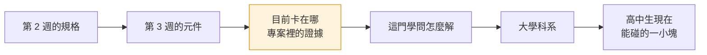
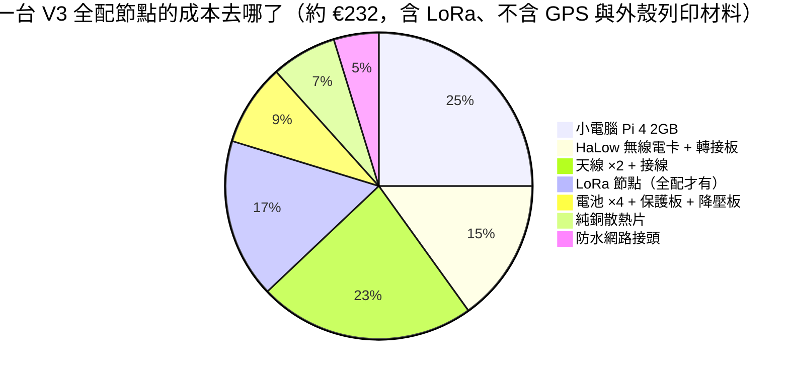
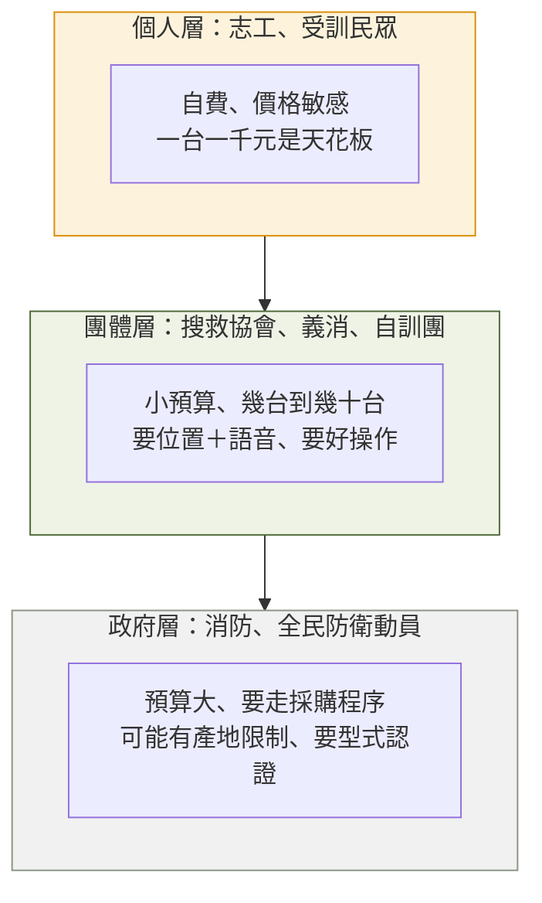
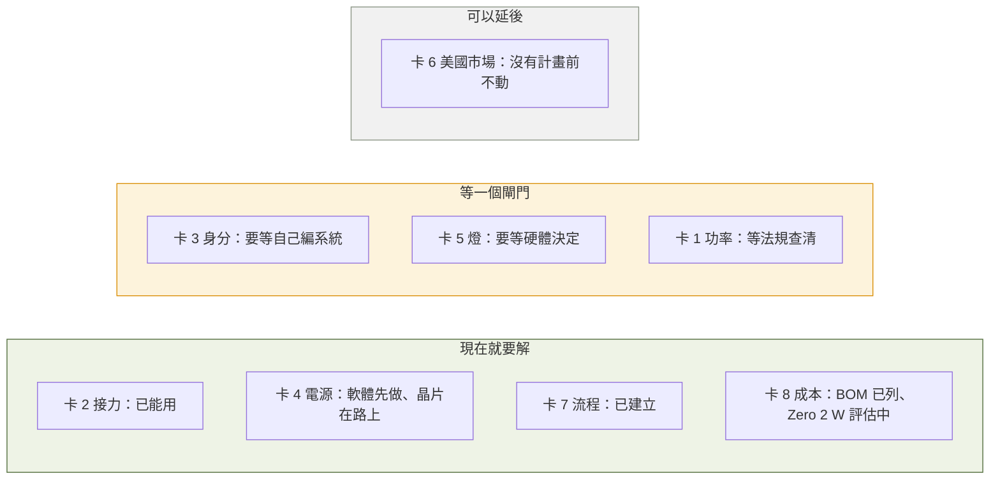

# 第 4 週 — 各學門在這案子裡到底要解什麼，以及：多少錢、賣給誰

> 核心問題：**每個學門的人走進這個案子，桌上會擺什麼問題？做出來一台多少錢？是為誰做的？**
> 這週的方法論：**學門卡**（規格 → 元件 → 卡在哪 → 這門學問怎麼解 → 科系 → 我現在能碰的一小塊）、**「現在不解就死」與「可以延後」的分堆**、**成本與目標市場**。
> 說法全部沿用前兩週：用「使用場景」「規格」「介面」講工程問題，不堆術語。

## 5 分鐘 — 回顧 + 情境

回顧：一條規格牽好幾個元件，每個元件背後是不同的學問。
今天的情境：假設你是計畫主持人，要找七個不同科系的朋友來幫忙，**你要跟每個人說「你負責解什麼」**。講完之後，還有一個人會走進來問：「這樣一台多少錢？你要賣給誰？」那個人是第八張卡。

## 12 分鐘 — 七張學門卡 + 一張成本卡

每張卡的格式一樣，方便比較：

### 卡 1｜傳得遠 — 通訊工程

| 欄 | 內容 |
|---|---|
| 規格 | UC1：1 公里外位置持續傳回 |
| 元件 | 天線、無線電卡、站點（環境） |
| 卡在哪（`事實`） | 走測發現：**800 公尺被建築包住的點，比 1 公里開闊的點還差**（丟包 90% 對 70%）。決定成敗的是視線，不是距離。換一根好天線，訊號強 5 個單位，差別在射程不在近距離 |
| 這門學問怎麼解 | 量「訊號比雜音大多少」而不是只量距離；選高處、靠窗的站點；挑天線；決定合法的功率 |
| 科系 | 電機工程、通訊工程、電信工程 |
| 現在能碰 | 用地圖找家附近三個有視線的高點，說出理由（第 5 週會拿真實數據對照） |

### 卡 2｜多台不打架 — 資訊工程（網路）

| 欄 | 內容 |
|---|---|
| 規格 | UC4：任何一台壞了，其他台照傳；指揮站知道是哪台不見了 |
| 元件 | 軟體：接力規則 |
| 卡在哪（`事實`） | 沒有總機，所以每台每秒都要喊一次「我在這裡、經過我到別台的品質多好」。喊話本身要佔用「空中時間」，專案算過：**一個範圍內大約 50 台就會被喊話塞滿一半的時間**，而且最貴的是「我是這個網的成員」那句廣播，不是真正的資料 |
| 這門學問怎麼解 | 設計「誰該喊、多久喊一次」的規則；算時間預算；壞一台幾秒內要繞路 |
| 科系 | 資訊工程、資訊科學、電機（網路組） |
| 現在能碰 | 用高中數學算「每台每秒喊 X 微秒，n 台佔多少」，跟專案的模型比（第 5 週） |

### 卡 3｜分得出誰是誰 — 資訊安全

| 欄 | 內容 |
|---|---|
| 規格 | 第 1 週的缺口：分得出誰在講、踢得掉一台、外人混不進來 |
| 元件 | 軟體：身分 |
| 卡在哪（`事實`） | 現在整個網用**同一把預設鑰匙**（燒出來的卡都是同一組字串），等於全班共用一把教室鑰匙：誰進來的分不出、要換鎖得全班換。另外，專案文件明講：**密碼擋不住有人故意在同一個頻率上吵**（干擾），那要靠換頻道與偵測，不是靠加密 |
| 這門學問怎麼解 | 每台一張自己的身分證（憑證）、能單獨撤銷一張；偵測「行為怪怪的那台」並隔離；供應鏈：零件從哪來 |
| 科系 | 資訊工程（資安組）、資訊管理、密碼學相關 |
| 現在能碰 | 用「教室鑰匙」的比喻，設計一套「怎麼發身分證、怎麼收回」的流程圖（第 6 週） |

### 卡 4｜撐得久、發射不掉速 — 電機工程（電源）

| 欄 | 內容 |
|---|---|
| 規格 | UC3 的前提：電池撐一整天；發射瞬間不掉速；快沒電要提前告訴人 |
| 元件 | 電池、電源線、無線電卡（介面：電池 ↔ 無線電） |
| 卡在哪（`事實`） | 電池「連得上、不當機、但跑不快」：發射瞬間電壓下垂，速度掉 3 到 4 倍；小電腦的欠壓警告抓不到。專案正在加一顆量電壓電流的晶片，快沒電時先安全關機（任務單 #122） |
| 這門學問怎麼解 | 量電流尖峰、選能瞬間放大電流的電池、線要夠粗、加監測晶片 |
| 科系 | 電機工程、電子工程 |
| 現在能碰 | 找出「為什麼手機電量 20% 時突然關機」的原因，跟這個案子對照 |

### 卡 5｜撐戶外、看得到燈 — 機械與工業設計

| 欄 | 內容 |
|---|---|
| 規格 | UC3：淋雨不壞、摔不壞、看一眼燈就知道狀態 |
| 元件 | 外殼、散熱片、接頭、燈 |
| 卡在哪（`事實`） | 專案採用一個開源的 V3 手持外殼（3D 列印、金屬散熱片、防潑水橡膠圈）。裝進去之後**燈看不到**，解法二選一：導光柱把光引到外面，或在面板另裝一顆燈（任務單 #128） |
| 這門學問怎麼解 | 熱怎麼排、水怎麼擋、按鍵和燈怎麼放人才看得到 |
| 科系 | 機械工程、工業設計、產品設計 |
| 現在能碰 | 比較「導光柱 vs 面板燈」的成本、防水、好不好做，做一張比較表（第二個月任務） |

### 卡 6｜合法、零件從哪來 — 法律與公共政策

| 欄 | 內容 |
|---|---|
| 規格 | 邊界的一條：在台灣可以合法開機；能賣給需要它的單位 |
| 元件 | 無線電卡（環境：法規、市場） |
| 卡在哪 | `事實`：這張卡是美國頻段（902 到 928 MHz），專案文件寫台灣免執照的範圍是 920 到 925 MHz，是美國範圍的一小段；OpenMANET 又把功率推高到約 27 dBm，可能超過當地上限。`待查證`：搜尋到的二手資料說台灣此頻段室內上限 1 W、室外 0.5 W，**要對照 NCC 的法規原文**。`事實`：無線電模組是中國公司 Quectel 的產品，專案文件指出這在美國政府與公共安全市場可能被 NDAA 法案擋下 |
| 這門學問怎麼解 | 查法規、判斷適用、提出合規方案（限功率、限頻道）；供應鏈風險評估 |
| 科系 | 法律、公共行政、科技管理、政治（公共政策） |
| 現在能碰 | 找到 NCC「低功率射頻器材技術規範」原文，把 920 到 925 MHz 那一段抄下來、標出功率上限（第二個月任務） |

### 卡 7｜做得出來、管得住 — 工程管理

| 欄 | 內容 |
|---|---|
| 規格 | 燒一張卡就能用；每次改動都有證據證明沒弄壞 |
| 元件 | 整個計畫的流程 |
| 卡在哪（`事實`） | 專案有 60 幾張任務單、一棵任務樹（#75）；每個改動要先開任務單、改完要附「在哪台機器上測了什麼、數字多少」才能合併；任務單用標籤分「現在能做／要等硬體／要等自己編系統」 |
| 這門學問怎麼解 | 決定先做哪個（相依關係）、定義「做完」、留下可追溯的證據 |
| 科系 | 工業工程與管理、資訊管理、專案管理 |
| 現在能碰 | 讀一張任務單，用第 2 週的四步表判斷它「規格開清楚了沒」 |

### 卡 8｜多少錢、賣給誰 — 成本與目標市場（回扣第 1 週）

這張卡不屬於某個工程科系，但**每張工程卡的答案都會被它改寫**。

**一台多少錢？**（`事實`，專案 `docs/enclosure-v3-bom.md`，2026 年 7 月歐洲參考價）

第一個發現：**「腦」加「無線電」約 €93，只佔四成；天線比無線電卡貴，電池與散熱加起來跟無線電卡一樣貴，外殼的列印材料還沒算。** 這跟直覺相反，也是為什麼第 5 卡（機械）和第 4 卡（電源）不能省。

**省錢的路：把 Pi 4 換成 Pi Zero 2 W？**

| | Pi 4 2GB | Pi Zero 2 W |
|---|---|---|
| 價格（`事實`，官方定價） | 約 US$45 | US$15 |
| 專案的評估（`事實`，`docs/productization.md`） | 可以當「帶身分證的節點」：有安全開機的根、能加密、能跑額外服務 | **只能當便宜、可拋棄的中繼**：沒有安全開機的根、記憶體只有一半、不能跑額外服務 |
| 結論 | 省下 US$30，**換掉一整層安全**。專案的決定是「兩種板子是兩種角色，不是同一角色的大小版」 |

這就是成本卡改寫工程卡的例子：卡 3（身分）在 Zero 2 W 上做不到，所以「便宜版」不能拿來當指揮站，只能當中繼。

**跟別人比**（台灣零售價，`事實`但會變動，查證日期 2026-09）

| 方案 | 一台大約 | 產地備註 |
|---|---|---|
| 對講機 UV-5R | 約 NT$950 | 寶鋒，**中國** |
| Meshtastic 節點 Heltec V3 | 約 NT$700 到 1,200 | Heltec，**中國** |
| 本專案 HaLow 節點全配 | 約 NT$8,000 上下（€232 換算，`推論`，台灣採購另有運費與關稅） | 無線電卡 Quectel（**中國**）+ Seeed（**中國**）；小電腦英國；晶片澳洲 |

再一個供應鏈事實（`事實`）：本專案用的無線電卡 Wio-WM6108，英國零售商 Pi Hut 已標示**停產**。這是第 1 週「零件從哪來」的限制真的發生了：規格再好，買不到卡就做不出第二批。

**賣給誰？民防界長什麼樣**（`事實`，報導與組織自述，見資料來源）

- 黑熊學院自稱已培訓逾 10 萬名民眾；台灣民團協會兩年內在各地播種出 19 個自訓團；壯闊台灣聯盟辦救災與民防講習（`事實`，報導者、ETtoday 報導）。
- 個人層一台一千元的天花板，就是 Meshtastic 兩萬人社群長出來的原因（`推論`）。
- 本專案一台八千元、要 3 到 10 台才成網，**個人層買不起、政府層卡產地與認證，目標市場落在團體層**（`推論`，這是專案文件裡的定位「先給人用、下一步給機器用」的另一種說法）。

**目標市場**這個詞的意思就是：**你的規格與價格，是為哪一層人開的。** 回頭看第 1 週的決策矩陣：對個人層，「價格」權重 5、「分得出誰是誰」權重 1，Meshtastic 贏；對團體層，權重反過來，HaLow 才有機會。**同一張矩陣、換一層市場，答案就翻盤。**

最後一件事：成本不只是買價。**總持有成本**還包括電池、備品、維修、訓練、燒卡與設定的人力。專案花大力氣做「燒一張卡就能用」「壞了自己說為什麼」（第 7 週），省的就是這部分。

| 欄 | 內容 |
|---|---|
| 科系 | 經濟、企管、工業工程與管理、科技管理 |
| 現在能碰 | 用蝦皮、露天、iCShop 查台灣實際價格，做一張「一台多少錢」表跟專案的 BOM 對照；差多少、為什麼（第二個月任務） |

### 分堆：現在不解就死、可以延後

專案自己怎麼分（`事實`，任務樹 #75 的標籤）：

判斷規則跟第 2 週的「一定要／最好有」是同一件事，只是多了一個問題：**它現在做得了嗎？**

## 8 分鐘 — 作業起頭：《W4 我的學門卡與市場判斷》

（課後不限時，寫成作業檔，格式見 [notes-template.md](notes-template.md)）

1. **AI 之前，我先想**：不看教材，寫下「如果我只能讀一個系，我現在會選哪個，為什麼」。四週後回頭看這一句。
2. **兩張自己的卡**：從八張卡挑兩張最有感的，**不看教材**，用自己的話重寫「卡在哪」與「這門學問怎麼解」。每張加一欄「該放哪一堆（現在／閘門／延後），理由」。
3. **批改 AI**：請 AI「幫我寫這張學門卡」（給它卡的格式與專案名稱）。然後**你當老師改它的版本**：用紅字標出三種東西：(a) 跟專案文件不符的（要寫出你對照了哪份文件）、(b) 沒有證據的斷言、(c) 比你寫得好的地方。三種都要至少一項。
4. **教授三問**：請 AI 扮該系教授，只問三個問題逼你發現想淺的地方。記錄問題原文、你的回答、答不出來的寫進「還不懂」欄。
5. **市場判斷**：拿第 1 週的矩陣，換成「團體層」的權重重算一次。寫一段：答案變了沒、哪個準則翻盤、你認為本專案該瞄準哪一層市場。
6. **「如果我只能讀一個系」**：回頭看第 1 點，寫一段現在的答案，以及變或沒變的原因。
7. 作業檔第 5 到 8 欄。這週的第 6 欄請把四週的「最有感的學門」排在一起看。

為什麼這題抄不了：批改 AI 要對照專案文件；「哪堆」的判斷是你的；市場層的權重是你的；「讀哪個系」只有你能答。

## AI 延伸學習（選做，把主題往外走）

- **AI 扮採購人員**：「你是一個搜救協會的採購，預算 5 萬元，要買通訊設備給 12 個人。以下是我的三個方案（對講機、Meshtastic、HaLow 節點）與價格。請只問我問題，問到你能決定為止。」學生要準備答案，答不出來的就是規格或成本表沒寫清楚的地方。
- **AI 當模擬器**：「假設無線電卡停產、下一批只能買到另一家的卡，價格多 30%。請描述這對一個 10 台節點的團體會發生什麼，不要建議解法。」學生自己回答：哪張卡（1 到 8）受影響、目標市場會不會移動。

## 延伸思考

1. 八張卡裡，**哪兩張的交界最危險**？（提示：想第 3 週的三個介面故障各落在哪兩張卡之間；再想成本卡改寫了哪張。）
2. 如果你只能讀一個系，你選哪個？然後你需要找哪些系的人合作，才能把這個案子做完？
3. 一個一台八千元、要十台才成網的東西，民防團體會不會買？如果不會，是規格開錯、市場選錯，還是時間未到？

## 5 分鐘 — 作業檔第 2 欄：AI 之前，我先想

課堂最後 5 分鐘，還沒開任何 AI，先寫下這三行（之後不能改）：

- 如果我只能讀一個系，現在我會選：___，因為 ___
- 八張卡裡我最有感的兩張：___、___
- 我猜本專案該賣給哪一層：___

## 這週碰到的學門

七個工程與法規學門，加上經濟與管理。這八張卡是第 8 週「學門到科系對照表」的底稿。

## 資料來源

- 本專案 BOM 與價格：`docs/enclosure-v3-bom.md`；Pi 4 與 Zero 2 W 的角色分工：`docs/productization.md`
- Raspberry Pi Zero 2 W 官方定價 US$15：<https://www.raspberrypi.com/news/new-raspberry-pi-zero-2-w-2/>
- Wio-WM6108 停產（Pi Hut 商品頁）：<https://thepihut.com/products/wio-wm6108-wi-fi-halow-mini-pcie-module>
- UV-5R 台灣零售價：<https://24h.pchome.com.tw/prod/DMAE4P-A9007VINO>；Heltec V3 台灣零售價：<https://www.ruten.com.tw/find/?q=meshtastic+heltec+v3>
- 報導者〈下班後的「社區守護者」：民防訓練團如何由下而上參與全民國防〉：<https://www.twreporter.org/a/civil-defense-groups>
- ETtoday〈台灣民防崛起〉（黑熊學院培訓人數）：<https://www.ettoday.net/news/20260819/3221913.htm>

---
← [week3.md](week3.md) · [README.md](README.md) · [week5.md](week5.md) →
