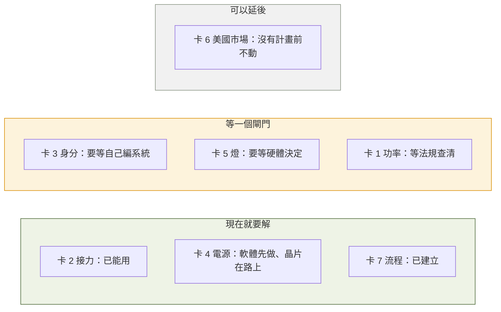

# 第 4 週 — 各學門在這案子裡到底要解什麼

> 核心問題：**每個學門的人走進這個案子，桌上會擺什麼問題？**
> 這週的方法論：**學門卡**（規格 → 元件 → 卡在哪 → 這門學問怎麼解 → 科系 → 我現在能碰的一小塊），以及**「現在不解就死」與「可以延後」的分堆**。
> 說法全部沿用前兩週：用「規格」和「介面」講工程問題，不堆術語。

## 5 分鐘 — 回顧 + 情境

回顧：一條規格牽好幾個元件，每個元件背後是不同的學問。
今天的情境：假設你是計畫主持人，要找七個不同科系的朋友來幫忙。**你要跟每個人說「你負責解什麼」。** 這週就是把那七句話講清楚。

## 12 分鐘 — 七張學門卡

每張卡的格式一樣，方便比較：

### 卡 1｜傳得遠 — 通訊工程

| 欄 | 內容 |
|---|---|
| 規格 | 1 公里外位置持續傳回 |
| 元件 | 天線、無線電卡、站點（環境） |
| 卡在哪（`事實`） | 走測發現：**800 公尺被建築包住的點，比 1 公里開闊的點還差**（丟包 90% 對 70%）。決定成敗的是視線，不是距離。換一根好天線，訊號強 5 個單位，差別在射程不在近距離 |
| 這門學問怎麼解 | 量「訊號比雜音大多少」而不是只量距離；選高處、靠窗的站點；挑天線；決定合法的功率 |
| 科系 | 電機工程、通訊工程、電信工程 |
| 現在能碰 | 用地圖找家附近三個有視線的高點，說出理由（第 5 週會拿真實數據對照） |

### 卡 2｜多台不打架 — 資訊工程（網路）

| 欄 | 內容 |
|---|---|
| 規格 | 任何一台壞了，其他台照傳；不需要總機 |
| 元件 | 軟體：接力規則 |
| 卡在哪（`事實`） | 沒有總機，所以每台每秒都要喊一次「我在這裡、經過我到別台的品質多好」。喊話本身要佔用「空中時間」，專案算過：**一個範圍內大約 50 台就會被喊話塞滿一半的時間**，而且最貴的是「我是這個網的成員」那句廣播，不是真正的資料 |
| 這門學問怎麼解 | 設計「誰該喊、多久喊一次」的規則；算時間預算；壞一台幾秒內要繞路 |
| 科系 | 資訊工程、資訊科學、電機（網路組） |
| 現在能碰 | 用高中數學算「每台每秒喊 X 微秒，n 台佔多少」，跟專案的模型比（第 5 週） |

### 卡 3｜分得出誰是誰 — 資訊安全

| 欄 | 內容 |
|---|---|
| 規格 | 分得出誰在講、踢得掉一台、外人混不進來 |
| 元件 | 軟體：身分 |
| 卡在哪（`事實`） | 現在整個網用**同一把預設鑰匙**（燒出來的卡都是同一組字串），等於全班共用一把教室鑰匙：誰進來的分不出、要換鎖得全班換。另外，專案文件明講：**密碼擋不住有人故意在同一個頻率上吵**（干擾），那要靠換頻道與偵測，不是靠加密 |
| 這門學問怎麼解 | 每台一張自己的身分證（憑證）、能單獨撤銷一張；偵測「行為怪怪的那台」並隔離；供應鏈：零件從哪來 |
| 科系 | 資訊工程（資安組）、資訊管理、密碼學相關 |
| 現在能碰 | 用「教室鑰匙」的比喻，設計一套「怎麼發身分證、怎麼收回」的流程圖（第 6 週） |

### 卡 4｜撐得久、發射不掉速 — 電機工程（電源）

| 欄 | 內容 |
|---|---|
| 規格 | 電池撐一整天；發射瞬間不掉速；快沒電要提前告訴人 |
| 元件 | 電池、電源線、無線電卡（介面：電池 ↔ 無線電） |
| 卡在哪（`事實`） | 電池「連得上、不當機、但跑不快」：發射瞬間電壓下垂，速度掉 3 到 4 倍；小電腦的欠壓警告抓不到。專案正在加一顆量電壓電流的晶片，快沒電時先安全關機（任務單 #122） |
| 這門學問怎麼解 | 量電流尖峰、選能瞬間放大電流的電池、線要夠粗、加監測晶片 |
| 科系 | 電機工程、電子工程 |
| 現在能碰 | 找出「為什麼手機電量 20% 時突然關機」的原因，跟這個案子對照 |

### 卡 5｜撐戶外、看得到燈 — 機械與工業設計

| 欄 | 內容 |
|---|---|
| 規格 | 淋雨不壞、摔不壞、看一眼燈就知道狀態 |
| 元件 | 外殼、散熱片、接頭、燈 |
| 卡在哪（`事實`） | 專案採用一個開源的 V3 手持外殼（3D 列印、金屬散熱片、防潑水橡膠圈）。裝進去之後**燈看不到**，解法二選一：導光柱把光引到外面，或在面板另裝一顆燈（任務單 #128） |
| 這門學問怎麼解 | 熱怎麼排、水怎麼擋、按鍵和燈怎麼放人才看得到 |
| 科系 | 機械工程、工業設計、產品設計 |
| 現在能碰 | 比較「導光柱 vs 面板燈」的成本、防水、好不好做，做一張比較表（第二個月任務） |

### 卡 6｜合法、零件從哪來 — 法律與公共政策

| 欄 | 內容 |
|---|---|
| 規格 | 在台灣可以合法開機；能賣給需要它的單位 |
| 元件 | 無線電卡（環境：法規、市場） |
| 卡在哪 | `事實`：這張卡是美國頻段（902 到 928 MHz），專案文件寫台灣免執照的範圍是 920 到 925 MHz，是美國範圍的一小段；OpenMANET 又把功率推高到約 27 dBm，可能超過當地上限。`待查證`：搜尋到的二手資料說台灣此頻段室內上限 1 W、室外 0.5 W，**要對照 NCC 的法規原文**。`事實`：無線電模組是中國公司 Quectel 的產品，專案文件指出這在美國政府與公共安全市場可能被 NDAA 法案擋下 |
| 這門學問怎麼解 | 查法規、判斷適用、提出合規方案（限功率、限頻道）；供應鏈風險評估 |
| 科系 | 法律、公共行政、科技管理、政治（公共政策） |
| 現在能碰 | 找到 NCC「低功率射頻器材技術規範」原文，把 920 到 925 MHz 那一段抄下來、標出功率上限（第二個月任務） |

### 卡 7｜做得出來、管得住 — 工程管理

| 欄 | 內容 |
|---|---|
| 規格 | 燒一張卡就能用；每次改動都有證據證明沒弄壞 |
| 元件 | 整個計畫的流程 |
| 卡在哪（`事實`） | 專案有 60 幾張任務單、一棵任務樹（#75）；每個改動要先開任務單、改完要附「在哪台機器上測了什麼、數字多少」才能合併；任務單用標籤分「現在能做／要等硬體／要等自己編系統」 |
| 這門學問怎麼解 | 決定先做哪個（相依關係）、定義「做完」、留下可追溯的證據 |
| 科系 | 工業工程與管理、資訊管理、專案管理 |
| 現在能碰 | 讀一張任務單，用第 2 週的五步表判斷它「規格開清楚了沒」 |

### 分堆：現在不解就死、可以延後

專案自己怎麼分（`事實`，任務樹 #75 的標籤）：

判斷規則跟第 2 週的「一定要／最好有」是同一件事，只是多了一個問題：**它現在做得了嗎？**

## 8 分鐘 — 作業：寫自己的學門卡

1. 從七張卡挑**兩張**你最有感的，用自己的話重寫「卡在哪」與「這門學問怎麼解」，不看教材。
2. 每張加一欄「我覺得它該放哪一堆（現在／閘門／延後），理由」。

**AI 進場（扮該學門的教授，蘇格拉底式，不給答案）**
「你是 ___ 系的教授。以下是我對這個案子裡你這個領域問題的理解。請只用問題回應我：問三個問題，逼我發現我哪裡想錯或想淺了。不要解釋，不要給答案。」
學生要回答那三個問題；答不出來的寫進「還不懂」欄，這欄是第 5 週以後的讀書清單。

## 延伸思考

1. 七個學門裡，**哪兩個的交界最危險**？（提示：想第 3 週的三個介面故障各落在哪兩張卡之間。）
2. 如果你只能讀一個系，你選哪個？然後你需要找哪些系的人合作，才能把這個案子做完？

## 5 分鐘 — 筆記

- 我重寫的兩張卡是 ___ 和 ___。
- 教授問倒我的問題：___
- 我認為最危險的交界是 ___ 和 ___，因為 ___。
- 我現在最想讀的系是 ___，還需要 ___ 系的人。

## 這週碰到的學門

全部七個。這七張卡是第 8 週「學門到科系對照表」的底稿。

---
← [week3.md](week3.md) · [README.md](README.md) · [week5.md](week5.md) →
