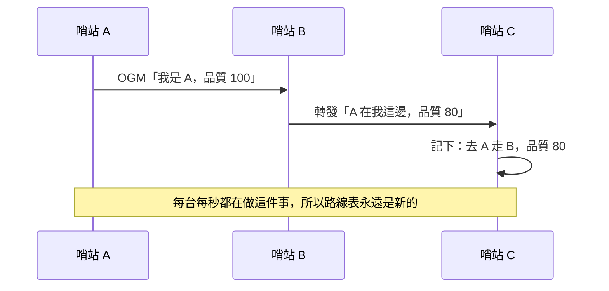
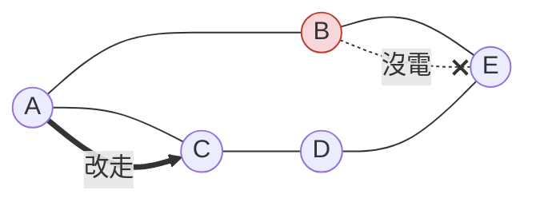
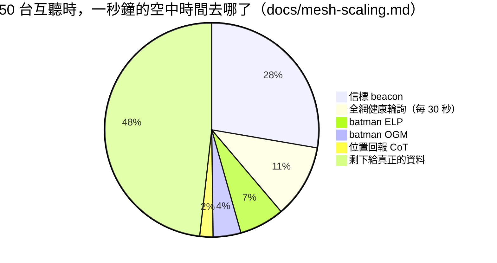

# 第 4 週 — 哨站怎麼接力（mesh 與自癒）

> 核心問題：**沒有總機，路是誰決定的？一個範圍裡塞得下幾台？**
> 這週講第 ② 層，並用一道高中數學算出「幾台會塞滿」。

## 5 分鐘 — 回顧 + 情境

回顧：SNR ≥ 25 才可靠；選點看視線。
情境：現在有五台哨站散在山坡上，A 要把訊息送到 E，中間要經過誰？B 突然沒電了怎麼辦？

## 12 分鐘 — batman-adv：每台裡的「送信大腦」

名字來源：B.A.T.M.A.N. = Better Approach To Mobile Ad-hoc Networking，德國 Freifunk 社群做的（`事實`），跟蝙蝠俠無關，但這個 repo 就用它命名。

### 每台每秒喊一次「我在這裡」



- **OGM**（originator message）：「我是誰、透過我到我的品質多好」。每台每秒發一次，鄰居再轉發。
- 每台自己算：「去 X 最好走誰」。**沒有中央路由器。**
- **自癒**：B 沒電 → 幾秒內 C 收不到「經由 B 到 A」的更新 → 自動改走別條。



### 廣播風暴：接力的副作用

「喊話」如果被兩台互相轉來轉去，會無限繁殖塞爆全網（**廣播風暴**）。
專案的對策（`事實`）：batman-adv 內建 **BLA（bridge loop avoidance）**，第一版路線圖把「確認 BLA 有沒有開」列為最急的引信（issue #10），後來確認已開啟。

### 一個範圍塞得下幾台？（高中數學）

專案量到的數字（`docs/mesh-scaling.md`，`事實`）：

| 東西 | 每一個要佔多少「空中時間」 | 多常發 |
|---|---|---|
| **信標（beacon）**「我是這個網的成員」 | 5,680 µs | 每台 0.92 次/秒 |
| OGM（路線廣播） | 833 µs | 每台 1 次/秒 |
| ELP（鄰居探測） | 684 µs | 每台 2 次/秒 |
| 一個 1400 位元組的資料封包 | 1,012 µs | 看你傳多少 |

一秒只有 1,000,000 µs，而且無線電是**大家共用同一個空中頻道，一次只能一台講話**。

> **算算看：** n 台互相聽得到，只算三種控制訊息，每秒佔多少 µs？
> n × (5680×0.92 + 833×1 + 684×2) = n × 7,427 µs
> 如果規定「控制訊息最多佔一半」（500,000 µs），n 最多約 = 500,000 ÷ 7,427 ≈ **67**。
> 專案的模型算出來是 **54**（它還扣了無線電實際只能用約 85% 的時間，以及碰撞）。



結論（`事實`）：**一個信標的時間 = 5.6 個滿載資料封包。** 最貴的不是傳資料，是「大家一直說我在這裡」。
這也是為什麼 issue #40 在問：信標間隔要不要拉長？

> 注意「一個範圍」的意思：這是**互相聽得到的一群**的上限，不是整個網的上限。網可以延伸幾公里、上百台，只要任何一台聽到的鄰居不超過這個數。

## 8 分鐘 — 思考題 / AI 動手題

**思考題**
1. 如果信標間隔從 1 秒改成 5 秒，上面的 n 會變多少？代價是什麼？（提示：新來的哨站要等多久才知道這個網存在？）
2. 「每台自己算路線」和「一個總機幫大家算」各有什麼好壞？災難現場你選哪個？

**AI 動手題**
1. 在筆電上跑專案的模型（要有 Python 3；沒有就把整個 `scripts/mesh-scale-model.py` 貼給 AI 請它模擬執行）：
   ```
   python3 scripts/mesh-scale-model.py
   python3 scripts/mesh-scale-model.py --beacon-int 5000 --poll 30
   ```
   把兩次的表格差異寫進筆記。
2. 貼給 AI：
   ```
   下面是一個網狀網路的空中時間模型（附程式）。請用高中生能懂的方式解釋：
   為什麼 beacon 佔比最大？把 beacon 間隔拉長會有什麼壞處？請分開標示哪些是
   程式裡的事實、哪些是你的推論。
   ```
   （貼上程式碼）

**上機版（只讀）**
- `batctl n`：看得到鄰居列表和「上次聽到是幾秒前」。
- `batctl o`：每一台「去哪裡走誰」的路線表。

## 5 分鐘 — 筆記

- OGM 是 ___，每台每秒 ___。
- 自癒的意思是 ___。
- 我算出一個範圍大約塞 ___ 台；模型算 ___ 台，差在 ___。
- 一個問題：___

## 這週碰到的學門

`資訊工程（網路、分散式系統）`、`數學（比例、時間預算）`、`統計（碰撞、丟包）`。

---
← [week3.md](week3.md) · [README.md](README.md) · [week5.md](week5.md) →
