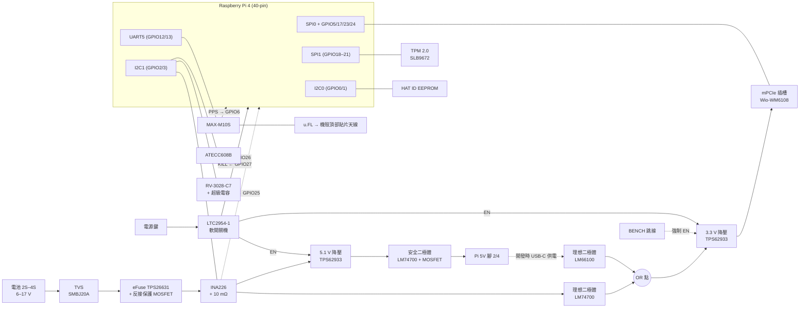

# Batman HAT v1:取代 Seeed WM1302 Pi HAT 的自製 HAT(規格草案)

狀態:**DRAFT v1**(2026-09-27)。適用主機:**Raspberry Pi 4**(過渡版;CM4 自製底板是下一步)。
相關單:#47(資料加密 / 安全元件)、#13(裝置 PKI)、#122(電池看門狗 / 安全關機)、#91(電源與散熱)、#92(TW 頻段)、#174(時間)、#181(HaLow+LoRa 共站)。

> 標記慣例:**【事實】** = 本專案實測、原始碼或規格書可查證;**【推論】** = 由事實推出、尚未實測;**【決策】** = 本文提出、待 review 拍板。

---

## 0. 一句話

**保留 Wio-WM6108(HaLow)不動,把安全晶片、時鐘、GNSS、電源管理做進自己的 HAT,並拿掉現有 HAT 上的中國料件**,讓現有 Pi 4 節點先成為「安全機制的練兵平台」,練到的東西直接帶到 CM4 底板。

## 1. 為什麼要自己做 HAT

| # | 問題 | 可信度 |
|---|---|---|
| P1 | Seeed WM1302 Pi HAT 電路圖上有 **ATECC608B-TNGLORAS-G(U3)**,但實際出貨的板子**沒有焊**(DNP)→ 現有節點上沒有任何安全元件 | 【事實】電路圖 `WM1302_Pi_Hat_v1.0.pdf` + 實板 |
| P2 | 現有 HAT 上有中國料件:**Quectel L76KB**(GNSS)、**CJ3407 / CJ2302**(長電科技 JCET 的 MOSFET) | 【事實】電路圖料號 |
| P3 | 該 HAT 是為 **SX1302 LoRa 網關**設計的,把 GPIO18、GPIO6、GPIO25、GPIO12、UART0 都接給了 LoRa / GPS,佔掉我們想用的腳 | 【事實】電路圖網路名稱 |
| P4 | 沒有 RTC、沒有電量量測、沒有軟開關機 → #122 安全關機、#174 時間都缺硬體 | 【事實】 |
| P5 | Wio-WM6108 目前**換不掉**(軟體、BCF、`SPI_NO_CS` 修正都綁在它身上) | 【決策】沿用 |

## 2. 範圍

| 放上 HAT | 不放(理由見 §8) |
|---|---|
| mPCIe 插槽(Wio-WM6108,腳位照舊) | PTT 音訊(CM108B) |
| **TPM 2.0:Infineon SLB9672** | LoRa |
| **ATECC608B**(或同腳位 608C) | |
| RTC:Micro Crystal RV-3028-C7 | |
| GNSS:u-blox MAX-M10S(天線用 u.FL 外拉) | |
| 電源:電池輸入、eFuse、5 V 降壓、INA226、LTC2954 軟開關機 | |
| HAT ID EEPROM | |

## 3. 方塊圖



## 4. GPIO 分配

### 4.1 HaLow 部分:照舊,一支都不動

來源:本 repo `docs/hardware.md` 的裝置樹節點(= OpenMANET `mm610x-spi.dtbo`)【事實】,對照 Seeed HAT 電路圖的 mPCIe 接線【事實】。

| 功能 | Pi GPIO | mPCIe 腳 | Seeed HAT 上的網路名稱 |
|---|---|---|---|
| SPI CS | GPIO8(CE0) | 51 | SX1302_CSN |
| SPI MOSI / MISO / SCLK | GPIO10 / 9 / 11 | 49 / 47 / 45 | SPI_MOSI / MISO / SCK |
| reset | GPIO17 | 22 | SX1302_RESET |
| IRQ | GPIO5 | 10 | SX1262_RESET |
| wake(power-gpios[0]) | GPIO23 | 33 | SX1262_IO1 |
| busy(power-gpios[1]) | GPIO24 | 31 | SX1262_IO2 |

**已用 Wio-WM6108 V30 電路圖(`Wi-Fi_Halow_FGH100M_MINI_PCIE` Rev 1.0,2024-11-07)逐腳確認**【事實】:

| mPCIe 腳 | 卡片上的網路 | 卡片內部接到 | 新 HAT 接法 |
|---|---|---|---|
| 45 / 47 / 49 / 51 | PCM_CLK / DOUT / DIN / SYNC | SPI SCK / MISO / MOSI / CS(22 Ω、0 Ω 串聯) | GPIO11 / 9 / 10 / 8 |
| 10 | UIM_DATA → MOD_INT | FGH100M 的 SPI_INT(0 Ω) | GPIO5 |
| 22 | PERST_N → MOD_RESET | FGH100M 的 RESET_N(0 Ω) | GPIO17 |
| 31 | MOD_BUSY | **R17 = DNP,卡上沒接通** | GPIO24(照接,相容驅動設定) |
| 33 | MOD_WAKEUP_IN | **R10 = DNP,卡上沒接通**(WAKEUP_IN 由 R9 10 kΩ 上拉) | GPIO23(照接,相容驅動設定) |
| 2 / 24 / 39 / 41 / 52 | VCC_3V3 / NC15 / VCC_3V3A/B/D | 全部接到 PCIE_3V3 | **全部接 3.3 V 降壓輸出** |
| 8(Seeed 接 GPIO18) | UIM_PWR | **未連接(×)** | **不接 → GPIO18 給 TPM** ✅ |
| 25(Seeed 接 GPIO6) | NC9/UART1_CTS | 未連接(×) | 不接 |
| 19(Seeed 接 1PPS) | NC8 | 未連接(×) | 不接 |
| 30 / 32(I2C) | UIM_CLK / UIM_RESET 區 | 未連接(×) | 不接 |
| 36 / 38 | USB_D− / USB_D+ | 未連接(×) | 不接 |

因此原本規劃的「各留一顆 0 Ω 跳線」**取消**,這些腳直接不拉線,省面積【決策】。

**電源注意**:卡片上有一顆 TI TPS613222A 升壓,把 3.3 V 升到 5 V 給 FGH100M 的射頻前端(VDD_FEM)【事實】→ HaLow 發射時的峰值電流全部從 3.3 V 抽,所以 3.3 V 降壓維持 **3 A 等級**,並在插座旁放大電容【推論】。

### 4.2 新增功能

| 功能 | Pi GPIO | 備註 |
|---|---|---|
| **TPM**:SPI1 CE0 / MISO / MOSI / SCLK | GPIO18 / 19 / 20 / 21 | **不與 HaLow 共用 SPI0**;只開 SPI1 的 CE0,GPIO17(SPI1 CE1)不開,避免撞 HaLow reset |
| TPM RST | GPIO4 | GPIO4 原本是 EKH01 的 JTAG 腳,mPCIe 卡沒有接【事實】 |
| TPM PIRQ | GPIO22 | 避開 GPIO24(LetsTrust 等現成 TPM 板會撞到 HaLow busy)【事實】 |
| I2C1 SDA / SCL | GPIO2 / 3 | INA226 `0x40`、RV-3028 `0x52`、ATECC608B(位址依版本,見 §5.2) |
| HAT ID EEPROM | GPIO0 / 1(I2C0) | HAT 規範保留腳,EEPROM `0x50` |
| GNSS UART5 TX / RX | GPIO12 / 13 | **UART0(GPIO14/15)保留給序列除錯台**(#61) |
| GNSS PPS | GPIO6 | 給 chrony / gpsd 校時(#174) |
| LTC2954 INT(使用者按下關機) | GPIO26 | `gpio-shutdown` |
| LTC2954 KILL(Linux 關好了、可斷電) | GPIO27 | `gpio-poweroff` |
| INA226 ALERT(低電壓硬體告警) | GPIO25 | 對應 #122 |
| **剩餘** | GPIO7、16 | 預留(面板 LED、按鍵) |

## 5. 各區塊設計要點

### 5.1 TPM 2.0 — Infineon SLB9672
- 規格:TPM 2.0、SPI;**FIPS 140-2 Level 2、CC EAL4+**【事實,依 pi3g / Infineon 說明,搜尋結果】;與 SLB9670 腳位相容,SLB9672 第 6 腳為 NC【事實,同上】。
- 用途:#47 LUKS 金鑰封存(`systemd-cryptenroll` / clevis)、#13 裝置金鑰不可匯出、PKCS#11(`tpm2-pkcs11`)。
- 限制:Pi 沒有量測開機,**PCR 封存的保護有限**【事實,見 `docs/productization.md`】;要擋「換系統取金鑰」需搭配 Pi 4 簽章開機。
- 電路:3.3 V、去耦依規格書;RST 接 GPIO4(另加上拉);PIRQ 接 GPIO22。

### 5.2 ATECC608B
- 用途:便宜的第二把身分金鑰(ECC P-256)、練 C 系列(沒有 TPM 的 SKU)的身分流程。
- **型號**:選 **TrustFLEX(`-TFLXTLS`)**,設定可自訂;**不要 TNG(Trust&GO)系列**,出廠已鎖設定,只剩少數 slot 可寫【事實,ATECC608B-TNGLoRaWAN 規格書】。
  - ATECC608C 同腳位、正在取代 B 版【推論,搜尋結果】;兩者擇一,電路不用改。
- I2C 位址依版本不同(未設定出廠 `0x60`,TrustFLEX / TNG 各有預設值)→ **焊上後以 `i2cdetect -y 1` 實測為準**。
- 封裝建議 **SOIC-8**(手工重工容易),不用 UDFN。

### 5.3 RTC — RV-3028-C7
- Micro Crystal(瑞士),3.2×1.5 mm,待機約 45 nA,內建備援切換與涓流充電【事實,規格書摘要】。
- 備援電源用超級電容(Seiko CPH3225A,日本),**不用鈕扣電池**(空運與更換問題)【決策】。
- CM4 本身沒有 RTC【事實】,這顆在 CM4 底板一樣會用到 → 現在就是驗證。

### 5.4 GNSS — u-blox MAX-M10S
- 9.7×10.1×2.5 mm【搜尋結果】,UART5 + PPS。
- 天線:**u.FL(Hirose,日本)外拉到機殼頂部的貼片天線**;HAT 在機殼內的方向不一定朝天,不在 HAT 上放貼片【決策】。
- 取代 Quectel L76KB(中國)。

### 5.5 電源

HAT 上的電源模組由下面 9 個部分組成(依電流流過的順序):

| # | 部分 | 做什麼(白話) | 建議料件 |
|---|---|---|---|
| 1 | 電池輸入座 | 電池線插這裡;有防呆,插不反 | Molex Micro-Fit 3.0 2-pin(美國) |
| 2 | TVS 突波保護 | 吸收插拔電池、靜電造成的瞬間高壓 | **Littelfuse SMBJ20A**(美國) |
| 3+4 | **eFuse 電子保險絲 + 反接保護** | 短路 / 過流自動切斷、可恢復;電壓過低或過高切斷;**正負接反也不會燒** | **TI TPS26631RGE** + 外接 N-MOSFET(美國) |
| 5 | 電量量測 | 量電池電壓和整台耗電 → 算剩餘電量;電壓過低時 ALERT 腳直接通知 Pi(#122) | **TI INA226** + **Vishay WSL2512 10 mΩ**(美國) |
| 6 | 5 V 降壓 | 把 6–17 V 降成 5.1 V 給 Pi 4 | **TI TPS62933**(美國) |
| 7 | 5 V 安全二極體 | Pi 的 USB-C 同時插電時,防止兩邊電源互灌 | **TI LM74700-Q1** + N-MOSFET(美國) |
| 8 | 3.3 V 降壓 | 專給 HaLow 卡,不跟 Pi 搶電 | **TI TPS62933**(美國,與 #6 同一顆) |
| 9 | 軟開關機 | 按電源鍵 → 先通知 Linux 關機 → 關好才斷電,避免 SD 卡損壞 | **ADI LTC2954-1**(美國) |

#### 5.5.1 選型理由

| 料件 | 關鍵規格 | 為什麼選它 | 可信度 |
|---|---|---|---|
| **TPS26631** eFuse | 4.5–60 V、6 A、內建 31 mΩ FET;可程式 UVLO / OVP / 過流;**帶 B-FET 驅動,外接一顆 N-MOSFET 即可做反接保護與逆流阻擋**;VQFN-24(RGE)| ① 60 V 耐壓 → 4S 滿電 16.8 V 加 TVS 箝位(約 32 V)都安全;② 一顆同時做保險絲 + 反接保護,**省掉原本規劃的輸入端 LM74700**;③ `-1` 版是「主動限流」(另有 `-0` 斷路器型、`-2/-3` 多了功率限制,本案用不到) | 規格【事實,TI 規格書摘要】;單價 ~4.8 美元起【搜尋結果】 |
| **TPS62933** 降壓 ×2 | 3.8–30 V 輸入、3 A、0.8–22 V 輸出、SOT583(1.6×2.1 mm);**最大工作週期 98%,低壓時自動降頻撐住輸出** | ① **5 V 與 3.3 V 用同一顆**,BOM 只多一種料;② 98% 工作週期 → 2S 電池放到 6.0 V 時仍可輸出 5.1 V(6.0 × 0.98 ≈ 5.9 V,扣線路壓降仍有餘裕);③ 3 A 對 Pi 4 足夠(官方要求背灌電源 ≥ 2.5 A) | 規格【事實,TI 規格書摘要】;2S 低電壓餘裕【推論,待實測】 |
| **LM74700-Q1** 安全二極體 | 3.2–65 V、搭配外接 N-MOSFET,順向壓降約 20 mV;SOT-23-6 | Pi 4 **沒有**內建 5 V 輸入理想二極體,**Raspberry Pi HAT 設計指南要求**背灌供電的 HAT 自己加安全二極體【事實】;原規劃的 LM66100 只能過 1.5 A,不夠【推論,依其規格】 | 規格【事實,TI】;單價約 0.7–1.3 美元【搜尋結果】 |
| **INA226** | 16-bit、I2C、0–36 V 匯流排電壓;**ALERT 腳**可設低電壓門檻 | 本專案既有設計(`docs/hardware.md`、#122 軟體已寫好);ALERT 接 GPIO25 → 就算 Linux 忙,低電量也能硬體通知 | 【事實,既有決策】 |
| **LTC2954-1** | 2.7–26.4 V、靜態電流 6 µA;`-1` 版 EN 為**高態有效**開汲極輸出 | `-1` 的 EN 可直接接 TPS62933 的 EN(高態致能);`-2` 是低態有效、用來推 P-MOSFET,本案用不到 | 【事實,ADI 規格書摘要】 |

#### 5.5.2 設計細節

- **兩顆 TPS62933 都從 INA226 之後的電池電壓取電**(不是 3.3 V 從 5 V 再降):5 V 那顆只負責 Pi,3 A 餘裕較大【決策】。
- 3.3 V 那顆在 mPCIe 插座旁加大電容(≥ 2 × 47 µF 陶瓷 + 1 顆 220 µF 聚合物),吃 HaLow 卡內部升壓給功放時的電流尖峰(卡上 TI TPS613222A,§4.1)【推論,容值待依實測調整】。
- 兩顆降壓的 EN 都接 LTC2954-1 的 EN → 按鍵關機時 HaLow 與 Pi 一起斷電。
- INA226 ALERT → **GPIO25**(用掉一支預留腳),預設門檻 2S = 6.4 V(3.2 V/cell)、4S = 12.8 V,與 #122 軟體門檻一致後再定【決策,數值待定】。
- TPS62933 有 `F`(強制 PWM)與 `O` / `P` 變體;先選基本款(輕載自動省電),若 HaLow 收訊受切換雜訊影響再換 `F` 版比較【推論】。
- MOSFET(反接保護、安全二極體各一顆):30 V 以上、≤ 10 mΩ、小型功率封裝;廠商限 **onsemi / Vishay(美國)、Infineon(德國)**,**不用 Nexperia**(§5.8)。型號在畫電路圖時依電流與封裝定。
- 電感與電容:電感用 Coilcraft XAL 系列(美國),陶瓷電容用 Murata / TDK(日本);值依 TI 規格書的設計公式計算。
- **3.3 V 降壓的輸入是「電池」與「Pi 5 V」二選一(OR 接法)**:電池經 LM74700、Pi 5 V 經 LM66100(TI,1.5 A,本路約 1 A)各自進 OR 點,誰電壓高誰供電;LTC2954 的電源也接 OR 點。這樣只插 Pi 的 USB-C 時 HaLow 卡仍有電(見 §5.5.3)【決策】。
- TPM、ATECC608B、RTC、GNSS 的 3.3 V 取自 **Pi 的 3.3 V**(合計約 80 mA)【推論】,不接 HaLow 的 3.3 V,避免發射時的雜訊干擾。

**不在 HAT 上**:電池充電、電芯保護板(BMS)、主保險絲。這些都在**電池包裡**,拔下來的電池包本身也有保護【事實,`docs/hardware.md` Power chain 的既有決策】。

- **輸入 6–17 V**(2S 到 4S 都吃)【決策】:對上 V3 外殼的 2S2P、`power-wiring.svg` 的 4S、V4 外殼的 2S 18650。
- 路徑:電池 → TVS → eFuse(含反接保護)→ INA226(高側,量整台電流含降壓損耗)→ 分成兩路:5.1 V 降壓 → 安全二極體 → Pi 5 V 腳;3.3 V 降壓 → mPCIe(細節見 §5.5.1–5.5.2)。
  - mPCIe 的 3.3 V **不從 Pi 的 3.3 V 取電**(HaLow 發射峰值 + 本專案 TX 欠壓歷史)【決策】。
- **LTC2954**:電源鍵按下 → INT 通知 Linux 關機 → Linux 關好後拉 KILL → 關掉降壓 EN。對上 #122(低電量安全關機)與 `power-wiring.svg` 的「開關走 EN、不走主電流」。
- INA226 **放在 HAT(本體側)**,I2C 不穿過電池接頭【事實,`docs/hardware.md` Power chain 的既有決策】。

#### 5.5.3 供電模式

| 模式 | 怎麼接 | Pi | HaLow 卡 | TPM / RTC / GNSS | 軟開關機 | 用途 |
|---|---|---|---|---|---|---|
| **野外** | 電池 → HAT 電池座 | ✅ HAT 供電 | ✅ | ✅ | ✅ | 正式使用 |
| **開發(建議)** | **12 V 變壓器 → HAT 電池座** | ✅ HAT 供電 | ✅ | ✅ | ✅ | 路徑與野外完全相同;接反有保護 |
| 開發(備用) | 只插 Pi 的 USB-C | ✅ USB-C | ✅ 經 OR 點(需插 **BENCH 跳線**,或按電源鍵) | ✅ | ⚠️ 按鍵只能讓 Linux 關機,切不了 USB-C 的電 | 只帶一條線時 |
| 兩者同時 | 電池 + USB-C | ✅ 兩邊電壓高者供電;安全二極體防互灌 | ✅ 由電池供電 | ✅ | ✅ | 充電 / 除錯時不小心都插上 |

注意:
- 只插 USB-C 時,HaLow 發射電流也從 Pi 的 5 V / 3 A 裡分(Pi 4 不支援 USB-PD 升壓)【事實】→ **可能重現本專案既有的 TX 欠壓**【推論】;要測發射相關問題請用 12 V 變壓器模式。
- **軟體必須認得「沒有電池」**:INA226 量到的電池電壓 < 1 V 時視為開發模式,不啟動 #122 的低電量關機,也不設定 ALERT 門檻【決策】。
- 12 V 變壓器建議 ≥ 2 A,DC 頭轉 Micro-Fit 的線材自製一條;因為有反接保護,接錯極性不會燒板【推論】。

### 5.6 測試點與除錯設計(給非硬體背景的除錯者)

原則:**不用拆板、不用焊線,拿三用電表和邏輯分析儀就能量**【決策】。所有測試點旁邊的絲印直接印名字與正常值範圍,例如 `5V (5.05–5.20)`。

**① 電源測試點 + 狀態燈**

| 測試點 | 正常值 | 旁邊的燈 |
|---|---|---|
| `VBAT_IN`(電池進來、反接保護前) | 2S:6.0–8.4 V;4S:12.0–16.8 V | — |
| `VBAT_PROT`(eFuse 之後) | 同上 | eFuse 異常:紅燈 |
| `5V` | 5.05–5.20 V | 綠燈 |
| `3V3_MPCIE`(HaLow 卡電源) | 3.25–3.40 V | 綠燈 |
| `3V3_PI`(Pi 提供的 3.3 V) | 3.25–3.40 V | — |
| `VRTC`(超級電容) | 約 2.5–3.3 V | — |
| `GND` × 至少 4 個(各區各一個) | 0 V | — |

- 電源測試點用**金屬環型測試點**(Keystone 5000 系列,美國),可以直接夾電表夾子。
- 狀態燈每顆耗電約 1–2 mA,留一個跳線,野外使用時可以拔掉省電【推論】。

**② 電流量測跳線**:在 `3V3_MPCIE`(HaLow 卡)和 `5V → Pi` 兩條線上,各串一個 **2-pin 排針 + 短路帽**。平常插著短路帽;要量電流時拔掉短路帽、串接電表,就能看到 HaLow 發射時的電流尖峰(對應本專案 TX 欠壓問題)。

**③ 訊號測試點**(直徑 1.5 mm 圓形焊墊,可放背面):

| 群組 | 測試點 |
|---|---|
| HaLow(SPI0) | SCLK、MOSI、MISO、CS、RESET(GPIO17)、IRQ(GPIO5)、WAKE(GPIO23)、BUSY(GPIO24) |
| TPM(SPI1) | SCLK、MOSI、MISO、CS、RST(GPIO4)、PIRQ(GPIO22) |
| I2C1 | SDA、SCL |
| GNSS | TX、RX(UART5)、PPS |
| 開關機 | LTC2954 的 INT、KILL、EN |

**④ 除錯排針**(2.54 mm,插杜邦線就能用):
- **序列除錯台 UART0**:3-pin(TX / RX / GND),3.3 V 電位。HAT 蓋住了 Pi 的排針,所以要在 HAT 上重新引出;接 USB 轉序列線就能看到開機訊息(#61)。
- **邏輯分析儀排針**:2×5,放 HaLow SPI0 四條線 + IRQ + BUSY + GND。本專案當初 `SPI_NO_CS` 的根因就是靠看 SPI 波形找到的(`docs/root-cause.md`)。

**⑤ 區塊隔離**:TPM、ATECC608B、GNSS、RTC 各自的電源串一顆 0 Ω 電阻。某一區懷疑有問題時,拆掉那顆電阻就能把它整個斷開,其他功能照常運作。

**⑥ 除錯對照表**:板子做出來時一起附上「症狀 → 量哪個點 → 正常值 → 下一步」的對照表(另開文件),讓沒有硬體背景的人也能照著查。

### 5.7 HAT ID EEPROM
- onsemi CAT24C32(美國)。寫入 HAT 識別資料,讓韌體自動套用 overlay(Pi 原生機制);Seeed 版沒有放。

### 5.8 拿掉的中國料件與替代

| 原料件 | 廠商 | 替代 |
|---|---|---|
| L76KB GNSS | Quectel(中國) | u-blox MAX-M10S(瑞士) |
| CJ3407 / CJ2302 MOSFET | 長電科技 JCET(中國) | onsemi / Vishay / Diodes Inc.(美國) |
| MP2161 3.3 V 降壓 | MPS(總部美國,主要營運據點在中國成都)⚠️ | TI TPS62933(美國) |

> ⚠️ **不要用 Nexperia**:總部在荷蘭,但母公司是中國聞泰科技(Wingtech)【事實】。先前討論中曾建議 Nexperia,在此更正。

## 6. 面積預算(HAT 65 × 56.5 mm)

| 項目 | 面積 mm² | 可信度 |
|---|---|---|
| HAT 總面積 | 3,672 | 【事實】 |
| 扣 40-pin 排針帶、4 個固定孔、板邊間距 | −770 | 【推論】 |
| mPCIe 插槽 + 卡片(51 × 30 平躺) | −1,700 | 【推論】 |
| **正面剩餘** | **≈ 1,200** | 【推論】 |
| TPM + ATECC608B | ~80 | 【推論】 |
| RTC + 超級電容 | ~60 | 【推論】 |
| GNSS + u.FL | ~225 | 【推論】 |
| 電源區(輸入座、反接保護、eFuse、兩顆降壓、INA226、LTC2954、OR 接法兩顆理想二極體) | ~430 | 【推論】 |
| ID EEPROM | ~20 | 【推論】 |
| 除錯:電源測試點 ×10、狀態燈 ×3、電流跳線 ×2、UART / 邏輯分析儀排針(訊號測試點放背面) | ~200 | 【推論】 |
| **合計** | **~1,015 → 餘約 185** | 【推論】 |

背面(朝 Pi 的那面)可放高度 ≤ 4 mm 的矮零件作為備援空間【推論,Pi 與 HAT 間距 11 mm,扣 SoC 散熱片】。

## 7. 軟體影響(草案,皆未驗證)

Raspberry Pi OS 先驗證,再移植到 OpenWrt / OpenMANET:

```ini
# config.txt(新增部分;HaLow 原有的 morse-ps / morse-spi 不動)
dtparam=i2c_arm=on
dtoverlay=spi1-1cs            # SPI1 只開 CE0 = GPIO18
dtoverlay=batman-hat-tpm      # 自製:把 slb9670 節點掛到 spi1(官方 tpm-slb9670 綁 spi0 CE1,不能直接用)
dtoverlay=i2c-rtc,rv3028
dtoverlay=uart5               # GPIO12/13
dtoverlay=pps-gpio,gpiopin=6
dtoverlay=gpio-shutdown,gpio_pin=26
dtoverlay=gpio-poweroff,gpiopin=27
```

自製 TPM overlay 草稿(**未編譯、未上機**):

```dts
/dts-v1/;
/plugin/;
/ {
    compatible = "brcm,bcm2711";
    fragment@0 {
        target = <&spi1>;
        __overlay__ {
            #address-cells = <1>;
            #size-cells = <0>;
            status = "okay";
            tpm@0 {
                compatible = "infineon,slb9670";   /* SLB9672 沿用同一 compatible */
                reg = <0>;                         /* spi1 CE0 = GPIO18 */
                spi-max-frequency = <32000000>;
                interrupt-parent = <&gpio>;
                interrupts = <22 8>;               /* PIRQ GPIO22, level low */
                reset-gpios = <&gpio 4 1>;         /* RST GPIO4, active low */
            };
        };
    };
};
```

OpenWrt 端需要的核心模組 / 套件(**官方 feed 是否齊全待確認**):TPM SPI(`CONFIG_TCG_TIS_SPI`)、tpm2-tss / tpm2-tools(搜尋只找到第三方套件庫)、PPS GPIO、RV-3028 RTC、gpsd、chrony、cryptoauthlib。

## 8. 不放上 HAT 的項目

| 項目 | 理由 | 可信度 |
|---|---|---|
| **PTT 音訊** | Pi 4 的 USB 不在 40-pin 上 → CM108B 要一條 USB 線接回 Pi;改用 I2S 會撞 TPM 的 SPI1(GPIO18–21),且 openmanetd 只認 OpenVLM 的 USB-HID PTT | 【事實】腳位;【推論】取捨 |
| **LoRa** | ① 面積約 800 mm² > 剩餘 470;② #181 實測 LoRa 發射讓本機 HaLow 吞吐掉 50–96%(兩板分開時),同板緊貼只會更糟;③ 已無空 UART | ①【推論】②【事實】③【事實】 |

兩者都等 CM4 底板(面積較大、USB 可直接走線、可做屏蔽)再整合。

## 9. 風險與待驗證

| # | 項目 | 驗證方式 |
|---|---|---|
| V1 | ~~mPCIe 第 8/25/19/30/32/36/38 腳在 WM6108 上是否真的沒用到~~ | ✅ 已用 Wio-WM6108 V30 電路圖確認:全部未連接(§4.1) |
| V2 | SPI1 上 TPM 與 SPI0 上 HaLow 同時運作無干擾 | 上機:HaLow iperf 滿載 + `tpm2_getrandom` 迴圈 |
| V3 | 自製 TPM overlay 能被 `tpm_tis_spi` 綁定 | `ls /dev/tpm0`、`tpm2_getcap properties-fixed` |
| V4 | ATECC608B I2C 位址與其他 I2C 裝置不衝突 | `i2cdetect -y 1` |
| V5 | 5 V 降壓 + 理想二極體在 HaLow 27 dBm 發射時不欠壓 | `vcgencmd get_throttled` + INA226 記錄 |
| V6 | 降壓晶片發熱對 HaLow 卡的影響 | 密閉機殼內熱像 / 溫度記錄(#91) |
| V7 | GNSS 天線經 u.FL 外拉的收星效果 | `ubxtool` / gpsd 衛星數與 C/N0 |
| V8 | OpenWrt 映像檔需要的核心模組與套件 | 在 OpenMANET build 裡開啟並打包 |

## 10. 需要的外部資料(本環境網路代理擋住,需人工下載放進 repo)

- ~~Wio-WM6108 V30 電路圖~~(已由使用者提供,§4.1 已對照)
- Infineon SLB9672 規格書與參考電路
- u-blox MAX-M10S 整合手冊(天線 / 偏壓設計)
- Micro Crystal RV-3028-C7 規格書
- Microchip ATECC608B-TFLXTLS(或 608C)規格書
- ADI LTC2954、TI 各顆電源晶片規格書

## 11. BOM 粗估(每片,打樣 10 片量級,美元)

| 區塊 | 料件 | 廠商(國家) | 數量 | 單價 | 可信度 |
|---|---|---|---|---|---|
| HaLow | mPCIe 52-pin 插槽 + 卡片固定柱 | TE / Amphenol(美國) | 1 | ~2 | 【推論】 |
| HaLow | Wio-WM6108(沿用現有) | Seeed / Quectel(中國)⚠️ | — | 已有 | 【事實】 |
| 安全 | Infineon SLB9672 | Infineon(德國) | 1 | ~4 | 【推論】 |
| 安全 | ATECC608B-TFLXTLS(SOIC-8) | Microchip(美國) | 1 | ~1 | 【推論】 |
| 時鐘 | RV-3028-C7 + CPH3225A 超級電容 | Micro Crystal(瑞士)/ Seiko(日本) | 1+1 | ~3.5 | 【推論】 |
| GNSS | MAX-M10S | u-blox(瑞士) | 1 | 11.4 | 【搜尋結果,DigiKey】 |
| GNSS | U.FL-R-SMT-1 | Hirose(日本) | 1 | ~0.5 | 【推論】 |
| 電源 | TPS26631(~4.8)、TPS62933 ×2、LM74700-Q1 ×2、LM66100、INA226、WSL2512 10 mΩ、SMBJ20A、MOSFET ×3、電感 ×2、電容、BENCH 跳線 | TI / Vishay / Littelfuse / onsemi(美國)、Coilcraft(美國)、Murata(日本) | — | ~18 | 【推論;TPS26631 單價為搜尋結果】 |
| 電源 | LTC2954 | ADI(美國) | 1 | ~3 | 【推論】 |
| 電源 | 電池輸入座 Micro-Fit 2-pin、按鍵 / LED 座 JST-SH | Molex(美國)/ JST(日本) | 1+1 | ~1.5 | 【推論】 |
| 其他 | CAT24C32 EEPROM、40-pin 母座、M2.5×11 銅柱 | onsemi / Samtec(美國) | — | ~3 | 【推論】 |
| PCB | 4 層 65 × 56.5 mm,台灣板廠 | 台灣 | 1 | ~5 | 【推論】 |
| **合計(不含 WM6108、貼片加工)** | | | | **≈ 50–60** | 【推論】 |

打樣時的貼片加工費另計,小量每片可能 NT$ 數千(【推論】)。

## 12. 與 CM4 底板的關係

這塊 HAT 是 **CM4 自製底板的電路驗證板**:TPM、ATECC608B、RTC、GNSS、電源管理的電路與軟體,驗證後原封不動搬到 CM4 底板;只有 HaLow(之後換 AzureWave AW-HM593)、PTT、LoRa 是 CM4 底板才新增的區塊。
