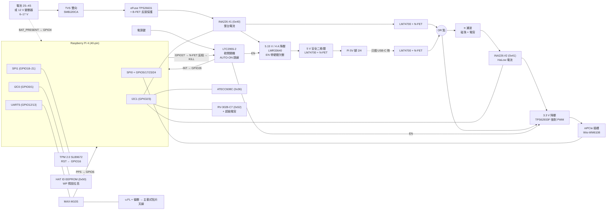

# Batman HAT v1:取代 Seeed WM1302 Pi HAT 的自製 HAT(規格草案)

狀態:**DRAFT v2**(2026-09-27;v1 經三份對抗式審查後修訂,修訂對照見 §13)。適用主機:**Raspberry Pi 4**(過渡版;CM4 自製底板是下一步)。
相關單:#47(資料加密 / 安全元件)、#13(裝置 PKI)、#122(電池看門狗 / 安全關機)、#91(電源與散熱)、#92(TW 頻段)、#105 / #137(序列埠登入鎖)、#174(時間)、#181(HaLow+LoRa 共站)。

> 標記慣例:**【事實】** = 本專案實測、原始碼或規格書可查證;**【推論】** = 由事實推出、尚未實測;**【決策】** = 本文提出、待 review 拍板;**【待量測】** = 要實物量過才能定。

---

## 0. 一句話

**保留 Wio-WM6108(HaLow)不動,把安全晶片、時鐘、GNSS、電源管理做進自己的 HAT,並拿掉現有 HAT 上的中國料件**,讓現有 Pi 4 節點先成為「安全機制的練兵平台」,練到的東西直接帶到 CM4 底板。

## 1. 為什麼要自己做 HAT

| # | 問題 | 可信度 |
|---|---|---|
| P1 | Seeed WM1302 Pi HAT 電路圖上有 **ATECC608B-TNGLORAS-G(U3)**,但實際出貨的板子**沒有焊**(DNP)→ 現有節點上沒有任何安全元件 | 【事實】電路圖 `WM1302_Pi_Hat_v1.0.pdf` + 實板 |
| P2 | 現有 HAT 上有中國料件:**Quectel L76KB**(GNSS)、**CJ3407 / CJ2302**(長晶科技 JSCJ,長電 JCET 分拆) | 【事實】電路圖料號 |
| P3 | 該 HAT 是為 **SX1302 LoRa 網關**設計的,把 GPIO18、GPIO6、GPIO25、GPIO12、UART0 都接給了 LoRa / GPS | 【事實】電路圖網路名稱 |
| P4 | 沒有 RTC、沒有電量量測、沒有軟開關機 → #122 安全關機、#174 時間都缺硬體 | 【事實】 |
| P5 | Wio-WM6108 目前**換不掉**(軟體、BCF、`SPI_NO_CS` 修正都綁在它身上) | 【決策】沿用 |

## 2. 範圍

| 放上 HAT | 不放(理由見 §8) |
|---|---|
| mPCIe 插槽(Wio-WM6108,腳位照舊) | PTT 音訊(CM108B) |
| **TPM 2.0:Infineon SLB9672** | LoRa |
| **ATECC608C-TFLXTLS**(與 608B 同腳位,見 §5.2) | |
| RTC:Micro Crystal RV-3028-C7 | |
| GNSS:u-blox MAX-M10S(主動式天線經 u.FL 外拉) | |
| 電源:電池輸入、eFuse、兩顆降壓、兩顆 INA226、LTC2955 軟開關機 | |
| HAT ID EEPROM(量產時寫入保護) | |

## 3. 方塊圖



(圖中 3.3 V 路徑的 INA226 #2 與 π 濾波畫在 OR 點之後、降壓之前;實際位置以電路圖為準:INA226 #2 的分流電阻要在所有大電容**上游**,§5.5.2。)

## 4. GPIO 分配

### 4.1 HaLow 部分:照舊,一支都不動

**已用 Wio-WM6108 V30 電路圖(`Wi-Fi_Halow_FGH100M_MINI_PCIE` Rev 1.0,2024-11-07)逐腳確認**【事實】:

| mPCIe 腳 | 卡片上的網路 | 卡片內部接到 | 新 HAT 接法 |
|---|---|---|---|
| 45 / 47 / 49 / 51 | PCM_CLK / DOUT / DIN / SYNC | SPI SCK / MISO / MOSI / CS(22 Ω、0 Ω 串聯) | GPIO11 / 9 / 10 / 8 |
| 10 | UIM_DATA → MOD_INT | FGH100M 的 SPI_INT(0 Ω) | GPIO5 |
| 22 | PERST_N → MOD_RESET | FGH100M 的 RESET_N(0 Ω) | GPIO17 |
| 31 | MOD_BUSY | **R17 = DNP,卡上沒接通** | GPIO24(照接,相容驅動設定) |
| 33 | MOD_WAKEUP_IN | **R10 = DNP,卡上沒接通**(WAKEUP_IN 由 R9 10 kΩ 上拉) | GPIO23(照接,相容驅動設定) |
| 2 / 24 / 39 / 41 / 52 | VCC_3V3 / NC15 / VCC_3V3A/B/D | 全部接到 PCIE_3V3 | **全部接 3.3 V 降壓輸出** |
| 8(Seeed 接 GPIO18) | UIM_PWR | **未連接(×)** | **不接 → GPIO18 給 TPM** ✅ |
| 25 / 19 / 30 / 32 / 36 / 38 | NC / UIM / USB | 未連接(×) | 不接 |

**電源注意**:卡片上有一顆 TI TPS613222A 升壓,把 3.3 V 升到 5 V 給 FGH100M 的射頻前端(VDD_FEM)【事實】→ HaLow 發射時的峰值電流全部從 3.3 V 抽。

### 4.2 全部 GPIO 一覽(v2)

| GPIO | 用途 | 備註 |
|---|---|---|
| 0 / 1 | I2C0:HAT ID EEPROM | HAT 規範保留 |
| 2 / 3 | I2C1:INA226 #1 `0x40`、INA226 #2 `0x41`、RV-3028 `0x52`、ATECC608C-TFLXTLS `0x36` | 位址不衝突【事實,審查者核對】 |
| **4** | **BAT_PRESENT**(低 = 有電池 / 變壓器) | GPIO4 開機預設上拉,正好配開汲極偵測【事實,BCM2711 預設】 |
| 5 | HaLow IRQ | 不動 |
| 6 | GNSS PPS | |
| 7 | **不可用**:底層裝置樹把它當 SPI0 CE1 佔住 | 【事實,`docs/hardware.md`】 |
| 8–11 | HaLow SPI0 | 不動 |
| 12 / 13 | UART5 → GNSS | |
| 14 / 15 | UART0 序列除錯台 | 引到 Tag-Connect 焊墊,量產不裝(§5.6) |
| **16** | **TPM RST** | GPIO16 開機預設**下拉** → 每次 SoC 重置都會把 TPM 一起按住重置,由 overlay 的 `gpio-hog` 釋放【決策,依審查】 |
| 17 | HaLow reset | 不動 |
| 18 / 19 / 20 / 21 | SPI1:TPM CS / MISO / MOSI / SCLK | CS 用 `cs-gpios`,見 §7 |
| 22 | TPM PIRQ | 外加上拉;**先不開中斷,用輪詢**(§7) |
| 23 / 24 | HaLow wake / busy | 不動 |
| 25 | INA226 ALERT(兩顆共用,開汲極) | 外加上拉至 Pi 3.3 V |
| 26 | LTC2955 INT(按鍵要求關機) | |
| 27 | 軟關機:驅動 N-FET 把 LTC2955 KILL 拉低 | 見 §5.5.3 |
| — | **沒有剩餘 GPIO** | 之後要加功能得改走 I2C 擴充 |

## 5. 各區塊設計要點

### 5.1 TPM 2.0 — Infineon SLB9672

- 規格:TPM 2.0、SPI;**FIPS 140-2 Level 2、CC EAL4+**【事實,依 pi3g / Infineon 說明,搜尋結果】;與 SLB9670 腳位相容。
- 接 SPI1(GPIO18–21),**不與 HaLow 共用 SPI0**。這是為了避開 SPI0 CE1(GPIO7 已被佔)與 morse 驅動的 `SPI_NO_CS` 特殊時序,**不是資安措施**【決策】。
- **RST 接 GPIO16**:開機預設下拉 → Pi 每次重置 TPM 都跟著重置,開機後由 `gpio-hog` 拉高釋放。Linux 的 `tpm_tis_spi` **不處理** `reset-gpios`【事實,審查者讀驅動原始碼】,所以不能靠它。
- **資安限制(重要)**:TPM 在可拆的 HAT 上 → 攻擊者把 HAT 整片移到自己的 Pi 4,因為 Pi 沒有量測開機,PCR 值是固定的,**用 PCR 封存的 LUKS 金鑰照樣解得開**;#13 的「金鑰不可匯出」也只代表拿不走,**不代表綁定這台節點**【推論,標準攻擊手法】。對策:
  1. LUKS 金鑰 = KDF(TPM 封存的秘密, **Pi 4 OTP 裡的裝置私鑰**);Pi 4 簽章開機鎖定後,只有簽過的映像檔讀得到 OTP 私鑰 → 只偷 HAT 或只偷 SD 卡都解不開【決策;Pi 4 OTP 私鑰功能依 Raspberry Pi 文件,待確認細節】。
  2. unseal 一律用**加密 / salted session**(防 SPI 匯流排側錄)【決策】。
  3. T 系列可再加 PIN(authValue)【決策】。
  4. **TPM 的 SPI 與 RST 不放任何測試點**(§5.6)。

- **SLB9672 設計細節**(規格書 Rev 1.5,2024-11-17,使用者提供):
  - 型號【事實】:SLB 9672**VU**2.0(−20–85 °C)/ **SLB 9672XU2.0(−40–85 °C,戶外選這顆)**;封裝只有 **PG-UQFN-32(5 × 5 mm,高 ≤ 0.6 mm)**,底部散熱墊接地。
  - 腳位【事實,表 11–13】:SCLK 19、CS# 20、MOSI 21、MISO 24、PIRQ# 18、RST# 17;VDD 1 / 14 / 22;GND 2 / 9 / 23 / 32;GPIO_00/01/02 = 3 / 4 / 7(內建上拉,可不接);**NC 6 / 29 / 30 必須空接**;pin 8 建議接 VDD、pin 16 建議接 GND、pin 10 建議經上拉接 VDD(TCG 相容 / 未來用);其餘 NCI 可空接。
  - 供電 3.3 V(也支援 1.8 V),取自 Pi 3.3 V;**3 × 100 nF 貼近 VDD 腳 + 1 µF**【事實,典型電路圖 7】。SPI 典型最高 33 MHz、只支援 mode 0【事實】→ overlay 設 25–32 MHz。
  - ⚠️ **CS# 要加 10 kΩ 上拉到 VDD**【事實,圖 7 註:系統無法保證上電 / 重置期間 CS# 在確定電位時需加】。本案 CS# 接 GPIO18,**GPIO18 開機預設下拉** → 不加上拉的話,開機期間 TPM 會被當成「被選取」【推論,BCM2711 預設下拉】。
  - ⚠️ **RST# 內建弱上拉**【事實】→ 只靠 GPIO16 的內部下拉(約 50 kΩ 級)未必壓得過 → **外加 10 kΩ 下拉到地**,確保 Pi 每次重置時 TPM 都被按住重置,直到 overlay 的 `gpio-hog` 拉高【決策】。
  - **PIRQ# 為開汲極、沒有內建上拉**【事實】→ 外加 10 kΩ 上拉到 3.3 V(§4.2 已列)。
- **RV-3028-C7 設計細節**(產品簡介,使用者提供):
  - 腳位【事實,由方塊圖編號辨讀】:1 CLKOUT、2 INT、3 SCL、4 SDA、5 VSS、6 VBACKUP、7 VDD、8 EVI;封裝 3.2 × 1.5 mm、高 ≤ 0.8 mm,焊墊尺寸依簡介的建議圖。
  - 工作電壓 1.1–5.5 V、45 nA @ 3 V、±1 ppm @ 25 °C、I2C 400 kHz、內建備援切換與涓流充電【事實】。
  - 接法:VDD = 3V3_SEC;VBACKUP = CPH3225A 超級電容 + 100 nF;CLKOUT、INT 不接(留測試點);**EVI 經 100 kΩ 接地**(App Manual §7.1:不可空接、經電阻接 VSS)【事實】。超級電容經內部蕭特基(0.25 V)充到約 3.05 V,低於 CPH3225A 額定 3.3 V【事實 + 計算】;LSM 模式下可用到 2.0 V,以約 60 nA 估計**備援約 2 天**【推論】,需要更久就換大容量電容或充電電池。

### 5.2 ATECC608C-TFLXTLS

- **改用 608C**:Microchip 建議新設計採用 ATECC608C,與 608B 外形、腳位、功能相容【事實,Microchip AN5078】;主選 ATECC608C-TFLXTLS(SOIC-8)。
- **TrustFLEX 的限制(v1 寫錯,更正)**:設定區(configuration zone)出廠已固定、**不能改**,只有少數 slot 可選擇是否鎖定;它和 Trust&GO 的差別主要是**允許用自己的 PKI**(自己的 CA 簽裝置憑證)【事實,ATECC608B/C-TFLXTLS 規格書,審查者核對】。I2C 位址 `0x36`。
- 若要練「自訂設定再鎖定」,另買**未設定版**(ATECC608B-MAHDA / -SSHDA,位址 `0x60`)或 Adafruit #4314 小板當消耗品練;**鎖定不可逆,鎖錯只能換晶片**【事實】。

### 5.3 RTC — RV-3028-C7

- Micro Crystal(瑞士),待機約 45 nA【事實,規格書摘要】;備援電源用超級電容 Seiko CPH3225A(日本)。
- **超級電容要靠 overlay 參數才會充電**:Linux 驅動只在設定 `trickle-resistor-ohms` 時才開啟涓流充電【事實,`rtc-rv3028.c`】→ §7 的 overlay 參數必加,否則斷電就掉時間。
- CM4 本身沒有 RTC【事實】,這顆在 CM4 底板一樣會用到。

### 5.4 GNSS — u-blox MAX-M10S

- 9.7×10.1×2.5 mm;內建 LTE-B13 陷波、SAW 濾波與 LNA【事實,整合手冊,審查者核對】;UART5 + PPS。
- **天線改用「主動式、LNA 前有 SAW 預濾波」的貼片天線**,HAT 上加天線偏壓電路(依整合手冊)【決策,依審查】。理由:HaLow 27 dBm(+ 若有 LoRa 30 dBm)的 900 MHz 訊號可能在天線間只隔 10–20 dB,會把 GNSS 前端推到飽和,發射時定位掉失【推論】。
- 貼片天線與 900 MHz 天線在外殼上盡量拉開。
- 取代 Quectel L76KB(中國)。

### 5.5 電源

#### 5.5.1 組成與選型(v2)

| # | 部分 | 做什麼(白話) | 選定料件 | 可信度 |
|---|---|---|---|---|
| 1 | 電池輸入 | 電池線**直接焊在 HAT 的焊墊**上,加束線固定(最矮、最耐震);v1 的 Micro-Fit 立式接頭太高(約 9–10 mm)塞不進外殼 | 焊墊 + 束線孔 | 【決策,依審查】 |
| 2 | TVS 突波保護 | 吸收插拔與靜電高壓;**改雙向**,正負接反時才不會變成短路 | **Littelfuse SMBJ20CA**(採購時指定非中國產線,見 §5.8) | 【事實】SMBJ20A 為單向;【決策】 |
| 3 | eFuse + 反接保護 | 短路 / 過流自動限流;電壓過低、過高切斷;接反不燒 | **TI TPS26631RGE** + 外接 N-MOSFET(B-FET) | 【事實,TI】 |
| 4 | 整台電流量測 | 量電池電壓和整台耗電 → 剩餘電量、低電量告警 | **TI INA226AIDGSR #1(0x40)** + 10 mΩ | 【事實,既有決策】 |
| 5 | 5 V 降壓(給 Pi) | 6–17 V → **5.17 V、4 A**;EN 腳串分壓電阻當**硬體欠壓保護**(6.40 V 開、5.88 V 關) | **TI LMR33640DDDAR**(1 MHz,HSOIC-8 PowerPAD) | 【事實,規格書 SNVSB99C】;細節 §5.5.2 |
| 6 | 5 V 安全二極體 | 防止 Pi 的 USB-C 電源倒灌回 HAT | **TI LM74700QDBVRQ1** + N-MOSFET | 【事實,RPi HAT 設計指南要求】 |
| 7 | 3.3 V 來源二選一 | 電池 / Pi 5 V 誰高誰供電(只插 USB-C 時 HaLow 也有電) | **LM74700QDBVRQ1 + N-MOSFET ×2**(v1 的 LM66100 會被電池電壓打爆,取消) | 【事實】LM66100 上限 5.5 V;【決策】 |
| 8 | 3.3 V 降壓(給 HaLow) | 固定頻率、雜訊可預期 | **TI TPS62933F**(FCCM 強制連續導通,SOT583) | 【事實,規格書 SLUSEA4D】;細節 §5.5.2 |
| 9 | HaLow 電流量測 | 軟體直接讀 HaLow 耗電與發射尖峰,取代 v1 的電流跳線 | **TI INA226AIDGSR #2(0x41)** + 10–20 mΩ | 【決策,依審查】 |
| 10 | 軟開關機 | 按鍵開關機;**可設定「一上電就自動開機」**(無人中繼站斷電恢復後自己起來) | **ADI LTC2955ITS8-2#TRPBF** | 【事實,規格書 2955fa】;選型理由 §5.5.2 |
| 11 | 電池存在偵測 | 分辨「沒裝電池」與「電池沒電 / 故障」 | 分壓 + N-FET 開汲極 → GPIO4 | 【決策,依審查】 |

**不在 HAT 上**:電池充電、電芯保護板(BMS)、主保險絲 → 都在電池包裡【事實,`docs/hardware.md`】。
⚠️ **電池包保險絲要跟著改**:HAT 在 2S 低電壓時輸入電流可達 3.5–4 A,`power-wiring.svg` 的 3 A 延遲保險絲(為 4S 設計)在 2S 包會誤熔【推論,依審查】→ 2S 包改 5 A 級,另開單更新 `hardware.md`。

#### 5.5.2 設計細節

- **eFuse TPS26631RGER 設計值**(規格書 SLVSE94G,2026-09-27 由使用者提供):
  - 變體【事實,表 4】:TPS26630 = 可調 OVP 切斷 + 1 倍限流;**TPS26631 = 可調 OVP 切斷 + 2 倍脈衝限流**;26632 / 26633 為固定 35 V 鉗位 + 功率限制;26635–26637 為 39 V 鉗位或無 OVP + 功率限制 → **TPS26631 正確**(v1 對 `-0` 的描述錯誤已更正)。
  - 封裝:RGE(VQFN-24,4×4 mm)或 PWP(HTSSOP-20,6.5×4.4 mm)【事實】→ 面積優先選 **RGE**(B 級,JLC 打件)。
  - 絕對最大:IN_SYS −60 ~ +67 V;UVLO / PGOOD 67 V;**OVP、dVdT、ILIM、MODE、SHDN 僅 5.5 V**【事實】→ 這幾腳的分壓要確保 17 V 輸入時仍 < 5.5 V。
  - **限流**:I_OL ≈ 18 kΩ·A ÷ R_ILIM(30 kΩ→0.6 A、9 kΩ→2 A、4.02 kΩ→4.5 A、3 kΩ→6 A)【事實,電氣特性表】→ **R_ILIM = 3.57 kΩ → 約 5.0 A**;脈衝允許 2 × I_OL = 10 A 持續最多 25.5 ms,快速跳脫 3 × I_OL = 15 A【事實 + 計算】。2S 最壞輸入約 3.8 A,留有餘裕【推論】。
  - **故障處理**:**MODE 接地 = 自動重試**(限流最長 129 ms 後關閉,約 648 ms 後重試)【事實,表 8-1】→ 無人中繼站選自動重試【決策】。
  - **UVLO**:上升 1.2 V、下降 1.122 V【事實】→ 383 kΩ / 100 kΩ → **5.80 V 開、5.42 V 關**(整台最後一道欠壓,低於 LMR33640 的 5.88 V;防電池深度放電)【計算】。
  - **OVP**:上升 1.2 V、下降 1.122 V【事實】→ 1.43 MΩ / 100 kΩ → **18.4 V 切斷、17.2 V 恢復**(4S 滿電 16.8 V 不誤動作;誤插 24 V 變壓器會被擋下)【計算】;17 V 時 OVP 腳 1.11 V < 5.5 V ✅。
  - **啟動斜率**:I_dVdT 2 µA × 增益 25 ÷ C → **C_dVdT = 22 nF → 2.27 V/ms,17 V 約 7.5 ms**;下游(兩顆降壓的輸入電容約 40–60 µF)湧浪約 0.14 A【計算】。
  - **PGOOD**:開汲極、耐 60 V【事實】;PGTH 由 OUT 分壓 383 kΩ / 100 kΩ → 5.8 V 以上才 PGOOD → **直接並到兩顆降壓的 EN 節點**(線與)【決策】。
  - **反接保護**:Q1 = 外接 N-FET(源極接 IN_SYS、汲極接 IN、閘極接 B_GATE),規格書參考電路用 **TI CSD19537Q3**;Q2 = 快速下拉 FET(接 DRV),要求 V_DS ≥ 15 V、V_GS 最大 20 V、Ciss ≤ 50 pF、V_GTH(min) ≤ 3 V,參考電路用 **BSS138**【事實,§8.3 / 圖 9-2】。B_GATE 驅動約 10.2 V【事實】。
  - **FLT**:開汲極故障輸出【事實】→ 接**紅色 LED**(電源取自 IN_SYS,4.7 kΩ)+ 測試點,就是 §5.6 的「eFuse 異常」燈【決策】。
  - IMON(類比電流輸出):不接,已有 INA226【決策】。SHDN:接法待確認內部上拉(規格書 §8.3)後定。
  - 參考電路的 TVS 用雙向 SMCJ36CA【事實,圖 9-2】,與本案改用雙向 SMBJ20CA 的方向一致。
- **LMR33640DDDAR 設計值**(規格書 SNVSB99C,2026-09-27 由使用者提供):
  - **選 D 版(1 MHz)而非 A 版(400 kHz)**:兩者 4 A、同封裝、同價($2.62,使用者查價);D 版建議電感 **3.3 µH**(A 版 6.8 µH),面積 / 高度較小;效率在 12 V→5 V、2 A 約 93% vs 94%(圖 9-5 / 9-7),差約 0.1 W【事實 + 推論】。
  - VIN 3.8–36 V(絕對最大 38 V);**EN 絕對最大 VIN + 0.3 V → EN 可直接接電池電壓**,審查擔心的 EN 耐壓問題不存在【事實】。
  - 最大工作週期 98%;5 V / 1 A 壓降 150 mV(頻率自動降到約 140 kHz 撐住)【事實】。
  - 高側限流 4.8–5.5 A(典型 5.5 A 以下)→ 電感飽和電流 ≥ 5.5 A【事實 + 推論】。
  - 回授:VFB = 1.0 V;RFBT = 100 kΩ、RFBB = 24.0 kΩ → **5.17 V**【計算】。
  - 周邊(規格書表 9-3,1000 kHz / 5 V):L = 3.3 µH(16 mΩ 級)、COUT = 3 × 22 µF、CIN = 10 µF + 220 nF【事實】;電感型號待選(低高度、Isat ≥ 5.5 A)。
  - **硬體欠壓**:EN 上升門檻 1.231 V、遲滯 100 mV【事實】→ 分壓比 4.2(上 102 kΩ / 下 24.3 kΩ)→ **6.40 V 開、5.88 V 關**(2S = 3.2 / 2.94 V 每芯);4S 滿電 17 V 時 EN = 3.27 V【計算】。
  - EN 節點上並接兩個**開汲極下拉**:eFuse PGOOD,以及由 LTC2955-2 的 EN̄ 驅動的 N-FET;任一拉低就關,全部放開才由分壓決定 → 一個節點完成「按鍵開機 + eFuse 正常 + 電壓夠」三個條件【決策】。
  - 模式:此型號為自動 PFM / PWM(輕載省電);規格書的比較表沒有強制 PWM 版【事實】→ 5 V 給 Pi 用可接受,雜訊敏感的 3.3 V 仍用 TPS62933F。
- **TPS62933F 設計值**(規格書 SLUSEA4D,2026-09-27 由使用者提供):
  - 變體對照【事實,表 6】:TPS62933 = 3 A PFM + SS;**TPS62933F = 3 A FCCM(強制連續導通,輕載不跳頻)+ SS**;-P / -O 版是 PG 腳。→ F 版正是審查要求的「固定頻率、雜訊可預期」。
  - VIN 絕對最大 32 V ✅;**EN 絕對最大只有 6 V** ⚠️【事實】→ **EN 絕對不可接到 OR 點或電池**(與 LMR33640 不同)。EN 內建 0.7 µA 上拉電流,浮空即致能【事實】→ 只用開汲極往下拉來關閉,不加外部上拉。
  - 致能邏輯(3.3 V 降壓要開 = 已按鍵開機 **或** BENCH):LTC2955-2 的 EN̄(關機時為高)經分壓驅動 N-FET_A 把 EN 拉低;BENCH 跳線把 **Pi 3.3 V** 接到 N-FET_C 的閘極,FET_C 把 FET_A 的閘極拉低 → 強制開啟。用兩顆雙 N-MOSFET(onsemi / Vishay,C 級)實作【決策】。
  - 頻率:**RT 接地 = 1.2 MHz**(1.0–1.35 MHz)【事實】;17 V → 3.3 V 的導通時間約 160 ns > 最小 70 ns ✅【計算】。
  - 回授 VFB = 0.8 V;規格書表 10-2(3.3 V、1200 kHz):**RTOP 31.3 kΩ / RDOWN 10.0 kΩ、L = 2.2 µH、有效 COUT 典型 30 µF(最少 10 µF)**【事實】→ 用 E96 的 31.6 kΩ / 10.0 kΩ = 3.33 V【計算】。
  - 限流:高側 4.2–5.8 A、低側 2.9–4.5 A;**FCCM 的反向限流 1.2–3.6 A**(輕載時會從輸出吸電流回輸入)【事實】→ 電感飽和電流 ≥ 5.8 A;3.3 V 軌上除了本降壓沒有別的電源,反向吸電流無風險【推論】。
  - 軟啟動:SS 電容 22 nF × 0.8 V / 5.5 µA ≈ 3.2 ms【計算】,限制對插座旁大電容的湧浪。
  - 插座旁的 π 濾波與額外大電容會改變迴路特性 → 上機量負載暫態與相位裕度(列入 V11)【推論】。
- **LM74700QDBVRQ1**(規格書 SNOSD17G):DBV(6 腳 SOT-23)與 DDF(8 腳 SOT-23-THIN)功能完全相同,只是封裝【事實,§5】→ 選最常見的 **DBV**;R = 3000 顆捲、T = 250 顆捲。EN 可直接接 ANODE 常開;VCAP ≥ 0.1 µF 且 ≥ 10 × MOSFET 的 Ciss;待機 80 µA、關閉 1 µA【事實】。全板共 3 顆。
- **LTC2955ITS8-2#TRPBF**(規格書 2955fa):
  - 變體【事實】:`-1` 的 EN 是**推挽式、高態有效**,輸出高電位跟隨內部約 5.2 V 的 LDO;`-2` 的 EN̄ 是**低態有效**,關機時經內部 900 kΩ 拉到 VIN、開機時拉到地。→ **v2 原選的 `-1` 錯誤**:它會主動把 EN 推到 5.2 V,蓋過 LMR33640 的欠壓分壓,也和 PGOOD 的開汲極線與打架。**改用 `-2`**,由 EN̄ 驅動 N-FET 下拉兩顆降壓的 EN【決策】。
  - EN̄ 在關機時等於 VIN(最高 18.4 V,受 eFuse OVP 限制)→ 經 1 MΩ 對地電阻與內部 900 kΩ 分壓後約 0.53 × VIN(6 V 時 3.2 V、18.4 V 時 9.7 V),給 V_GS 最大 ±20 V 的邏輯位準 N-FET【計算】。
  - 封裝 / 溫度【事實】:DDB(DFN-10,多 SEL / PGD 腳)或 **TS8(TSOT-23-8,SEL 內部接地)**;`C` = 0–70 °C、**`I` = −40–85 °C** → 戶外選 I 級、TSOT(腳位簡單,好重工)。
  - **KILL 開機遮蔽 304–720 ms**(典型 512 ms),遮蔽期間忽略 KILL / PB / ON【事實】→ 印證 §5.5.3 的 KILL 硬體上拉是必要的。KILL 絕對最大 6 V → 上拉到 3.3 V ✅。
  - **AUTO-ON**:ON 腳上升門檻 0.8 V【事實】;跳線插上時 ON 接 VIN 分壓 **675 kΩ / 100 kΩ → 約 6.2 V 自動開機**【計算】;TSOT 版 SEL 內部接地,ON 下降不會觸發關機(關機交給欠壓保護)。
  - 長按強制關機:TMR 電容 5.2 秒/µF + 預設 64 ms【事實】→ **1 µF ≈ 5.3 秒**【計算】。斷電後 1 秒內不接受再開機(鎖定時間)【事實】。
  - VIN ≤ 20 V 可直接接(> 20 V 才需要 1 kΩ + 10 nF)【事實】;本案受 OVP 限制在 18.4 V 以下。
- **INA226AIDGSR**(規格書 SBOS547):只有一種封裝 VSSOP-10(DGS),`R` = 大捲、`T` = 小捲【事實】→ 兩顆都用 INA226AIDGSR;位址由 A0 / A1 決定:#1 兩腳接地 = `0x40`,#2 的 A0 接 VS = `0x41`【事實,表 6-2】。
- **5 V 軌**:設定約 **5.17 V**(補安全二極體與排針壓降;Pi 4 欠壓旗標在 4.63 V)【決策】。2S 低電量時的壓降預算(eFuse 31 mΩ + B-FET + 10 mΩ + 二極體 FET + 連線)約 0.25–0.3 V,**2S 在 TX 尖峰時只剩約 0.2 V 餘裕** → 2S 的軟體低電量門檻訂 6.4 V、硬體欠壓 6.0 V【推論,待實測】。
- **3.3 V 軌**:TPS62933F 固定頻率;**π 濾波(磁珠 + 電容)**後才進 mPCIe 的大電容(≥ 2 × 47 µF 陶瓷 + 1 顆**低高度** 7343 聚合物電容,≤ 1.9 mm);INA226 #2 的分流電阻放在**所有大電容上游**,不讓量測元件卡在電容與插座之間【決策,依審查】。
- **擺位**:兩顆降壓放在 mPCIe **插座端**的板邊,遠離卡片的射頻 / u.FL 端與 GNSS;SW 節點銅面最小化,第 2 層完整接地;預留**低高度屏蔽框焊墊**(上游 V3 當初就得貼銅箔遮降壓雜訊【事實】)。
- **散熱**:HAT 上合計約 2–2.5 W【推論】;外層 2 oz 銅 + 散熱過孔,降壓靠板邊,必要時用導熱墊貼金屬散熱片;外殼**不能用 PLA**(約 55–60 °C 軟化),V3 外殼要改 PETG / ASA【推論,依審查】。
- **EN 網路**:兩顆降壓各自一條 EN。LMR33640 的 EN 可承受 VIN + 0.3 V,直接用電池分壓;**TPS62933F 的 EN 最大 6 V,只能開汲極往下拉**(已由規格書確認)。
- **BENCH 跳線**:只在**Pi 3.3 V 存在時**才能把 3.3 V 降壓打開(跳線的電源取自 Pi 3.3 V,經二極體 OR 進 EN)→ 避免 Pi 關機時 HaLow 卡經 MISO / IRQ 反向供電給 Pi 的 GPIO【決策,依審查】。

#### 5.5.3 軟開關機時序(v1 的致命錯誤在這裡,已改)

v1 的接法會讓**每次按電源鍵,0.5 秒後就斷電,節點永遠開不了機**:LTC295x 要求開機後 512 ms 內 KILL 必須拉高,但 Pi 要好幾秒才會控制 GPIO27;而且 `gpio-poweroff` 預設是關機時拉**高**,極性相反【事實,ADI 規格書摘要 + Raspberry Pi overlay README,兩位審查者各自抓到】。

v2 接法:
1. **KILL 用約 10 kΩ 上拉到「隨 5 V 降壓一起起來的 3.3 V」** → 一開機 KILL 就是高,不受 Pi 開機速度影響。
2. **GPIO27 → N-MOSFET(閘極下拉)→ KILL**:Linux 關機(含 `halt`)時 `gpio-poweroff`(預設高態)把 FET 打開 → KILL 被拉低 → 斷電。
3. **reboot 不會斷電**:重開機時 GPIO27 回到預設下拉,FET 關閉,KILL 維持高【推論,依 overlay README 行為】。
4. **AUTO-ON 跳線**(LTC2955 的 ON 腳):插上 = 一有電就自動開機(C0 / T0 站台、桅桿中繼);拔掉 = 要按鍵(手持機)【決策】。
5. **Linux 當機時**:長按電源鍵(時間由 PDT 電容決定)強制斷電;BENCH 跳線插著時強制斷電切不掉 HaLow 的 3.3 V,文件要註明【事實,規格書摘要;決策】。

#### 5.5.4 供電模式

| 模式 | 怎麼接 | Pi | HaLow 卡 | 用途 |
|---|---|---|---|---|
| **野外** | 電池 → HAT 焊墊 | ✅ HAT 供電 | ✅ | 正式使用 |
| **開發(建議)** | **12 V 變壓器 → HAT 電池輸入** | ✅ HAT 供電 | ✅ | 路徑與野外相同;接反有保護 |
| 開發(備用) | 只插 Pi 的 USB-C | ✅ USB-C | ✅ 經 OR 點(需 BENCH 跳線或按鍵) | 只帶一條線時;發射可能重現 TX 欠壓【推論】 |
| ~~兩者同時~~ | 電池 / 變壓器 + USB-C | ⚠️ | ✅ | **不建議**:5 V 安全二極體只擋「USB-C → HAT」一個方向,HAT 的 5.15 V 仍可能經 Pi 倒灌進 USB-C 電源(Pi 4 的 USB-C 輸入沒有防逆二極體)【推論,兩位審查者各自指出】 |

- **電池種類要讓軟體知道**:12 V 變壓器會被當成 4S 的 3.0 V/cell 而觸發低電量;3S / 4S 電壓範圍也有重疊 → **電池種類(2S / 3S / 4S / 變壓器)做成軟體設定**(uci),不靠電壓猜【決策,依審查】。
- **「沒有電池」改用硬體 BAT_PRESENT(GPIO4)判斷**,不用 v1 的「INA226 < 1 V」:0 V 也可能是 eFuse 跳脫、分流電阻或接線故障、驅動設定錯誤,把這些當成開發模式會默默關掉保護【推論,依審查】。INA226 讀取失敗一律當 UNKNOWN / WARN。

### 5.6 除錯設計(v2:零高度、正面、量產可關閉)

v1 的除錯設計有三個問題:排針太高塞不進外殼、訊號測試點放在拆了才碰得到的背面、UART0 排針重新露出無密碼 root shell(#137)【事實,審查】。v2:

| 項目 | v2 做法 | 開發板 | 量產板 |
|---|---|---|---|
| **電源測試點** | SMD 小型測試點(Keystone 5015 級,約 1–1.6 mm 高),**放正面**;絲印印名稱與正常值,例 `5V (5.10–5.25)`、`3V3_MPCIE (3.25–3.40)`、`VBAT_IN`、`VBAT_PROT`、`3V3_PI`、`VRTC`、`GND ×4` | 裝 | 裝(僅電源,無資安疑慮) |
| **電流** | 由兩顆 INA226 軟體直接讀(整台、HaLow),**取消 v1 的電流跳線**(跳線本身的接觸電阻會重現 TX 欠壓);另留分流電阻兩端的 Kelvin 小焊墊,讀到的 mV × 100 = mA | — | — |
| **序列除錯台 + HaLow SPI** | 一個 **Tag-Connect TC2050**(免排針、零高度的 10 腳焊墊;Tag-Connect,美國):UART0 TX/RX、GND、3V3 感測、SPI0 SCLK/MOSI/MISO/CS、HaLow IRQ、BUSY;接一條 Tag-Connect 線就能看開機訊息與 SPI 波形 | 焊墊 | 焊墊(沒有接頭;**上線前必須先完成 #137 的 `ttylogin=1` + 每台獨立密碼**,列為發行關卡) |
| **TPM 訊號** | **不放任何測試點**(防 SPI 側錄 / 重置攻擊,§5.1) | — | — |
| **其他訊號**(I2C、GNSS UART/PPS、INT/KILL/EN、BAT_PRESENT) | 正面小焊墊 | 有 | 有 |
| **狀態燈** | 0402 LED ×2:5 V 正常(綠)、eFuse 異常(紅) | 裝 | 裝 |
| **區塊隔離** | 各區電源改用**錫橋跳線焊墊**(預設接通,切斷一條細銅就斷開;要恢復再用烙鐵點錫) | 有 | 有 |

**外殼端(另開單)**:外殼加一個密封的維修埠(例:M8 4-pin,帶 UART0 + GND + 5 V 感測)與 IP67 面板按鍵;HAT 端透過排線接過去。

### 5.7 HAT ID EEPROM

- onsemi CAT24C32(美國),讓韌體自動套用 overlay。
- **它也是裝置樹注入點**:誰改得了 EEPROM,就能關掉 TPM 節點、重開 spidev、改腳位【推論,依審查】→ **WP 腳預設拉高(寫入保護)**,只在燒錄時用錫橋或治具解除;量產的 `config.txt` 關閉自動讀取 HAT EEPROM 並明列 overlay(參數名稱待依 Raspberry Pi 文件確認)。

### 5.8 供應鏈與原產國

**政策(使用者決策,2026-09-27):看元件特性。** 中國製造的疑慮是「被塞了什麼髒東西」(硬體木馬、被換料、被植入韌體);元件本身**沒有能力藏東西**的,就可以用。依此分三級:

| 級別 | 判斷標準 | 本案元件 | 採購與組裝規則 |
|---|---|---|---|
| **A 級:信任鏈** | 有韌體、存金鑰、可程式、或決定系統信任的資料(時間、位置、裝置樹) | **TPM SLB9672、ATECC608C、HAT ID EEPROM**(可注入裝置樹)、**RTC RV-3028**(時間影響憑證有效期)、**GNSS MAX-M10S**(有韌體,位置 / 時間可被偽造) | **非中國原產**,只從原廠授權通路(DigiKey / Mouser / Arrow)購買並保留出貨證明;**不交給中國的組裝廠經手**(§5.9) |
| **B 級:有邏輯、無韌體、不碰秘密** | 類比或簡單數位 IC,出問題最多是「不工作 / 燒掉」,藏不了資料 | eFuse、降壓、LM74700、INA226、LTC2955 | 優先非中國產地;**可接受中國產地**,但要買正規通路的原廠料(防仿冒) |
| **C 級:被動 / 分離元件** | 電阻、電容、電感、磁珠、TVS、MOSFET、LED、接頭、裸 PCB | 全部被動件、SMBJ20CA、N-MOSFET、焊墊、PCB | **中國製造可用** |

> 已知例外:**Wio-WM6108(Seeed / Quectel,A 級但中國)** 是現階段無法替換的既有風險(P5),CM4 底板改 AzureWave AW-HM593(台灣)時解除。

各廠商的所有權與產地參考(A 級採購時再逐顆確認原產地證明 COO):

| 廠商 | 所有權 | 製造地(與本案相關的部分) | 本案處理 |
|---|---|---|---|
| TI | 美國 | 有成都晶圓 / 封測廠【推論】 | 採購時要求原產地證明(COO) |
| ADI、Microchip、onsemi、Vishay | 美國 | onsemi 有樂山合資廠等【推論】 | 同上 |
| Infineon | 德國 | 待查 | 同上 |
| u-blox、Micro Crystal | 瑞士 | 待查 | 同上 |
| Murata、TDK、Seiko、JST、Hirose | 日本 | 部分產線在中國【推論】 | 同上 |
| Molex、Amphenol、Samtec、Coilcraft、Keystone、Tag-Connect | 美國 | 部分產線在中國【推論】 | 同上 |
| TE Connectivity | **瑞士 / 愛爾蘭**(v1 誤寫為美國) | — | 更正 |
| Littelfuse | 美國 | 標準料號可能出自無錫廠 | TVS 屬 C 級,**中國產地可用**(依新政策) |
| **Diodes Inc.** | 美國 | **上海兩座晶圓廠,上海 / 濟南 / 成都封測**【事實,Diodes 公司簡介】 | **從替代清單移除**(v1 誤列) |
| **Nexperia** | **中國聞泰科技** | — | 不用【事實】 |
| MPS(原 HAT 的 MP2161) | 美國 | 成都大型營運據點 | 已換掉 |
| Seeed、Quectel(Wio-WM6108) | **中國** | 中國 | 暫時沿用(P5),見下 |

- **Wio-WM6108 供貨**:The Pi Hut 標示「Discontinued」,但 Seeed 官網商品頁仍在、AliExpress 2026-06 仍有庫存、OpenELAB 可預購;**查不到 Seeed 官方停產公告**【搜尋結果】。該卡 2025-03 才上市【事實,CNX Software】,較像通路停止進貨【推論】。→ 寫信向 Seeed 確認停產計畫與最後下單時間(LTB);確認前先按節點數 + 備品購足【決策】。

### 5.9 製造分工:JLCPCB 為首選(使用者決策,2026-09-27)

JLCPCB(深圳,中國)負責 PCB 與大部分打件;依 §5.8 的分級,**A 級元件不經 JLC 之手**:

| 步驟 | 誰做 | 內容 |
|---|---|---|
| 1 | **JLCPCB** | 4 層 PCB 製作 + 打件 **B、C 級元件**;A 級元件的焊墊**留空(DNP)** |
| 2 | 我們 | A 級元件由原廠授權通路購買(保留出貨單與原產地證明) |
| 3 | **台灣小量 SMT / 維修廠**(或自行) | 在 JLC 回來的板上補焊 A 級元件 |
| 4 | 我們 | 上電測試、燒錄 EEPROM、TPM / ATECC 初始化 |

A 級元件的封裝因此要**方便第二次補焊**【決策】:
- ATECC608C、CAT24C32 → **SOIC-8**(烙鐵可焊,非硬體背景也能做)。
- SLB9672(VQFN-32)、RV-3028-C7(陶瓷小封裝)、MAX-M10S(LGA)→ 需要熱風槍或鋼板回焊,交給台灣 SMT 廠;SLB9672 若有 TSSOP 版本則優先改用(待查規格書)。
- A 級元件集中擺在同一區,方便補焊與目視檢查。

設計面配合 JLC:
- 疊構與阻抗用 JLC 公開的 4 層標準疊構計算(GNSS 50 Ω 走線)。
- B、C 級被動件盡量選 JLC 零件庫的「基礎料」(省換料費);BOM / 打件座標檔依 JLC 格式輸出。
- 設計規則用 JLC 4 層板的一般能力再留餘裕(線寬 / 線距 ≥ 0.127 mm、過孔 ≥ 0.3 / 0.45 mm)。

> 備註:repo 的發行檢查清單「No China-origin deps (#46)」針對軟體相依套件;硬體改依本節與 §5.8 的分級規則。

## 6. 尺寸、高度與面積(v2)

### 6.1 高度限制【待量測】

- V3 外殼內腔:Pi + HAT + mPCIe 疊層 20.0 mm,**卡片那一側只剩 1.0 mm、底部 0.5 mm**【事實,`docs/enclosure-v3-bom.md`】。
- **決策(使用者,2026-09-27):高度「盡量壓低」,外殼配合 HAT 修改**,不以 V3 外殼的現有間隙為硬限制。
- 設計原則:能選低的就選低的;HAT 正面零件以**不高於 WM6108 卡的最高點**為目標,超過的零件要在 §13 註明原因,並回饋給外殼設計(V4 外殼參數化,見 PR 內 3D 檢視)。
- 被排除的 v1 零件:2.54 mm 排針(8.5 mm)、Micro-Fit 立式座(9–10 mm)、徑向 220 µF 電容(5.8–7.7 mm)、Keystone 5000 環型測試點(4.6 mm)、XAL5030 以上的電感【事實,各規格;依審查】。
- **背面**(朝 Pi):11 mm 銅柱間距扣掉 Pi 4 SoC + 散熱片(5–8 mm)後,SoC 上方只剩約 1–3 mm【推論】→ 背面只放 ≤ 1.0 mm 的零件,並依 Pi 4 機構圖畫出背面禁放區。

### 6.2 面積

v1 的「剩約 185 mm²」**不可信**:電源區以封裝 + 周邊零件計約 750 mm²(v1 估 430),除錯區 350–500(v1 估 200),還漏算大電容、佈線過孔(擺件密度通常只有 60–70%)【推論,依審查】。
→ **下一步在 KiCad 用實際封裝的 courtyard(零件佔位框)重算**,結果若放不下,依序刪減:
1. 除錯區再縮(LED 剩一顆、焊墊合併)
2. 低高度零件(0402 / 0603 / SOT583)放進 mPCIe 卡下方(改用 5.2H 插座後卡底離板約 3.0–3.3 mm → 扣掉卡片背面零件後放 ≤ 1.0 mm 的非射頻晶片與被動元件;不放開關電源的 SW 節點。見 §6.4)
3. GNSS 移出 HAT(改用含接收器的主動式天線模組,走 UART 排線)
4. 取消 USB-C 備用供電(拿掉 OR 點的一組 LM74700)

### 6.3 Pi 4 Wi-Fi 天線禁佈區

Pi 4 的 Wi-Fi 模組與 PCB 天線在 40-pin 排針旁的角落【事實,審查者引用】;HAT 的完整銅層蓋在 11 mm 上方會讓天線失調、遮蔽【推論】。OpenMANET 用 Pi 內建 Wi-Fi 當手機連線的設定熱點 → **HAT 在該角落所有層都不鋪銅、不放零件**,並計入面積;板子做好後量有 / 無 HAT 的 RSSI。

### 6.4 mPCIe 插座(v2.1 改選:連欣 XDMP-052-A01,5.2 mm 高)

**選型**:JLC 料號 **C7498130**,深圳市連欣科技有限公司(**中國廠商**)的 MINI PCIE 52P 0.8PH H5.2,圖面版本 A0(2012/8/17)。純被動金屬接點,沒有晶片也沒有韌體 → §5.8 的 **C 級**,可以用【決策,依使用者規則】。
- **為什麼從 4.0H 改成 5.2H**:4.0H 插上卡後,卡片底面離板只有 2.1 mm,卡片下方幾乎不能放零件。5.2H 只讓疊層多約 1.2 mm,但卡片下方的空間多約 1 mm,可以放 TPM、ATECC608、RTC、INA226 這些**低高度、非射頻、不需要量測**的晶片,換回板面積【決策,使用者要求換高;推論】。
- **備案**:C7498129(XDAP-0528-049,4.0H,同一家)。兩顆的建議焊墊圖幾乎相同,但**備案要照它自己的規格書重畫封裝**,不可以直接套用。

**規格書讀到的數值**【事實,讀自使用者提供的 4 頁圖面(影像判讀,畫封裝時再對一次)】:

| 項目 | 數值 | 用途 |
|---|---|---|
| 插座本體 | 長 30.40 mm(塑膠本體 29.00)、高 **5.20 mm** | 外殼 / 3D 模型 |
| 焊墊 | 寬 0.60 ± 0.05、長 2.00 ± 0.10、間距 0.80 mm;上下兩排各距定位孔中心線 4.10 mm | KiCad 封裝 |
| 定位孔(沒有電氣功能) | Ø1.60 ± 0.05(pin 1 側)、Ø1.10 ± 0.05,孔距 25.00 ± 0.10 mm;定位孔到焊墊列 3.50 mm | 封裝、防呆 |
| 固定焊墊 | 2 顆,各 2.30 × 3.20 mm,外緣距 27.15 mm | 封裝 |
| 卡片鎖孔位置(全長卡) | 距定位孔中心線 **48.04 mm**(4.0H 圖寫 48.05),兩孔距 24.20 mm | 固定柱位置 |
| 卡片鎖孔周圍禁放區 | 2 塊 5.80 × 5.80 mm | 佈局 |
| 圖面標示的板厚 | 1.20 ± 0.05 mm | 定位銷長度的參考;我們用 1.6 mm 板,銷比板短不影響【推論】 |
| 插卡力 | ≤ 2.3 kgf(15° 插入角) | — |
| 回焊 | 規格書寫「此尺寸需在回焊後仍在公差內」,沒有給溫度曲線;沿用 4.0H 那份的 250 °C / 10 秒上限【推論】 | 給 JLC 的製程備註 |
| 包裝 | 捲帶,每捲 800 顆 | JLC 可自動打件 |

**插卡後卡片底面離板高度:約 3.0–3.3 mm**【推論】。規格書**沒有直接標這個數字**。我用兩種方法估:
- 用剖面圖(比例 2:1)量:卡槽下緣到板面約 3.0–3.1 mm。
- 用 4.0H 的幾何推:5.2 − 0.9(槽頂厚)− 1.0(卡厚)≈ 3.3 mm。

**第一批板子到貨後要實際量**(列入 §9)。

**對設計的影響**:
1. **卡片下方**:扣掉 Wio-WM6108 背面零件的高度(**待量**),大約還剩 2 mm → 可以放 0402 / 0603 被動元件,以及 ≤ 1.0 mm 的 QFN / DFN / SOT 晶片。
   - **不放**開關電源的電感和開關節點:離 HaLow 射頻太近。
   - **不放** GNSS:同樣是射頻干擾。
   - **不放**測試點:插卡後碰不到。
2. **堆疊高度**:插座 5.2 mm 是插座端的最高點;卡片頂面約 4.0–4.3 mm,再加上卡片正面的屏蔽罩 / u.FL 座【推論】。
3. **固定柱**:要約 3.0–3.3 mm 高、M2 螺紋的表面黏著(SMT)固定柱或螺母。偏好**非中國**品牌(例如德國 Würth WA-SMSI 系列)。**料號待選**:高度要等量過卡片實際位置再定,也要確認 WM6108 的鎖孔是 M2。

## 7. 軟體影響(草案,皆未驗證)

Raspberry Pi OS 先驗證,再移植到 OpenWrt / OpenMANET:

```ini
# config.txt(新增部分;HaLow 原有的 morse-ps / morse-spi 不動)
dtparam=i2c_arm=on
dtparam=i2c_arm_baudrate=100000   # 維持 100 kHz:400 kHz 時 ATECC608 的喚醒脈衝(寫位址 0x00)短於 60 µs 下限【推論,電路圖審查】
dtoverlay=batman-hat-tpm          # 自製、自足(含 SPI1 腳位與 cs-gpios);不要再載 spi1-1cs
dtoverlay=i2c-rtc,rv3028,trickle-resistor-ohms=3000,backup-switchover-mode=3   # 3 = LSM(BSM=11):超級電容經內部蕭特基只充到 ~3.05 V,與 VDD 3.3 V 太接近,
                                   # App Manual §4.2.2 明言此時不建議 DSM(會反覆切換)【事實】
# RV-3028 出廠預設 CLKOUT 輸出 32.768 kHz【事實,App Manual §4.4】→ 開機腳本寫 EEPROM 35h:FD=111 關閉
dtoverlay=uart5                   # GPIO12/13;裝置名稱不要寫死,交給 gpsd 設定
dtoverlay=pps-gpio,gpiopin=6
dtoverlay=gpio-shutdown,gpio_pin=26
dtoverlay=gpio-poweroff,gpiopin=27   # 預設高態有效:關機時打開 N-FET → KILL 拉低
core_freq_min=500                 # SPI1(aux)與 mini-UART 的時脈來自 core clock,固定下來(數值待定)
```

自製 TPM overlay 草稿 v2(**未編譯、未上機**;依審查修正:自帶 SPI1 腳位、`cs-gpios`、關掉 spidev、先不開中斷、用 `gpio-hog` 釋放 RST):

```dts
/dts-v1/;
/plugin/;
/ {
    compatible = "brcm,bcm2711";
    fragment@0 {                       /* SPI1 腳位:19/20/21 = ALT4,18 = GPIO 輸出當 CS */
        target = <&gpio>;
        __overlay__ {
            batman_spi1_pins: batman_spi1_pins {
                brcm,pins = <19 20 21>;
                brcm,function = <3>;
            };
            batman_spi1_cs: batman_spi1_cs {
                brcm,pins = <18>;
                brcm,function = <1>;
            };
            tpm_rst_hog: tpm_rst_hog {     /* GPIO16 開機預設下拉 = TPM 重置中;這裡釋放 */
                gpio-hog;
                gpios = <16 0>;
                output-high;
            };
        };
    };
    fragment@1 {
        target = <&aux>;
        __overlay__ { status = "okay"; };
    };
    fragment@2 {
        target = <&spi1>;
        __overlay__ {
            #address-cells = <1>;
            #size-cells = <0>;
            pinctrl-names = "default";
            pinctrl-0 = <&batman_spi1_pins &batman_spi1_cs>;
            cs-gpios = <&gpio 18 1>;       /* 一次 TPM 交易中 CS 必須保持(tpm_tis_spi 需要) */
            status = "okay";
            tpm@0 {
                compatible = "infineon,slb9670";   /* SLB9672 沿用 */
                reg = <0>;
                spi-max-frequency = <32000000>;
                /* 先不接中斷(輪詢);穩定後再試 interrupts = <22 8> */
            };
        };
    };
};
```

### 7.1 OpenWrt / OpenMANET 移植缺口(依審查查證)

| 項目 | 現況 | 要做的 |
|---|---|---|
| TPM SPI 核心模組 | OpenWrt 23.05 的 `kmod-tpm-tis` 只給 x86,**沒有 `kmod-tpm-tis-spi`**【事實】 | 自製 KernelPackage(`CONFIG_TCG_TIS_SPI` + `TCG_TIS_CORE`) |
| RV-3028 RTC | **沒有 `kmod-rtc-rv3028`**【事實】 | 自製 KernelPackage |
| PPS GPIO | `kmod-pps-gpio` 已有【事實】 | 直接用 |
| tpm2-tss / tpm2-tools | 官方 feed 查不到【事實,審查者查證】 | 自行打包 |
| cryptoauthlib | 未打包【推論】 | 自行打包 |
| LUKS 解鎖 | OpenWrt 沒有 systemd,**沒有 `systemd-cryptenroll`**【推論】 | 自寫開機早期解鎖腳本 |
| 電源鍵 | `gpio-shutdown` 依賴 logind【事實,README】 | 改用 `gpio-button-hotplug` + `/etc/rc.button/power` |
| gpsd / chrony | 已有【事實】 | 直接用 |

### 7.2 必須先改的既有程式

- **`deploy/provisioning/batpower`**:目前沒有「沒有電池」的判斷;只插 USB-C 時 INA226 讀到 0 V,**約 30 秒後就會觸發 CRIT 關機**(一旦 `source` 從 `mock` 改成 `hwmon` / `i2c`)【事實,審查者讀程式碼】→ 在任何 HAT 節點切換 `source` 之前,先加入 BAT_PRESENT(GPIO4)與電池種類設定,並把讀取失敗當 UNKNOWN。
- **INA226 ALERT(GPIO25)目前沒有程式在讀**;`ina2xx` hwmon 驅動不處理 alert 中斷【推論】→ 用 gpio-keys 或常駐程式。
- **`docs/led-indicator.md` 的「空閒 GPIO」清單已過時**(且一直誤列 GPIO17 = HaLow reset)→ 已於本次一併更正。

## 8. 不放上 HAT 的項目

| 項目 | 理由 | 可信度 |
|---|---|---|
| **PTT 音訊** | Pi 4 的 USB 不在 40-pin 上 → CM108B 要一條 USB 線接回 Pi;改用 I2S 會撞 TPM 的 SPI1(GPIO18–21),且 openmanetd 只認 OpenVLM 的 USB-HID PTT | 【事實】腳位;【推論】取捨 |
| **LoRa** | ① 面積不夠;② #181 實測 LoRa 發射讓本機 HaLow 吞吐掉 50–96%(兩板分開時);③ 已無空 UART / GPIO | ①【推論】②③【事實】 |

## 9. 風險與待驗證

| # | 項目 | 驗證方式 |
|---|---|---|
| V1 | ~~mPCIe 未用腳~~ | ✅ 已用 Wio-WM6108 V30 電路圖確認(§4.1) |
| V2 | SPI1 TPM 與 SPI0 HaLow 同時運作 | HaLow iperf 滿載 + `tpm2_getrandom` 迴圈 |
| V3 | 自製 TPM overlay 綁定成功;reboot 後 `TPM2_Startup` 正常 | `/dev/tpm0`、`tpm2_getcap`;連續 reboot 50 次 |
| V4 | I2C 裝置位址 | `i2cdetect -y 1` 應看到 0x36 / 0x40 / 0x41 / 0x52 |
| V5 | 2S 低電量(6.0–6.4 V)+ HaLow 發射時 Pi 不欠壓 | 可調電源降壓掃描 + `vcgencmd get_throttled` + INA226 #1/#2 記錄 |
| V6 | 密閉外殼熱測 | 40 °C 環境、Pi 滿載 + HaLow 連續發射,量降壓與卡片溫度(#91) |
| V7 | GNSS 受 HaLow / LoRa 發射影響 | 比較 HaLow iperf 發射 on/off、LoRa 發射 on/off 時的 C/N0 與定位 |
| V8 | OpenWrt 映像檔(§7.1 全部項目) | 在 OpenMANET build 打包並上機 |
| V9 | 軟開關機:按鍵開機、`halt` 斷電、`reboot` 不斷電、AUTO-ON、長按強制斷電 | 各做 20 次 |
| V10 | 熱插拔:運作中插拔電池 / 變壓器 / USB-C | 示波器看 5 V、3.3 V 軌 |
| V11 | 降壓雜訊對 HaLow 接收 | 降壓滿載下量 HaLow 接收靈敏度 / 封包錯誤率 |
| V12 | Pi Wi-Fi 設定熱點受 HAT 遮蔽 | 有 / 無 HAT 的 RSSI |
| V13 | 高度與碰撞 | KiCad 3D + 外殼模型;實物試裝 |
| V14 | 5.2H 插座插卡後卡片底面實際高度(規格書未標,估 3.0–3.3 mm) | 第一批板到貨用卡尺量,據此選固定柱高度與卡下方零件限高(§6.4) |

## 10. 需要的外部資料(本環境網路代理擋住,需人工下載放進 repo)

- ~~Wio-WM6108 V30 電路圖~~(已提供)
- **Seeed HAT 疊層高度實測值**(板面 → 卡片最高點)
- TI:LMR33640、TPS62933F、TPS2663、LM74700-Q1、INA226
- ADI:LTC2955
- Infineon SLB9672、Microchip ATECC608C-TFLXTLS、Micro Crystal RV-3028-C7
- u-blox MAX-M10S 整合手冊(天線偏壓設計)
- Raspberry Pi 4 機構圖(背面禁放區)、Pi 4 OTP 私鑰文件
- ~~板廠~~ → JLCPCB(公開疊構可直接查;若代理擋住再請使用者下載)

## 11. BOM 粗估(每片,打樣 10 片量級,美元)

| 區塊 | 料件 | 單價 | 可信度 |
|---|---|---|---|
| HaLow | mPCIe 插座 XDMP-052-A01 5.2H(C7498130,中國連欣,C 級,JLC 10 片價 US$0.51)+ 約 3 mm M2 SMT 固定柱(料號待選) | ~2 | 【插座:JLC 資料;其餘推論】 |
| 安全 | Infineon SLB9672XU2.0(−40–85 °C) | ~4 | 【推論】 |
| 安全 | ATECC608C-TFLXTLS(SOIC-8) | ~1 | 【推論】 |
| 時鐘 | RV-3028-C7 + CPH3225A | ~3.5 | 【推論】 |
| GNSS | MAX-M10S + U.FL + 天線偏壓 | ~13 | 【搜尋結果 + 推論】 |
| 電源 | TPS26631RGER、CSD19537Q3、BSS138、LMR33640DDDAR、LM74700QDBVRQ1 ×3、LTC2955ITS8-2、INA226AIDGSR ×2(使用者查價 $2.62)、TPS62933F、LM74700-Q1 ×3、N-MOSFET ×4、INA226 ×2、分流電阻 ×2、SMBJ20CA、LTC2955、磁珠、電感 ×2、電容 | ~25 | 【推論】 |
| 其他 | CAT24C32、40-pin 母座、M2.5×11 銅柱、SMD 測試點 | ~4 | 【推論】 |
| PCB | 4 層、外層 2 oz,台灣板廠 | ~6 | 【推論】 |
| **合計(不含 WM6108、貼片加工、Tag-Connect 線)** | | **≈ 60–70** | 【推論】 |

## 12. 與 CM4 底板的關係

這塊 HAT 是 **CM4 自製底板的電路驗證板**:TPM、ATECC608C、RTC、GNSS、電源管理的電路與軟體,驗證後原封不動搬到 CM4 底板;只有 HaLow(之後換 AzureWave AW-HM593)、PTT、LoRa 是 CM4 底板才新增的區塊。

## 13. 對抗式審查修訂紀錄(v1 → v2)

三位獨立審查者(電源 / 腳位軟體資安 / 機構射頻生產)共提出 8 個 BLOCKER、19 個 MAJOR、11 個 MINOR(重複者合併)。

| # | 嚴重度 | 問題 | v2 處理 |
|---|---|---|---|
| 1 | BLOCKER | LM66100 在 OR 點承受電池電壓(>5.5 V)→ 燒毀短路 → 電池電壓灌進 Pi | 改 LM74700 + N-FET(§5.5.1 #7) |
| 2 | BLOCKER ×2 | LTC2954 KILL 512 ms 內未拉高 → 永遠開不了機;`gpio-poweroff` 極性相反;reboot 會斷電 | KILL 硬體上拉 + GPIO27 驅動 N-FET 反相(§5.5.3) |
| 3 | BLOCKER | SMBJ20A 單向,接反時成為短路 | 改雙向 SMBJ20CA |
| 4 | BLOCKER | 正面零件高於 WM6108 卡,塞不進 V3 外殼 | 高度硬限制 + 換低高度零件(§6.1) |
| 5 | BLOCKER | 面積預算少估 300–600 mm² | 改用 KiCad courtyard 重算 + 刪減順序(§6.2) |
| 6 | BLOCKER | TPM overlay 與 `spi1-1cs` 的 spidev 搶同一個 CS;沒有自己的 `cs-gpios` | 自足 overlay(§7) |
| 7 | BLOCKER | TPM 在可拆 HAT 上,PCR 封存擋不住「整片 HAT 移走」 | 金鑰綁 Pi 4 OTP + 加密 session + 無 TPM 測試點(§5.1) |
| 8 | MAJOR | 5 V 用 3 A 的 TPS62933 在 2S 低電量無餘裕、過熱 | 改 LMR33640 4 A;5.15 V;硬體欠壓(§5.5.1–2) |
| 9 | MAJOR ×2 | 5 V 安全二極體不擋 HAT → USB-C 電源的倒灌 | 文件改為單向說明;不建議同時插(§5.5.4) |
| 10 | MAJOR ×2 | LTC2954 斷電恢復後不會自己開機(無人中繼站) | 改 LTC2955 + AUTO-ON 跳線(§5.5.3) |
| 11 | MAJOR | BENCH 跳線與 LTC EN 打架;Pi 關機時 HaLow 反向供電 GPIO | EN 分開 + BENCH 取自 Pi 3.3 V(§5.5.2) |
| 12 | MAJOR | 沒有硬體欠壓保護 | LMR33640 EN 分壓(§5.5.1 #5) |
| 13 | MAJOR | 2S 包的 3 A 保險絲會誤熔 | 另開單改電池包保險絲(§5.5.1) |
| 14 | MAJOR ×2 | 電流跳線在 3 A 路徑上,重現 TX 欠壓、會鬆脫 | 取消,改 INA226 #2(§5.6) |
| 15 | MAJOR | 除錯設計要拆機、要焊接、要新開孔 | Tag-Connect + 正面焊墊 + 外殼維修埠(§5.6) |
| 16 | MAJOR | GNSS 被 900 MHz 發射推到飽和 | 主動式預濾波天線 + 偏壓 + V7 測試(§5.4) |
| 17 | MAJOR | HAT 蓋住 Pi 4 Wi-Fi 天線 | 全層禁佈區(§6.3) |
| 18 | MAJOR | 降壓雜訊進 HaLow 接收 | TPS62933F 強制 PWM、π 濾波、擺位、屏蔽框(§5.5.2) |
| 19 | MAJOR | 熱:2–2.5 W 集中在 SoC 與卡片之間;PLA 外殼 | 2 oz 銅、板邊擺位、外殼改 PETG / ASA(§5.5.2) |
| 20 | MAJOR | 原產國標的是總部,不是產地;Diodes、TE 標錯 | 原產國表 + 採購要 COO + 政策待定義(§5.8) |
| 21 | MAJOR | 整塊 HAT 綁死一張可能停產的卡 | 先一次買齊卡片或提前 CM4 路線(§5.8) |
| 22 | MAJOR | 「INA226 < 1 V = 沒電池」不安全,且 batpower 會在 30 秒後關機 | 硬體 BAT_PRESENT + 電池種類設定 + 改 batpower(§5.5.4、§7.2) |
| 23 | MAJOR | UART0 排針重新露出無密碼 root shell | Tag-Connect 焊墊 + #137 列為發行關卡(§5.6) |
| 24 | MAJOR | HAT EEPROM 是裝置樹注入點 | WP 拉高 + 關閉自動讀取(§5.7) |
| 25 | MAJOR | `reset-gpios` 被驅動忽略;GPIO4 預設上拉,reboot 不重置 TPM | RST 改 GPIO16(預設下拉)+ `gpio-hog`(§4.2、§7) |
| 26 | MAJOR | TrustFLEX「可自訂設定」寫錯 | 更正;另備未設定版練習(§5.2) |
| 27 | MAJOR | OpenWrt 移植缺口比 v1 寫的大 | 逐項列表(§7.1) |
| 28 | MINOR | GPIO7 其實被 SPI0 CE1 佔住 | 標為不可用(§4.2) |
| 29 | MINOR | ALERT / PIRQ 開汲極需外加上拉;TPM 先用輪詢 | 已加(§4.2、§7) |
| 30 | MINOR | `led-indicator.md` 空閒 GPIO 清單過時 | 已更正 |
| 31 | MINOR | RV-3028 超級電容沒有 overlay 參數就不會充電 | 加參數(§7) |
| 32 | MINOR | 5 V 設定點在二極體之前,Pi 端電壓偏低 | 5.15 V(§5.5.2) |
| 33 | MINOR | eFuse 啟動湧浪與上電順序未定 | dV/dt 計算 + EN 等 PGOOD(§5.5.2) |
| 34 | MINOR | eFuse 變體說明寫錯 | 更正(§5.5.2) |
| 35 | MINOR | 608B → 608C | 改 608C(§5.2) |
| 36 | MINOR | 未定疊構與阻抗、多顆零件無法手工重工 | JLC 疊構 + A 級元件補焊分工(§5.9) |
| 37 | MINOR | UART 命名(mini-UART / PL011)、core clock 固定 | §7 註記 |
| 38 | MINOR | 12 V 變壓器會觸發 4S 低電量 | 電池種類軟體設定(§5.5.4) |
