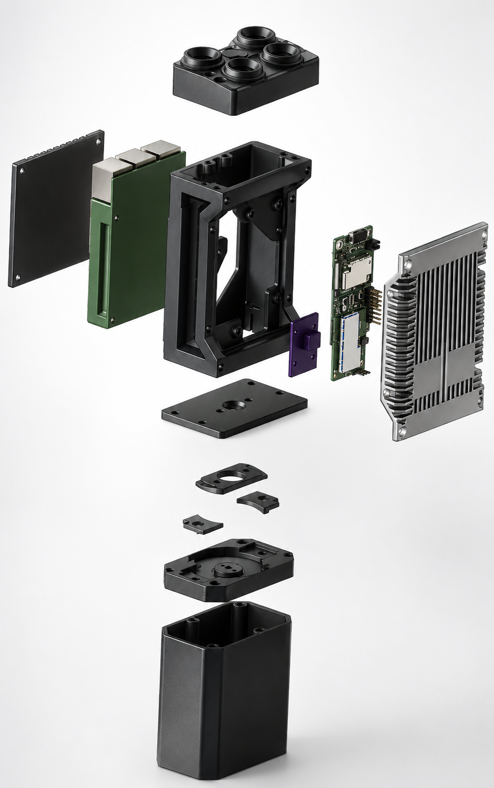
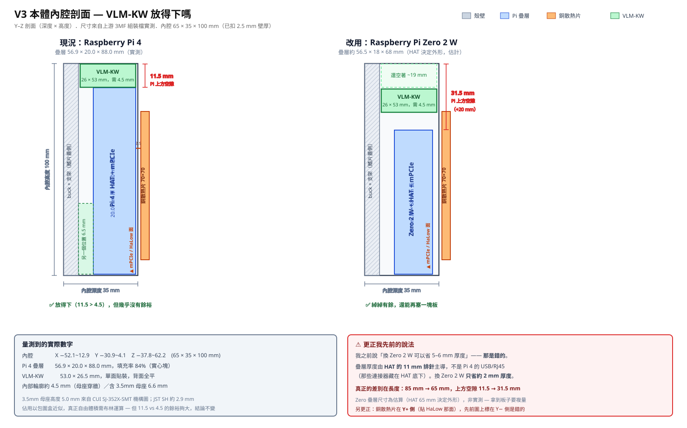
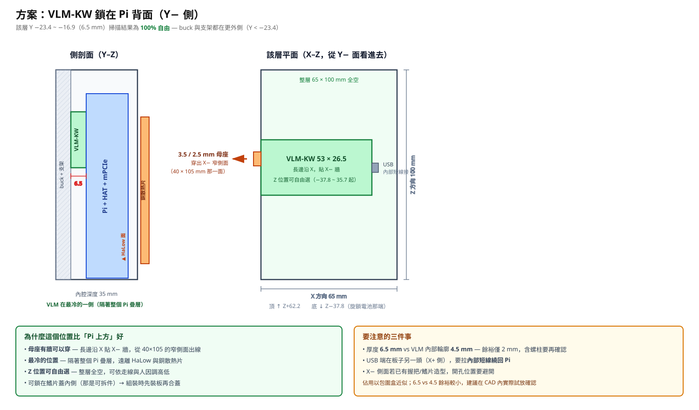

# V3 手持電台外殼 — 完整 BOM（HaLow + LoRa 全配）

外殼機構檔來源：**[ties1887/Mesh-radio-Halow-LoRa](https://github.com/ties1887/Mesh-radio-Halow-LoRa)** 的 **`V3_18-6-2026`**（MIT 授權）。
V3 是「Raspberry Pi 4 + WM1302 HAT + Wio-WM6108」量身版 = **對應本專案節點硬體**。
價格為原表 EU 參考價（€，2026-07 更新），台灣可搜同型號本地買。**此為全配（含 LoRa），非省版。**

- 可列印檔：`V3_18-6-2026/3MF/Assem2.3MF`（含所有殼件，**免支撐**列印）；CAD 原始檔在 `STEP/`、`Solidworks 2023/2025/`。
- 原始完整 BOM（Google Sheet）：<https://docs.google.com/spreadsheets/d/1Nt8EjYsgWTId0Qjl1BAAxPci3bh1FSZ7VQxQRFxyHnk>

---

## 外觀 / 組裝視圖

> 圖片轉存自上游 [ties1887/Mesh-radio-Halow-LoRa](https://github.com/ties1887/Mesh-radio-Halow-LoRa) `V3_18-6-2026/images`（MIT 授權）。上游未提供標準爆炸圖；以下為 AI render 總覽與 SolidWorks 實體視角，殼件逐件分解檔見上游 `STEP/`、`Solidworks 2023/2025/`。

**AI render 成品總覽**（頂部 4 天線孔、側面銅散熱片、底部防水航空接頭）

**SolidWorks 三視角**

### 爆炸圖 / 組裝順序
> 官方爆炸圖，取自上游 `README BEFORE BUILD.md` 的內嵌附件。

由圖看到的堆疊順序（上 → 下）：
1. **頂蓋 `Top new`**（4 天線孔那面）
2. **後蓋板**（左側黑色平板）＋ **綠色電池模組**滑入
3. **中段主體框 `middel part` / `PCB frame`**（骨架框，PCB 由此滑入，公差極小、慢推）
4. **紫色小件**＝ PCB 定位/卡榫，**綠色 PCB**（Pi + HaLow）＋ 右側**金屬散熱片 `cooling`**（實際用金屬版）
5. **中隔板 `base`**（帶中央孔的平板）
6. 一組**小密封/壓環件**（環＋兩片小蓋）＝ 底部接頭密封
7. **底蓋**（航空接頭那面）
8. **電池艙筒 `batcase`**（最底大筒身）

組裝要點（上游 README BEFORE BUILD 重點，務必先讀）：
- **螺絲長度要對** —— 太長會頂穿框體、碰到 PCB／焊點造成短路。
- PCB 滑入公差極小，慢推、別刮掉小元件；beta 件可能要打磨修配。
- 電源正負線 **16–18 AWG 成對絞**，降壓降、降發熱。
- **Buck 降壓板噪訊大 → 銅箔膠帶遮蔽並接地**（銅箔勿碰帶電點）。
- Pi 裝小散熱片；後散熱片 3MF/STEP 只是視覺參考，**買金屬版**。
- 前後密封槽走 **2mm 橡膠 O-ring**（大 O-ring 剪段黏合）→ 防潑水非全防水。
- 旋鎖電池目前是 pogo-pin，上游計畫改磁吸,焊接會更好。
- 全部件**免支撐**列印。

> ⚠️ **螺絲/緊固件清單缺**：BOM 與上游都只寫「M3/M4，長度要對」，**沒有逐項規格、長度、數量**。建議自備 M3/M4 各數種長度（如 M3×6/8/10/12、M4×8/10）現場配，或量測列印件孔深再購。上游計畫在 BOM 加 `Fasteners` 分類但尚未完成。

### 殼件分解（一件一檔，等同零件表）
| 殼件檔 | 對應部位 |
|---|---|
| `Top new` | 頂蓋（4 天線孔那面） |
| `middel part` | 中段主體 |
| `base` / `batcase` | 底座 / 電池艙 |
| `PCB frame` | PCB 固定框 |
| `pi4withall` | Pi 4 + HAT 定位件 |
| `buck converter` | 降壓板座 |
| `cooling` | 散熱片座（視覺參考，實際買金屬版） |
| `wing part` | 側翼 / 握把 |
| `Twist lock battery part V3` / `Twist lock radio part V3` | 旋鎖式電池⟷電台快拆結構 |
| `3MF/Assem2.3MF` | 全部殼件的**免支撐列印總成**檔 |

---

## HaLow（運算 + 無線）
| 零件 | 數量 | 單價 | 連結 |
|---|---|---|---|
| Raspberry Pi 4 Model B 2GB | 1 | €58.05 | （跑 OpenMANET，見 openmanet.github.io/docs）|
| Wio-WM6108 Wi-Fi HaLow mini-PCIe（902–928MHz，注意法規）| 1 | €14.90 | https://www.seeedstudio.com/Wio-WM6108-Wi-Fi-HaLow-mini-PCIe-Module-p-6394.html |
| WM1302 Raspberry Pi HAT | 1 | €19.90 | https://www.seeedstudio.com/WM1302-Pi-Hat-p-4897.html |

## LoRa（全配，不省）
| 零件 | 數量 | 單價 | 連結 |
|---|---|---|---|
| RAK WisMesh 1W Booster Starter Kit（含 1W 功放的完整 LoRa 節點）| 1 | €39.00 | https://store.rakwireless.com/products/meshtastic-1w-lora-booster-kit-rak3401 |
| RAK12500 WisBlock GNSS（u-blox **ZOE-M8Q**）— GPS，*選配*（或用手機 GPS）| 1 | €19.75 | https://www.tinytronics.nl/nl/communicatie-en-signalen/draadloos/gps/modules/rakwireless-rak12500-wisblock-gnss-gps-locatie-module-zoe-m8q |

## ⭐ 電池與電源（V3 的高峰值電流設計 → 解 TX 欠壓）
| 零件 | 數量 | 單價 | 連結 |
|---|---|---|---|
| **Samsung INR21700-45T 4500mAh 50A**（cell）→ **2S2P** | 4 | €2.79 | https://www.nkon.nl/samsung-inr21700-45t-4500mah-50a.html |
| **2S 10A 8.4V BMS**（藍版，平衡+供電）| 1 | €2.90 | https://nl.aliexpress.com/item/1005003656392591.html |
| **DC-DC Buck 7-24V→5V**（**必須 5V / ≥4A**）| 1 | €6.00 | https://www.tinytronics.nl/nl/power/spanningsconverters/buck-(step-down)-converters/dfrobot-dc-dc-buck-converter-7-24v-naar-5v-4a |

## 散熱
| 零件 | 數量 | 單價 | 連結 |
|---|---|---|---|
| **純銅散熱片 70×70×3mm**（給 HaLow 模組）| 1 | €14.29 | https://nl.aliexpress.com/item/1005004251581428.html |
| Raspberry Pi 4 散熱片組 | 1 | €1.52 | https://nl.aliexpress.com/item/4000266052801.html |

> ⚠️ 後散熱片：3MF/STEP 內附的是**視覺參考**，實際請買上面的金屬版。

## 天線與接頭
| 零件 | 數量 | 單價 | 連結 |
|---|---|---|---|
| GIZONT 玻纖 N-male 全向天線 868/915MHz（HaLow + LoRa 各一）| 2 | €23.59 | https://nl.aliexpress.com/item/1005011946812428.html |
| UFL → SMA pigtail（量好長度）| 2 | €2.71 | 蝦皮/AliExpress 搜「U.FL to SMA pigtail 1.13」|
| UFL → N（選配）| 2 | €3.86 | https://nl.aliexpress.com/item/1005008877279360.html |
| UFL → TNC（選配）| — | — | https://nl.aliexpress.com/item/1005012323556605.html |

## 網路（防水）
| 零件 | 數量 | 單價 | 連結 |
|---|---|---|---|
| 防水乙太轉接 A（8pin A-Female → RJ45）| 1 | €5.69 | https://nl.aliexpress.com/item/1005008753710731.html |
| 防水乙太轉接 B（8pin A-Male → RJ45）| 1 | €5.69 | https://nl.aliexpress.com/item/1005008753710731.html |

## 外殼材料 & 雜項
| 零件 | 數量 | 備註 |
|---|---|---|
| PLA（或更硬材質）列印線材 | — | 主體 |
| TPU / 2mm 橡膠 O-ring（密封，選配）| — | 前後密封槽走 2mm 橡膠條 → **防潑水、非全防水** |
| 線材（**電源用 16–18 AWG**）| — | 正負絞對、降壓降噪 |
| M3 / M4 螺絲 | — | **長度要對，太長會頂到內部電路短路** |

---

## 概算
- **全配（含 LoRa、不含選配 GPS）**：約 **€231.7**
- 加 GPS（RAK12500）：約 **€251.5**
- （未含 PLA 線材、線/螺絲、運費、台灣本地價差）

## 組裝關鍵（作者 README BEFORE BUILD 重點）
1. **螺絲長度要對** —— 太長頂到電路/焊點 → 短路。
2. **PCB 滑入公差極小** —— 慢推、別刮掉小元件；beta 版有些件要打磨修配。
3. **電源正負線成對絞 + 16–18 AWG** —— 降壓降、降發熱。
4. **Buck 降壓板噪訊大 → 接地銅箔膠帶遮蔽**（銅箔勿碰帶電點）。
5. **所有件免支撐列印。**
6. 密封走 2mm 橡膠 O-ring；**防潑水非全防水**。

## 對本專案的意義
V3 的電源鏈（**2S2P Samsung 45T 45A cell + 2S BMS + 5V/4A buck + 16–18AWG 絞線 + 銅箔遮蔽**）正是為了扛 HaLow TX 峰值電流而設計 —— 直接對應本專案的 **TX 欠壓/掉電**問題。照此電源方案做，欠壓大概率可解。GPS 用 ZOE-M8Q（u-blox M8）或 USB u-blox 或手機 GPS 皆可，插上即餵 openmanetd → CoT/ATAK。

---

## 採購來源比較（台灣視角）

原表是 EU 來源（nkon.nl / tinytronics.nl / AliExpress），對台灣不是最優。分成三站買最省運費也最快：

| 零件 | 🇹🇼 台灣本地 | 🏭 原廠/專賣 | 🅰️ Amazon | **建議** |
|---|---|---|---|---|
| Raspberry Pi 4B | ✅ iCShop/機器人王國/蝦皮 | — | ✅ | **🇹🇼 本地** |
| Wio-WM6108（HaLow） | 偶有蝦皮 | ✅ Seeed 官網 | ✅ B0H1LVXPJQ | **Seeed 或 Amazon** |
| WM1302 Pi HAT | 偶有 | ✅ Seeed | ✅ B096XND41Q | **Seeed 或 Amazon** |
| RAK WisMesh 1W（LoRa） | ❌ | ✅ **RAK 官網** | ❌ | **RAK 官網**（唯一） |
| GPS | ✅ USB u-blox VK-172/M8N | RAK12500 | ✅ | **🇹🇼 USB u-blox** 或手機 |
| Samsung 21700-45T ×4 | ✅ 蝦皮/露天 | — | ⚠️ 無法國際寄 | **🇹🇼 本地（必須）** |
| 2S 10A BMS | ✅ 蝦皮 | — | ✅ | **🇹🇼 本地** |
| Buck 5V/4A | ✅ 蝦皮/iCShop | — | ✅ | **🇹🇼 本地** |
| 銅散熱片 70×70×3 | ✅ 蝦皮 | — | ✅ | **🇹🇼 本地** |
| Pi 散熱片組 | ✅ 蝦皮/iCShop | — | ✅ | **🇹🇼 本地** |
| 915MHz N-male 天線 ×2 | ✅ 蝦皮/露天 | — | ✅ | **🇹🇼 本地** |
| UFL→SMA / UFL→N pigtail | ✅ 蝦皮/iCShop | — | ✅ | **🇹🇼 本地** |
| 防水 8pin→RJ45 | ✅ 蝦皮 | — | 部分 | **🇹🇼 本地** 或 AliExpress |
| 線材(16-18AWG)/螺絲/O-ring/PLA/TPU | ✅ 本地 | — | — | **🇹🇼 本地** |

### 👉 一律台灣本地買（別繞 Amazon/EU）
1. **Samsung 21700-45T ×4** — 鋰電無法國際寄，只能本地（蝦皮搜「21700 45T」）
2. **2S BMS、Buck 5V/4A**（蝦皮搜「2S BMS 10A」「DC-DC 5V 4A buck」）
3. **銅散熱片 70×70×3、Pi 散熱片組**
4. **915MHz N-male 天線、UFL→SMA/N pigtail**（蝦皮搜「915 天線 N公」「U.FL SMA pigtail」）
5. **防水 8pin→RJ45 航空頭**
6. **線材（16-18AWG）、M3/M4 螺絲、2mm O-ring、PLA/TPU 線材**
7. **Raspberry Pi 4B**（本地 Pi 通路現貨）
8. **GPS 用 USB u-blox**（VK-172 / NEO-M8N，取代 RAK12500）

### 不在台灣本地的兩類
- **HaLow 模組**（Wio-WM6108 + WM1302 HAT）→ Seeed 官網 或 Amazon（[WM6108](https://www.amazon.com/Wio-WM6108-Wi-Fi-HaLow-mini-PCIe-Module-p-6394.html/dp/B0H1LVXPJQ) / [WM1302 HAT](https://www.amazon.com/NGW-1pc-WM1302-Pi-HAT-Raspberry/dp/B096XND41Q)）
- **LoRa**（RAK WisMesh 1W）→ RAK 官網（唯一來源）

### 三站購物法
1. **🇹🇼 台灣本地（蝦皮/iCShop/露天）**：電池 + 所有通用件 + Pi 4B + USB GPS
2. **🏭 Seeed 官網（或 Amazon）**：WM6108 + WM1302 HAT
3. **🏭 RAK 官網**：WisMesh 1W LoRa kit

> ⚠️ Amazon US 的 21700 鋰電幾乎無法寄台灣（hazmat）；HaLow 模組是 902–928MHz，台灣 ISM 為 920–925MHz，天線與 regdomain 要對得上。

### 為什麼不建議 Amazon 一站（成本試算）
蝦皮「每店 NT$60 運費」看似會累加，但實算下來 Amazon 仍不划算：
- **通用件蝦皮本來就便宜約 NT$1,500**（比運費差距大）。
- **Amazon 一大單會被課 ~10% 進口稅**（訂單>NT$2000，Amazon 預收 ~NT$450），吃掉合併運費的優勢。
- **電池反正只能蝦皮買**，那筆 NT$60 躲不掉。

| 通用件那叢（到手估價） | 蝦皮 | Amazon |
|---|---|---|
| 併 2–3 家 | **~NT$2,820** | ~NT$5,230 |
| 散買 8 家 | ~NT$3,150 | ~NT$5,230 |

→ 結論：**減少蝦皮店家數**（併店）才是正解，不是換 Amazon。

### 台灣蝦皮併店採購法（3–4 家買齊本地件）
**主叢集（挑一家包大部分）**：Pi 4B、Pi 散熱組、銅散熱片、2S BMS、Buck 5V/4A、USB GPS、pigtail
- **iCShop**（[icshop.com.tw](https://www.icshop.com.tw/)，電子件最全，首選）／莓亞科技（[meiyagroup.com.tw](https://www.meiyagroup.com.tw/)）／機器人王國（[shop.playrobot.com](https://shop.playrobot.com/)）／TaiwanIOT（[taiwaniot.com.tw](https://www.taiwaniot.com.tw/)）——都有官網+蝦皮賣場（搜店名）

**另外三樣單獨的店**：
| 東西 | 蝦皮搜尋關鍵字 |
|---|---|
| Samsung 21700-45T ×4 | 「21700 45T」「INR21700 動力」 |
| 915MHz N-male 天線 ×2 | 「915 天線 N公 玻纖」「LoRa 天線」 |
| 防水 8pin→RJ45 | 「防水網路頭 航空 RJ45」（或 AliExpress） |

**併店結果**：iCShop(通用件+GPS+pigtail) + 電池1家 + 天線1家 + RJ45(1家/AliExpress) ≈ **3–4 家、運費 ~NT$180–240**。
下單前確認：**Buck 是 5V/≥4A**、天線 **915MHz/N公**、pigtail 接頭 **U.FL↔SMA** 對得上。

> 蝦皮賣場請搜店名進去；庫存每天變，本清單只給方向不保證即時有貨。

---

## 內腔空間實測（2026-09-09）

起因是評估 **OpenVLM VLM-KW**（K頭→USB 的 PTT 介面板，見 `expansion-gps-ptt.md`）能不能裝進本體。
數字是解上游 `V3_18-6-2026/3MF/Assem2.3MF` 的組裝幾何算出來的，不是估的。

### 量到的尺寸

| | |
|---|---|
| 整台（含電池艙）| **70.0 × 48.0 × 218.7 mm** |
| 本體段外形 | 70 × 40 × 105 mm |
| **本體內腔**（扣 2.5 mm 壁厚）| **65 × 35 × 100 mm** |
| **Pi 4 + HAT + mPCIe 疊層** | **56.9 × 20.0 × 88.0 mm**（填充率 84%）|
| 銅散熱片 | 70 × 70 × 4 mm，**在 Pi 的 Y+ 側**（貼 mPCIe/HaLow 那面），間距 2.5 mm |
| buck + 支架 | Y −29.7 ~ −23.9（Y− 側，鰭片蓋那面）|

**Pi 疊層吃掉內腔 35 mm 深度裡的 20 mm** —— 這是重畫外殼時最關鍵的一個數字。

### Pi 各面剩餘空間

| 面 | 剩餘 | 可用來放板子？ |
|---|---|---|
| Y− 側（Pi 背面）| 14.0 mm，扣掉 buck/支架後 **6.5 mm** | ✅ 該層 65 × 100 mm **全空** |
| Y+ 側 | 1.0 mm | ❌ |
| Z+ 側（頂蓋那端）| **11.5 mm** | ✅ 53 × 26 mm |
| Z− 側（底部）| 0.5 mm | ❌ |
| X 兩側 | 3.8 / 4.3 mm | ❌ |

### VLM-KW 放哪

VLM-KW = **53.0 × 26.5 mm，單面貼裝、背面全平**。內部輪廓約 **4.5 mm**（PCB 1.6 + JST SH 2.9）；
含 3.5 mm 母座則是 6.6 mm，但**母座本來就要穿出殼壁**，不佔內腔。

| | Pi 背面（Y−）| Pi 上方（Z+）|
|---|---|---|
| 可用厚度 | 6.5 mm（餘裕 2 mm）| 11.5 mm（餘裕 7 mm）|
| 母座出口 | **X− 窄側面 (40×105)** ✅ | 頂面，要多開孔 |
| 溫度 | **最冷**（隔著整個 Pi 疊層）| 熱空氣聚集處 |
| 組裝 | **可鎖在可拆的鰭片蓋內側** ✅ | 要塞進頂部 |
| Z 位置 | 整層全空，可自由選 | 固定 Z 51~62 |

**建議 Pi 背面**，除非螺柱高度把 2 mm 餘裕吃掉。

### ⚠️ 換 Pi Zero 2 W 的實際效益（更正常見誤解）

疊層厚度是由 **HAT 的 11 mm 排針**主導的，不是 Pi 4 的 USB/RJ45（那些藏在 HAT 底下）。
所以換 Zero 2 W **厚度只省約 2 mm**（20 → 18 mm）。

**真正的差別在長度**：Pi 4 的 85 mm → Zero 2 W 由 65 mm 的 HAT 決定外形，
疊層 Z 從 88 → 約 68 mm，**Pi 上方空隙從 11.5 mm 變成 31.5 mm**。

### 方法與但書

- 幾何來源：`Assem2.3MF` 的 `<components>` 樹遞迴展開 + build item 變換，毫米單位。
- 用**填充率**（體積 ÷ 包圍盒）區分薄殼（<30%，外殼件）與實心塊（>35%，內部元件）。
- 佔用以**包圍盒近似**，真正自由體積需布林運算。Pi 上方 11.5 vs 4.5 的餘裕夠大結論穩固；
  **Pi 背面 6.5 vs 4.5 餘裕較小，建議在 CAD 內實際試放確認**。
- Zero 2 W 疊層 18 × 68 mm 為**估算**（HAT 決定外形），拿到板子要複量。
- 3.5 mm 母座高度 5.0 mm 取自 CUI SJ-352X-SMT 機構圖。
