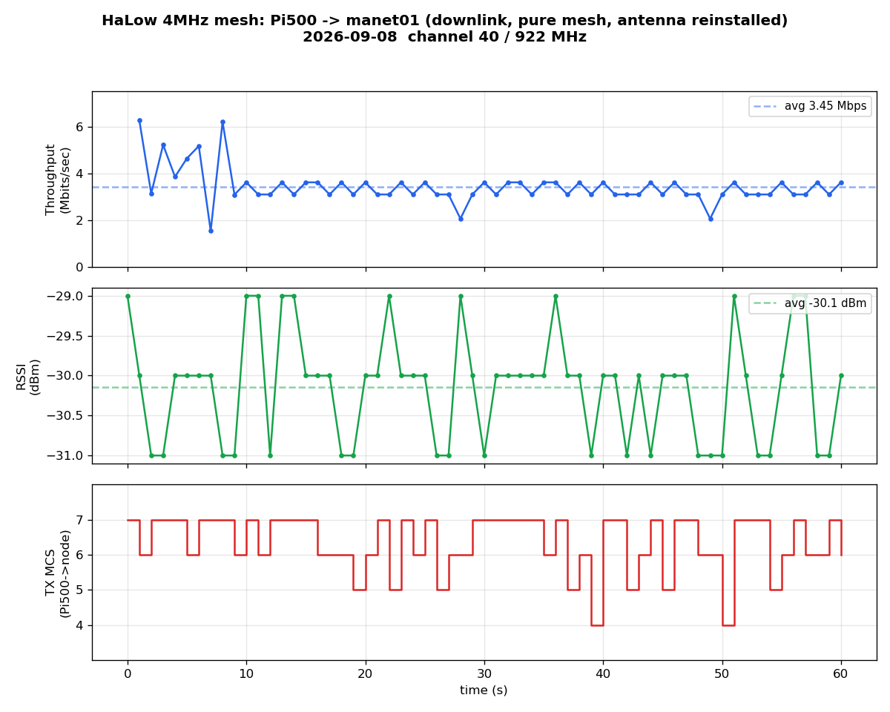
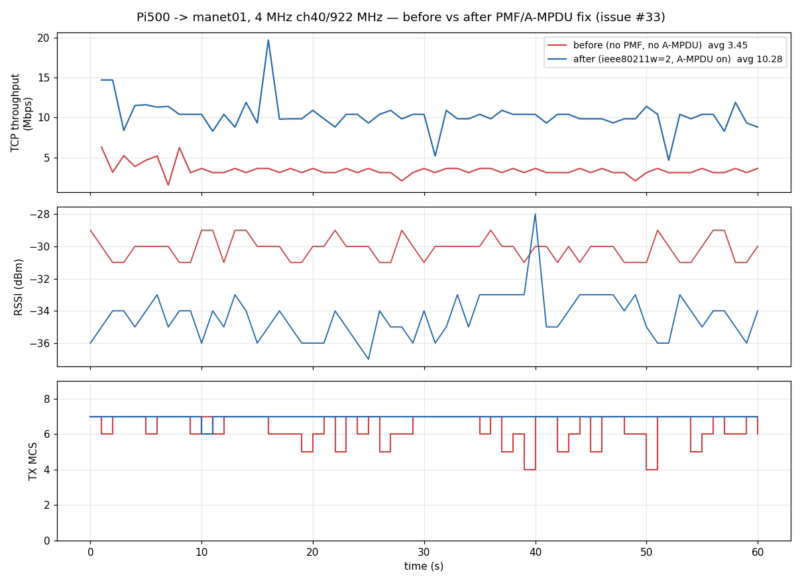
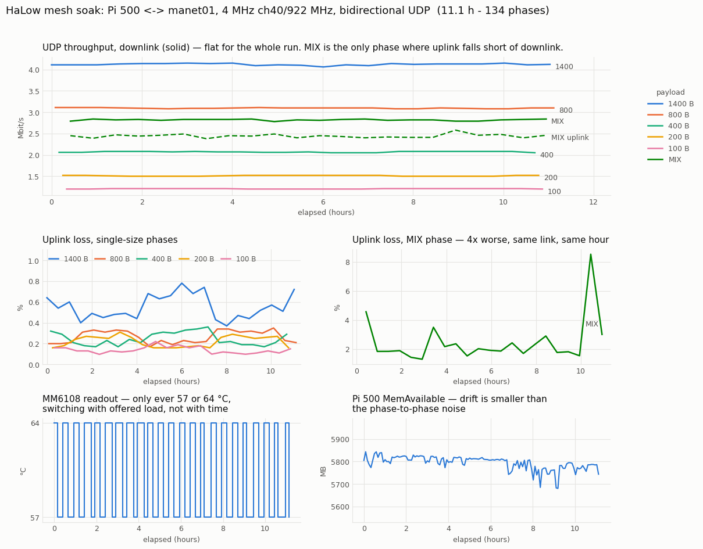
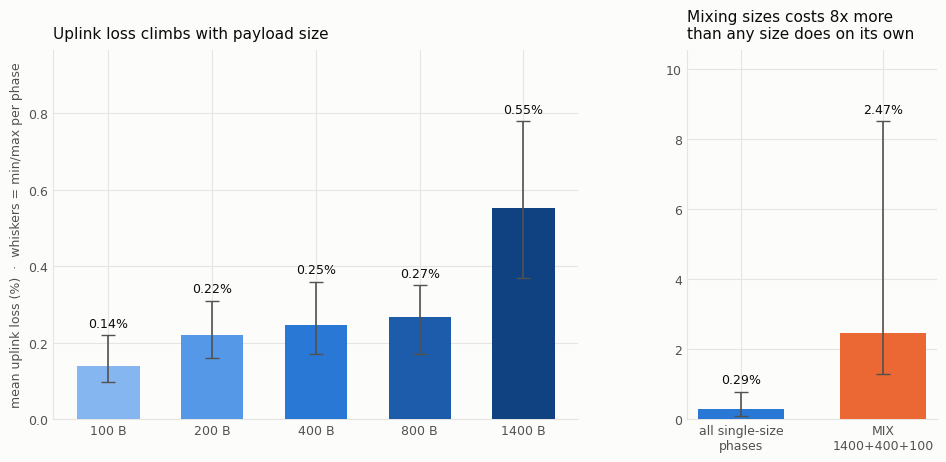
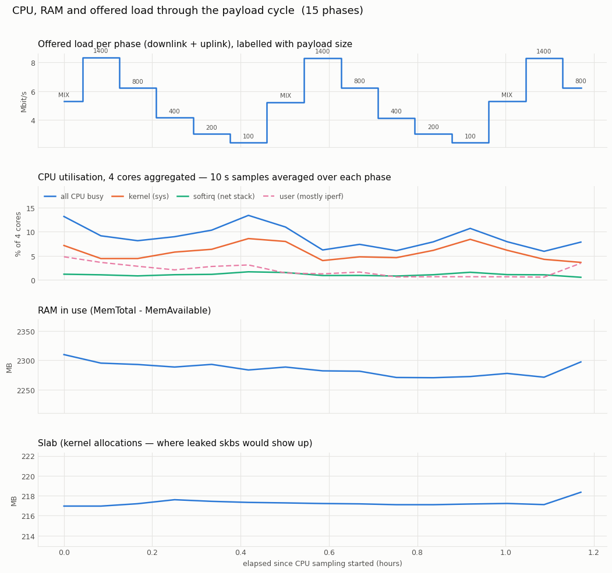
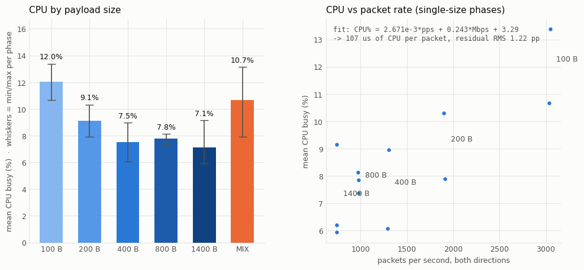
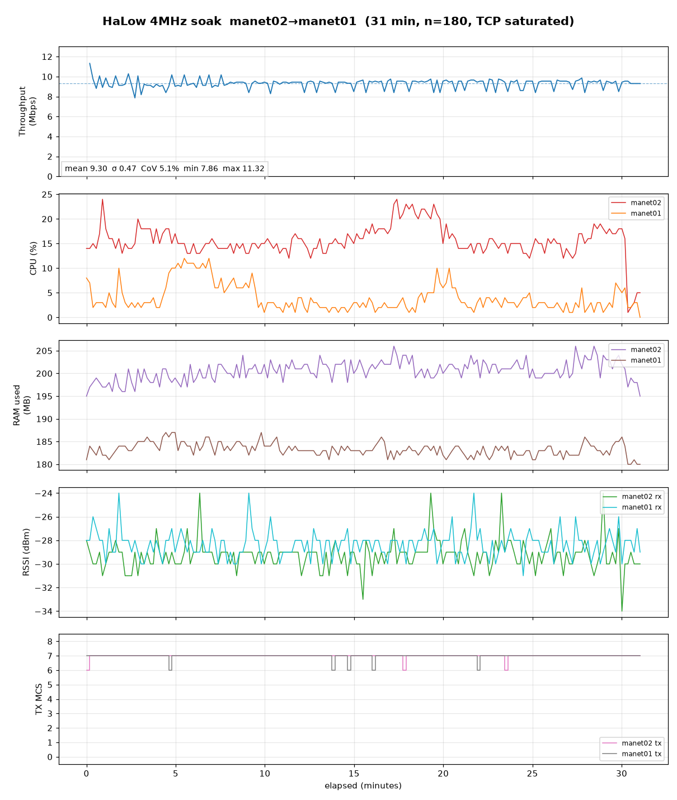

# 野外鏈路測試紀錄（walk / antenna / power / NLOS）

節點：manet01 ↔ manet02，**2MHz ch42（923MHz）**，txpower 27dBm（HaLow 無法軟體調降，全程滿功率）。
**node01 位於 12 樓（~36m 高）** = 高站點/閘道；node02 為移動端。
量測法：`iw station dump`（signal avg）、`morse_cli stats`（noise）→ SNR；`batctl tp`（吞吐，會抖）；IP ping（丟包）；meshled 綠燈狀態。

## 數據點

| # | 情境 | 天線 | 電源 | 訊號 | SNR | 吞吐 | 丟包 | LED | 備註 |
|---|---|---|---|---|---|---|---|---|---|
| 1 | LOS 5m | 原 | 市電 | -47dBm | 47dB | 2.96 Mbps | 0% | LINKED | 乾淨基準 |
| 2 | LOS 5m | **新** | 市電 | **-42dBm** | 55dB | 2.87 Mbps | — | LINKED | **新天線 +5dB** vs 原 |
| 3 | LOS 5m | 新 | **電池** | -46~48dBm | 50dB | **0.5–0.8 Mbps** | **0%** | LINKED | 連通完美，但**吞吐被電池壓 3–4×** |
| 4 | **NLOS** 近 | 新 | 電池 | **-88dBm** | **8dB** | — | **100%** | **WEAK** | 遮蔽厚；**連上但不能用** |
| 5 | **1km**（較開闊） | 新 | 電池 | **-87dBm** | 12–14dB | — | **70%** | **WEAK** | 264ms 延遲；勉強活（30% 通） |
| 6 | **800m**（更遮蔽） | 新 | 電池 | **-92dBm** | 6–13dB | — | **90%** | **WEAK** | 626ms；比 1km 還差 |
| 7 | **1F**（node02@1F vs node01@12F，短距） | 新 | 電池 | -69~70dBm | **25–29dB** | — | **0%** | **LINKED** | 22ms；**可靠可用**（填上中間空缺）|

## 關鍵結論

### 天線 A/B（點 1 vs 2，同 5m）
- **新天線比原天線強 +5dB**（-42 vs -47）。近距離吞吐一樣（都頂到 2MHz 天花板 ~2.9Mbps），但 **+5dB 的價值在射程**（遠處多撐 ~1.8× 距離）。

### 電池 vs 市電（點 2 vs 3，同 5m 同天線）
- **電池：連通完美（0% 丟包）、不硬欠壓（throttled=0x0），但持續吞吐掉到 0.5–0.8 Mbps**（市電 2.9）。
- **電池在 TX 峰值下電壓下垂 → PA 表現差 → 吞吐崩，但不觸發 Pi 欠壓偵測。**
- ⭐ **`get_throttled` 抓不到這個** → 測電池要看「負載下吞吐」，不是只看 throttled。
- 白話：這顆電池「**能通、不當機、但跑不快**」。語音/位置 OK，影片不行。

### NLOS（點 4）
- SNR 掉到 8–11dB：**batman 看得到鄰居（neigh=1、綠燈 WEAK），但 IP ping 100% 丟包 = 連上但完全不能用。**
- ⭐ **WEAK（綠燈慢閃）≠ 能用**。只有 **LINKED（恆亮）** 才可靠。野外綠燈慢閃就當它「快沒了」。

### ⭐ 距離 vs 遮蔽（點 5 vs 6）— 最重要的一課
- **800m（點6）比 1km（點5）更差**（90% vs 70% 丟包、-92 vs -87dBm）。**更近卻更爛。**
- → **決定成敗的是「視線/遮蔽」，不是「距離」。** 800m 那點遮蔽更重（node02 被建物包住）。
- node01 在 12F（高站點）已佔優勢，瓶頸在 **node02 近端的地面雜波**。
- **部署原則：選點看「有沒有清楚視線 / 靠窗 / 高處」，不是看多近。** 被包住的地面點再近也死；開闊/高的點遠也行。
- 都市模型：**一台架高當閘道涵蓋廣，地面節點要靠窗/開口或加一跳中繼。**

## SNR → 可用性對照（本次觀察）
| SNR | 表現 | 可用? |
|---|---|---|
| ~47–55（LOS 5m） | 滿速 2.9Mbps、0% 丟包、LINKED | ✅ 完美 |
| **~25–29（1F 點7）** | **0% 丟包、22ms、LINKED** | ✅ **可靠可用** |
| ~12–14（1km 點5） | 70% 丟包、264ms、WEAK | ⚠️ 勉強/不可靠 |
| ~6–8（NLOS/800m 點4,6） | 90–100% 丟包、WEAK | ❌ 不可用 |

**實測門檻**：**SNR ≳ 25 → LINKED、0% 丟包、可靠**；SNR ~12 已是 70% 丟包的邊緣；SNR <10 基本死。
→ 野外部署目標：**讓鏈路維持 SNR ≥ 25**（綠燈恆亮），別依賴 WEAK。

## 待辦 / 下一步
- 把 node02 往少遮蔽處挪，找**綠燈恆亮(LINKED)+0% 丟包**的可用 NLOS 邊界。
- LOS 拉遠（20–100m）測自由空間射程。
- 電池吞吐問題 → V3 電源（2S2P Samsung 45T 高電流）應可解，屆時重測點 3。

---

# Bench 測試：Pi500 ↔ manet01 mesh throughput（2026-09-07）

⚠️ **這是桌上 bench，不是野測。條件與前面野測不同（工具、距離、對端硬體），數字不可直接類比。方法論待商榷，僅記錄原始觀察。**

## 設備（硬體分版本）

| 角色 | 硬體 | 系統 | S1G 使用者空間 | morse 韌體 |
|---|---|---|---|---|
| 一端 | **Pi 500 = BCM2712（Pi5 級）+ RP1** | Debian 13 | 自建 `wpa_supplicant_s1g`（MorseMicro/hostap mm6108-2.0.1） | rel_mm6108_2_0_1 |
| 另一端 | **manet01 = BCM2711（Pi4）** | OpenMANET 24.10 1.8.0 | OpenWrt 內建 | rel_mm6108_2_0_1 |

兩端 Wio-WM6108（MM6108），mesh_id `openmanet1`、SAE、BATMAN_V。量測工具：`batctl meshif bat0 tp`（batman throughput meter，over 802.11s+batman）。

## 2 MHz（S1G ch42 = 923 MHz，op_class 69）

| RSSI (node→Pi500) | throughput (batctl tp) | 備註 |
|---|---|---|
| -40 dBm | 1.05–1.39 Mbps | Pi500 txpower 當時 5 dBm |
| -54~-58 dBm | ~0.65 Mbps | |
| -61~-65 dBm | 0.36–0.87 Mbps | 兩端 27 dBm；tx retries 85–118% |

- 觀察：throughput 與 RSSI 未見清楚單調關係；**tx retries 偏高（85–118%）**；RSSI 在單次量測內跳動（±10 dB）。
- 對照前面野測（兩台 OpenMANET 節點）LOS 5m 為 **2.9 Mbps** —— 本 bench 明顯偏低。可能因素（未定論）：近場、Pi500 txpower 受 morse 驅動限制、batctl tp 量測特性、量測方向與 RSSI 讀取方向相反。

## 4 MHz（S1G ch40 = 922 MHz，op_class 70）

- ⭐ **Pi500 的 `wpa_supplicant_s1g` 與 manet01 的 OpenWrt 在 4 MHz mesh 下無法 peer。** 已試 `s1g_prim_1mhz_chan_index` 0/1/2/3 皆不成（2 MHz 同設定可正常 peer）。
- 推測 primary-1MHz 通道協商或 S1G 4MHz 處理在 wpa_supplicant ↔ OpenWrt 之間不一致，待查。
- ⚠️ 操作教訓：改頻寬會斷 mesh；用 `nohup` 排自動還原**沒撐過 SSH 斷線**，manet01 一度失聯，最後靠 `/boot/sysupgrade.tgz` 注入 `channel=42` 救回。以後改頻道用 cron/at 或更可靠的還原機制。

## 待辦

- 真正的 tput-vs-RSSI 曲線：兩台**同韌體 OpenMANET 節點**（都 27 dBm）、固定位置、野外拉開距離、用 iperf。
- 4 MHz peering：先在兩台 OpenMANET 節點間確認可行（同 OpenWrt 端），再看 Pi500 端。

## Pi500 ↔ manet01 mesh iperf（2026-09-08，mesh_nolearn 修好後）

第一次用真 iperf（前次是 batctl tp）。條件：LOS 桌面、-55 dBm、兩端 27 dBm、2MHz ch42、市電。

| 方向 | 工具 | 吞吐 |
|---|---|---|
| 下行 Pi500→manet01 | iperf TCP | 1.2–1.5 Mbps |
| 上行 manet01→Pi500 | iperf TCP -R | 0.77 Mbps |
| 下行 | iperf UDP @10M offered | 僅 183 Kbps 落地（供過於求，鏈路撐不住 10M）|

加壓時 tx retry **25%**（vs 2026-09-07 batctl tp 的 85–118%，明顯改善）。

- 數字與 2026-09-07 batctl tp 基準一致（-54~-58 dBm ≈ 0.65 Mbps），仍**低於 節點↔節點 LOS 5m 的 2.9 Mbps**。
- 已知因素（未定論）：Pi500 morse 驅動 txpower 受限、近場、半雙工 + TCP RTT 敏感。
- 重點：這是 **mesh_nolearn=1 修復後**首次量到「單播能持續傳資料」（修復前 batctl ping 100% 全丟）。功能已通，吞吐調校是另一條線。

### 追加數據點：近距離強訊號（2026-09-08，同日換位置）

同鏈路換到訊號更好的位置，2MHz ch42 不變：

| RSSI | 下行 TCP | 上行 TCP | tx retry | 備註 |
|---|---|---|---|---|
| -55 dBm | 1.2–1.5 Mbps | 0.77 Mbps | 25% | 原位置 |
| **-32~-35 dBm** | **2.94–3.07 Mbps** | **1.6 Mbps** | 24% | 換位置後，下行頂到 2MHz 天花板 |

- 下行 3 Mbps ≈ 節點↔節點 LOS 5m 的 2.9 Mbps → **HaLow 2MHz 上限**。
- 甜蜜區約 **-30 ~ -55 dBm**：更近（-3 dBm）飽和→單播全丟；更遠（-88）WEAK→不能用。
- 印證前一格偏低主因是位置/訊號，非 mesh 故障。

## 2MHz vs 4MHz 對比（2026-09-08，Pi500 ↔ manet01，同位置 ~-31 dBm）

純 HaLow 量測（eth0 down，否則流量會抄有線捷徑 → 上行假性 74 Mbps）：

| 指標 | 2MHz (ch42/op69) | 4MHz (ch40/op70) | 變化 |
|---|---|---|---|
| 下行 TCP | 3.0 Mbps | 3.83 Mbps | +28% |
| 上行 TCP | 1.6 Mbps | 2.57 Mbps | +60% |
| tx retry | 24% | 11% | 減半 |

4MHz 有實質提升（上行尤佳、retry 減半），但非理論翻倍 —— TCP over 半雙工 mesh 損耗 + Pi500 morse txpower 受限。**決定：留用 4MHz。**

### ★ 4MHz 切換的關鍵：primary 1MHz channel index

切 4MHz 不是只改 channel + op_class。**primary 1MHz sub-channel 兩端必須一致**，否則
SAE-AUTH-FAILURE、plink 卡 LISTEN、看得到訊號但配不上對。

- 節點：`uci set wireless.radio1.channel=40; uci commit wireless`（morse 從 regdb 自動推 op_class=70、
  bw=4、**primary index=1**）。channel 號本身在 regdb 唯一對應一個頻寬（42=2MHz、40=4MHz）。
- Pi500 (`/etc/halow/mesh-wlan1.conf`)：`channel=40`、`op_class=70`、**`s1g_prim_1mhz_chan_index=1`**
  （2MHz 時是 0；4MHz 節點算出來是 1，Pi500 要跟著改 1 才 peer）。

US 4MHz 頻道（morse regdb，op_class 70）：s1g_chan 8/16/24/32/40/48 = 906/910/914/918/922/926 MHz。
選 40（922 MHz）因與原 2MHz ch42（923 MHz）最接近。

切換順序（無 console/有線時的安全做法）：先改節點 channel+commit+reboot，再改 Pi500 對齊；
失敗（節點在 4MHz 起不來/配不上）則插 eth0 從有線 revert `channel=42`。兩端皆已 commit/存檔，冷開機保留。

## 60秒時序：4MHz 下行 Tput/RSSI/MCS（2026-09-08，天線重裝後）

Pi500→manet01 下行，純 mesh（eth0 down），channel 40 / 922 MHz、每秒採樣 60 秒。



原始數據：[`data/mesh-4mhz-1min-pi500-manet01.csv`](data/mesh-4mhz-1min-pi500-manet01.csv)

| 指標 | 值 |
|---|---|
| 吞吐 | 平均 3.45 Mbps（1.54–6.29 波動）|
| RSSI | -30 dBm（±1，極穩）|
| TX MCS | 眾數 7，週期性掉到 4–5 |

- 天線重裝後 TX MCS 眾數從 MCS5（裝之前）回到 **MCS7**、峰值 6.29 Mbps，有改善。
- **但 RSSI 穩定 -30 dBm 下 MCS 仍週期性掉到 4–5**，吞吐谷底跟著掉 → 非訊號問題，是
  **Pi500 morse rate-control 抖動**（驅動層），天線改善絕對水準但解不掉抖動。
- 印證瓶頸在 Pi500 發射側。4MHz 真實實力仍待 manet01↔manet02 兩台正規節點對打量測。

## ★ issue #33 根因與修復：PMF(MFP) 不對稱 → A-MPDU 完全不聚合（2026-09-09）

**結論先講：吞吐低跟 rate-control 沒關係，是 Pi500 側 `wpa_supplicant` 沒開 PMF，
導致 ADDBA 交握永遠失敗、整條 mesh 從頭到尾都沒有 A-MPDU 聚合，每包都單發。**

修法是一行設定，不用改驅動：`/etc/halow/mesh-wlan1.conf` 的 `network={}` 內加

```
    ieee80211w=2      # PMF required；不加則 ADDBA/DELBA 明文送出，被節點丟棄
```

### 怎麼查出來的

1. **看晶片統計，不是看 MCS。** `morse_cli -i wlan1 stats`：

   ```
   AGG A-MPDUs : 1175375 0 0 0 0 0 0 0 0 0 0 0 0 0 0 0 0
   TX BlockAck : 0
   ```
   A-MPDU 長度直方圖 **全部落在第 0 格**＝每個 A-MPDU 只有 1 個 MPDU，`TX BlockAck` 是 0。
   也就是說聚合根本沒在運作。MCS7 在 4MHz 只有 16.65 Mbps PHY，扣掉每包的
   preamble/SIFS/ACK/backoff，不聚合的天花板就是 3～4 Mbps —— 跟實測 3.45 完全對得上。

2. **看 BA session 有沒有建起來。** 打開驅動 log（`echo 7 > /sys/kernel/debug/ieee80211/phy2/morse/logging/{default,mesh,mgmtfrm}`）後 dmesg：

   ```
   A-MPDU TX start        <- 起 BA
   A-MPDU TX flush        <- 1 秒後被砍（ADDBA Response 逾時）
   A-MPDU TX start        <- 重試，永遠等不到 oper
   ```
   從來沒有 `A-MPDU TX oper`。節點端 `agg_status` 也是全 0、`next dialog_token: 0xfa`（試了 250 次）。

3. **ftrace 定位是哪一半掉的。**

   ```bash
   printf 'ieee80211_process_addba_resp\nieee80211_process_addba_request\nsta_addba_resp_timer_expired\n' \
     > /sys/kernel/tracing/set_ftrace_filter
   echo function > /sys/kernel/tracing/current_tracer; echo 1 > /sys/kernel/tracing/tracing_on
   ```
   結果：`process_addba_request` 4 次（**收得到**對方的 ADDBA Request）、
   `process_addba_resp` **0 次**、`sta_addba_resp_timer_expired` 4 次。
   節點端 dmesg 則連一次 `A-MPDU RX start` 都沒有 → **Pi500 送出去的 BACK 類 action frame
   對方完全沒收到**。單向壞，方向是 Pi500 → 節點。

4. **比對兩端的 STA flag，找到不對稱：**

   | | Pi500 看對方 | manet01 看 Pi500 |
   |---|---|---|
   | `MFP` | **no** | **yes** |

   機制（mac80211）：
   - BlockAck（category 3）**屬於 robust management frame**（`_ieee80211_is_robust_mgmt_frame()`
     的排除清單只有 Public / HT / UNPROT_DMG / SELF_PROTECTED / VENDOR_SPECIFIC）。
   - 送端 `ieee80211_tx_h_select_key()`：mgmt frame 若 `ieee80211_use_mfp()` 為 false 就
     `tx->key = NULL` → **明文送出**。而 `use_mfp()` 的第一個條件就是
     `test_sta_flag(sta, WLAN_STA_MFP)`。Pi500 沒設 → ADDBA 明文。
   - 收端 `ieee80211_drop_unencrypted_mgmt()`：對方 STA 有 MFP 且 robust mgmt frame 沒加密 → **靜默丟棄**。

   MPM peering frame 是 category 15（SELF_PROTECTED，非 robust），所以**配對照樣成功**；
   data frame 走 pairwise key 也照樣通。只有 ADDBA/DELBA 這種 robust action frame 被吃掉，
   所以症狀才會是「什麼都好，就是慢」。

   節點端（OpenWrt `encryption='sae'`）預設就帶 `ieee80211w=2`；Pi500 這邊手寫的
   `mesh-wlan1.conf` 漏了，兩端不對稱。

### 修復後（同位置，60 秒每秒採樣）



原始數據：[`data/mesh-4mhz-1min-pi500-manet01-pmf.csv`](data/mesh-4mhz-1min-pi500-manet01-pmf.csv)
完整可用設定檔：[`../scripts/pi500-mesh-wlan1.conf`](../scripts/pi500-mesh-wlan1.conf)

| 指標 | 修復前 | 修復後 |
|---|---|---|
| 下行 TCP（60s 平均）| 3.45 Mbps | **10.28 Mbps**（中位數 10.40，4.65–19.70）|
| 上行 TCP | 2.57 Mbps | **8.76 Mbps** |
| A-MPDU 長度分佈 | 全部 = 1 MPDU | 峰值 **13–17 MPDU** |
| `TX BlockAck` | 0 | 2165 / 60s |
| TX MCS 分佈 | MCS7 只佔 48%，週期掉到 4–5 | **MCS7 佔 96%**，60 秒採樣 60/61 是 7 |
| `tx failed` | 434 | **0** |
| RSSI | -30 dBm | -34 dBm（更差，增益不是來自訊號）|

RSSI 反而比修復前差 4 dB，吞吐仍 ~3 倍 → 確認增益來自聚合，不是 RF。

### 校正 issue #33 的原始判斷

原本記錄的「Pi500 morse rate-control 抖動」是**果不是因**：不聚合 → 每包單發、
碰撞/ACK 逾時比例高 → MMRC 讀到丟包就降 MCS。聚合修好後 MCS 自己就穩在 7 了。
`mmrc_table` 裡「低 MCS 成功率反而更低」（MCS0 4MHz SGI 是 0/285＝0%，MCS7 卻有 92%）
這個違反物理的訊號，當時就該提示問題不在 SNR / rate-control。

### 順帶記錄：仍待處理的次要項目

- Pi500 rate table 上限是 **MCS7**（無 MCS8/9）—— 對端 VHT MCS map 回報 `SUPPORT_0_8`，
  依 `morse_rc_sta_add_vht_sta_caps()` 的 VHT→S1G 對應（9→9, 8→7, 7→2）只展開到 S1G MCS7。
- `AGG crosses TBTT` 每 60 秒約 330 次（beacon_int=1000 TU），還有壓縮空間。
- `max_rate_tries=1`（驅動預設），retry chain 是 MCS7→6→5→0 各一次。

## PMF 修好之後的完整基準：UDP 天花板、上下行不對稱、抖動來源（2026-09-09）

承上節。`ieee80211w=2` 修好聚合之後重新做的完整量測，同位置、eth0 down 純 mesh、
4MHz ch40/922 MHz、RSSI -30～-34 dBm。

### UDP 天花板（`iperf -u -l 1400`）

| 方向 | 餵 8M | 餵 10M | 餵 12–14M | 餵 20M | 遺失 |
|---|---|---|---|---|---|
| 下行 Pi500→manet01 | — | 10.5 | **11.0** | 10.9 Mbps | **0%** |
| 上行 manet01→Pi500 | 8.39 | — | 9.34 | **9.42** Mbps | **0%**（jitter 2.32 ms）|

**天花板：下行 11.0 Mbps、上行 9.4 Mbps。**

**0% 遺失是重點** —— 餵到 20M 也不掉包，代表不是佇列爆掉，是 **mac80211 內建 TXQ 的
fq_codel 在做 backpressure**（`tc qdisc show dev wlan1` 顯示 `noqueue`，佇列在 mac80211 裡，
不在 netdev qdisc）。發送端被擋住，不是封包被丟掉。

TCP 拿到 9.88 / 8.42 Mbps = UDP 天花板的 **90%**，這個效率是正常的。

### 上下行不對稱：兩個成因，都在「節點發、Pi500 收」這條鏈

30 秒單向 TCP，兩端同時 diff `morse_cli stats`：

**(a) RTS/CTS —— 佔 6.6%**（→ issue #35）

```
manet01  RTS threshold: 1000    ← 資料 frame ~1448B，每個 A-MPDU 都觸發
Pi500    RTS threshold: (未設)
```

計數器完全對得上：上行時 manet01 `TX RTS: +2542`、A-MPDU 共 ~2449 個，`TX MCS` 直方圖
**MCS2 = 2542**（RTS 走 basic rate）；Pi500 這端 `RX RTS: +2359`、`TX CTS: +2359`。
下行同樣時間 Pi500 只送 **7** 個 RTS。

實測（`iw phy phy0 set rts off`，量完已還原 1000）：UDP 上行 9.38 → **10.0 Mbps**、
TCP 上行 8.42 → 8.64、節點 MCS7 佔比 37% → 50%。

**(b) Pi500 接收品質差 7.6 倍 —— 佔 ~8%**（→ issue #34）

同樣 RSSI 下：

| 接收端 | MPDU FCS fail | invalid delimiters |
|---|---|---|
| manet01 收（下行）| 220 / 29434 = **0.75%** | 2.4% |
| **Pi500 收（上行）** | 1537 / 27185 = **5.7%** | 6.5% |

A-MPDU 內個別 MPDU 壞掉不會算成 ACK timeout（節點 ACK timeout 只有 1.9%），但 BlockAck
bitmap 會回報缺漏 → MMRC 判定丟包 → 降速。所以節點只有 **37% 用 MCS7**，Pi500 反向是 **94%**。

### 抖動來源：是量測假象，不是鏈路，也不是 OS scheduling

同一次 40 秒 TCP 下行，**兩端同時**每 0.5 秒取樣：

| | min–max | CoV |
|---|---|---|
| 發送端（Pi500 iperf client）| 5.18 – **27.20** Mbps | **27.2%** |
| 接收端（manet01，真正上空的量）| 8.63 – 10.90 Mbps | **5.3%** |

**發送端出現 27.2 Mbps，但這條鏈的 UDP 硬上限是 11.0 Mbps** —— 物理上不可能。iperf client
數的是「寫進 socket 的 bytes」：mac80211 TXQ 排空時 `write()` 立刻返回就記一個爆量，
被 backpressure 擋住就記一個谷底。**上一節 issue #33 原圖畫的 1.54–6.29 波動，同樣是發送端假象。**

再把 TCP 擁塞控制也拿掉，用 UDP 餵 8 Mbps（低於天花板）看接收端：

```
UDP@8M 接收端：n=68   8.06 – 8.74 Mbps   CoV = 1.3%
```

排除的假設：

- **不是 OS scheduling。** 同時段 4 核平均 7%、單次取樣最高 26%，93% 閒置。而且真是排程問題的話，
  等速率的 UDP 也會抖，它沒有（CoV 1.3%）。
- **不是週期性干擾。** 自相關全部 |r| < 0.15，沒有鎖在 1.024 s（`beacon_int=1000` TU）的 TBTT 週期。
- 接收端 TCP 殘留的 5.3% 是 TCP cwnd × fq_codel AQM × rate-control retry 的正常互動。

> **量測守則：無線鏈路要看接收端的數字。發送端的 iperf interval 量的是 socket 緩衝，不是空中速率。**

## MCS7 是硬體天花板，不是 bug（2026-09-09，issue #36 結案）

4MHz 速率表只到 MCS7、沒有 MCS8/9，一度以為是能力協商漏掉、還有 ~20% 可撈。**不是。**

**證據一：晶片自己回報的。** `debug_mask=1` 重載驅動，看
`morse_mac_config_vht_base_cap()` 從韌體能力推出來的值：

```
morse_mac_config_vht_base_cap: vht rx_mcs_map 0xfffd
```

`0xfffd` 每 2 bits 一個 spatial stream：1SS = `1` = `IEEE80211_VHT_MCS_SUPPORT_0_8`，
2SS–4SS = `3` = 不支援。走到 `else` 分支代表韌體**同時**沒回報 `MORSE_CAPS_MCS8` 和
`MORSE_CAPS_MCS9`：

```c
if (MORSE_CAPAB_SUPPORTED(s1g_caps, MCS9) || MORSE_CAPAB_SUPPORTED(s1g_caps, MCS8))
        mcs_map |= IEEE80211_VHT_MCS_SUPPORT_0_9 ...
else
        mcs_map |= IEEE80211_VHT_MCS_SUPPORT_0_8 ...
```

再經 shim 的 VHT→S1G 對應（9→9, 8→7, 7→2）得到 **S1G MCS0–7 + MCS10**，
正是 `MMRC rates: 0x4ff` 和 `mmrc_table` 的內容。**能力沒有在翻譯層掉，是晶片從來沒宣告過。**

**證據二：Morse Micro 官方文件。** MM6108 支援 **MCS0–7 與 MCS10**；256-QAM（MCS8/9）
是新一代 **MM8108** 的功能。我們速率表裡那兩行 1MHz 的 MCS10 也正好吻合這個描述。

→ **4MHz MCS7 SGI = 16.65 Mbps PHY 就是這條鏈路的真天花板。**
實測 UDP 11.0 Mbps = **PHY 的 66%**，以半雙工 + BlockAck + beacon 來說是健康的。

### 真正的空間在頻寬，不在調變（→ issue #39）

同一份 init log 顯示這顆晶片的 US 規範表**有 8 MHz 頻道**：

```
Deconstructing ch 12 (908000 kHz, 8 MHz) into primaries
Deconstructing ch 28 (916000 kHz, 8 MHz) into primaries
Deconstructing ch 44 (924000 kHz, 8 MHz) into primaries
```

8MHz MCS7 SGI ≈ **33.3 Mbps PHY，是現在 4MHz 的兩倍**，也對得上 Morse 標稱 MM6108
最高 ~32.5 Mbps。但**先別急**：頻寬加倍等於功率譜密度砍半（約 3 dB 鏈路預算），
MANET 要的是距離不是峰值；而且 #34 沒解之前 Pi500 會讓 8MHz 看起來比實際差。
順序見 #39。

## 封包大小掃描：這條鏈路是「封包數」受限，不是「位元率」受限（2026-09-09）

起因是評估要不要在 mesh 上跑聲音／影像。餵 30 Mbps 打到飽，只改封包大小：

| 封包 payload | 吞吐 | pps | 遺失 | Slab 增量 |
|---|---|---|---|---|
| 1400 B | **11.1 Mbps** | 991 | 0% | +32 kB |
| 800 B | 9.70 Mbps | 1516 | 0% | +0 kB |
| 400 B | 7.27 Mbps | 2272 | 0% | +64 kB |
| 200 B | 5.05 Mbps | 3156 | 0% | +0 kB |
| 100 B | **2.72 Mbps** | 3400 | 0% | +128 kB |

**兩個結論。**

**1. 記憶體完全不隨封包大小或封包率變動。** 從 991 pps 到 3400 pps，slab 增量都在
±128 kB 的雜訊範圍內，遺失率全程 0%。純轉發不會累積 —— 節點任何時刻只持有佇列深度那麼多的
skb，跟串流的位元率或持續時間無關。mac80211 內建的 fq_codel 用 backpressure 擋住發送端，
而不是讓佇列長大（這也是為什麼餵 30M 還能 0% 遺失）。

**2. 但吞吐隨封包變小而崩。** 1400 B 有 11.1 Mbps，100 B 只剩 2.72 Mbps ——
**天花板落在約 3200–3400 pps，不是某個 Mbps 數字。** 每個封包不論大小都要付一份固定的
空中成本（preamble、SIFS、BlockAck、backoff），小封包把這份成本攤在更少的酬載上。

### 對聲音／影像的實務意義

- **瓶頸是封包率和空中時間，不是 RAM。** 挑硬體時記憶體不是考量點（見 `hardware.md`）。
- **影像**用滿 MTU 的大封包，效率最好，可用約 11 Mbps。
- **聲音**才是要小心的：RTP 一個 20 ms frame 約 160–200 B，每條串流 50 pps。
  以 pps 為單位算預算，不要以 kbps 算。**把多個 frame 打包進一個 RTP 封包**
  （例如 60 ms 一包而非 20 ms）可以直接把 pps 砍成三分之一。
- **多跳會再砍。** 這是共享媒介，中繼節點要在同一個頻道上把封包再送一次，
  所以兩跳的端到端吞吐大約只有一跳的一半。這也不是記憶體問題，是空中時間。

## 12 小時耐久測試：鏈路不會累，但「混合封包大小」會咬人（2026-09-09）

前面所有測試都是幾十秒到幾分鐘的短跑。這次要回答的是不一樣的問題：**放著跑一整天，
會不會有什麼東西慢慢壞掉**——熱衰退、記憶體洩漏、mesh 重新 peering、rate control 越跑越保守。

`scripts/halow-soak.sh`，Pi 500 ↔ manet01，4 MHz ch40/922 MHz，**上下行同時**灌 UDP，
每 5 分鐘換一次 payload 大小，循環 `1400 → 800 → 400 → 200 → 100 → MIX`。
跑了 **11.12 小時 / 134 個 phase / 24.3 GB**（提前手動收，非跑滿 12 h）。
每個 phase 的送出速率設在該尺寸單向天花板的 ~70%，讓遺失率是真訊號而不是灌爆的假象。
MIX phase 是三條不同大小的串流**同時**跑（1400+400+100），總和約 60% 容量。



### 首末對比（各尺寸的前 3 個 cycle vs 後 3 個 cycle）

| payload | 下行 Mbps 首→末 | 上行 Mbps 首→末 | 上行遺失 首→末 |
|---|---|---|---|
| 1400 B | 4.11 → 4.13 | 4.17 → 4.18 | 0.593% → 0.600% |
| 800 B | 3.11 → 3.09 | 3.15 → 3.15 | 0.203% → 0.263% |
| 400 B | 2.07 → 2.07 | 2.09 → 2.09 | 0.273% → 0.223% |
| 200 B | 1.52 → 1.51 | 1.54 → 1.53 | 0.193% → 0.230% |
| 100 B | 1.20 → 1.21 | 1.23 → 1.23 | 0.150% → 0.130% |
| MIX | 2.82 → 2.83 | 2.44 → 2.45 | 2.750% → 4.358% |

**吞吐的首末差全部落在 ±0.02 Mbps 以內**，遺失率的首末差則落在各自的相位間噪音裡
（單一尺寸 CoV 21–23%，MIX 61%）。11.1 小時、24.3 GB、133 次 phase 切換：
**`plink` 一次都沒斷、下行遺失全程 0.000%、沒有一個 phase 需要重新 peering。**

### ⭐ 新資訊：混合封包大小的代價，是單一尺寸的 8 倍



上行遺失隨封包變大而升高——0.139%（100 B）一路到 0.553%（1400 B）——這是 issue #34
的指紋，跟之前單流測試看到的方向一致。**但 MIX phase 是 2.465%，比所有單一尺寸的平均
（0.285%）高 8.6 倍，比最差的 1400 B 還高 4.5 倍，而且單一 phase 最高衝到 8.52%。**

這是單流測試看不到的東西，而且不是流量變多造成的：MIX 的總負載（雙向合計 5.26 Mbps）
比 800 B phase（6.25 Mbps）還**低**，遺失率卻高 8 倍。

MIX 也是**唯一一個上行跟不上下行的 phase**：下行 2.82 / 上行 2.44 Mbps，短少 13%。
其他所有尺寸的上下行都在 2% 以內對稱。三條不同大小的串流搶同一個上行佇列時，
A-MPDU 沒辦法把它們聚合得一樣有效率——大小混雜會打斷聚合，而聚合正是 issue #33
修好之後撐起這條鏈路的東西。

**實務意義**：對照前一節「聲音／影像」的規劃——**同一個節點上同時跑語音（小封包）和影像
（大封包），代價比把兩者的位元率加起來要大得多。** 要嘛把語音打包成大一點的封包
（60 ms 一包）拉近尺寸差距，要嘛接受這 2% 的上行遺失並在應用層補。
這值得開一個 issue 單獨追。

### 溫度讀值只有兩個值 —— 不能拿來做熱設計

114 個取樣裡，`morse_cli stats` 的晶片溫度**只出現過 57 和 64 兩個數字**，中間什麼都沒有。
而且它跟時間無關、跟負載完全單調相關（134 個取樣，只有 57 和 64）：

| phase | 雙向合計 Mbps | 讀到的溫度 |
|---|---|---|
| 100 B | 2.44 | 57 °C（19/19） |
| 200 B | 3.05 | 57 °C（19/19） |
| 400 B | 4.16 | 57 °C（14）/ 64 °C（5） |
| 800 B | 6.25 | 64 °C（17）/ 57 °C（2） |
| MIX | 5.26 | 64 °C（19/19） |
| 1400 B | 8.30 | 64 °C（19/19） |

400 B 剛好卡在門檻上、兩個值都會出現——這正是量化感測器在邊界上的行為。
所以這個讀值**是真訊號，但解析度粗到不能用**：

- ✅ 可以當「晶片現在忙不忙」的指示器
- ❌ **不能**拿來驗證 V3 外殼的散熱、不能拿來做熱設計、不能拿來看有沒有熱衰退

外殼熱測試要用外部探針或 Pi 自己的 thermal zone（見 `enclosure-v3-bom.md`）。

### 記憶體：沒有洩漏

`MemAvailable` 9.4 小時掉了 31 MB（5952 → 5921 MB），但相位間的振盪範圍是 130 MB
（5816–5946）——**趨勢比噪音小，這不是洩漏。** `Slab` 從 218.9 MB 到 222.2 MB，
全程在 ±3 MB 內漂移，沒有單調成長。

這跟前一節封包大小掃描的結論一致：純轉發不會累積，節點任何時刻只持有佇列深度那麼多的
skb。**跑 9 小時和跑 60 秒，記憶體行為沒有差別。**

### 不是趨勢的東西（避免過度解讀）

1400 B 的上行遺失在第 4.5–7 小時看起來有個隆起（0.78% vs 平均 0.548%）。**這是噪音**：
只有 +1.9σ，其他五個尺寸沒有同步的隆起，而且同期 RSSI 完全平（每小時平均 −36.4 到
−37.5 dBm，全程沒動）、`tx_failed` 增量也沒變（2.85 vs 2.41 次/phase）。
真的有外部干擾的話六個尺寸會一起中槍。

### 結論

**這條鏈路可以放著跑。** 沒有熱衰退、沒有記憶體洩漏、沒有 rate control 漂移、沒有掉線。
唯一新增的風險項是混合封包大小的上行遺失，那是應用層設計要處理的，不是鏈路的毛病。

### ⭐ CPU：小封包貴 3.3 倍，而且成本在 `sys` 不在 `softirq`

soak 的 CSV 沒有 CPU 欄位，所以另外跑 `scripts/soak-cpu-sample.py`（每 10 s 從 `/proc/stat`
取樣）補測最後 75 分鐘，再按時間戳跟 phase 對齊。**閒置基線另外量：總 CPU 4.91%、
`sys` 0.32%、`softirq` 0.01%**（soak 收工後 9 分鐘，同一台機器沒有其他負載）。



| payload | 雙向吞吐 | CPU（原始） | **扣掉基線** | `sys` | `softirq` |
|---|---|---|---|---|---|
| 100 B | 2.43 Mbps | 12.02% | **7.11%** | 8.49% | 1.64% |
| 200 B | 3.05 | 9.10% | 4.19% | 6.24% | 1.12% |
| 400 B | 4.15 | 7.51% | 2.60% | 5.19% | 0.95% |
| 800 B | 6.24 | 7.78% | 2.87% | 4.29% | 0.78% |
| 1400 B | 8.31 | 7.09% | **2.18%** | 4.24% | 1.02% |
| MIX | 5.28 | 10.67% | 5.76% | 7.08% | 1.28% |



**三個結論。**

**1. CPU 跟吞吐量成反比。** 1400 B 搬 8.31 Mbps 只花 2.18%，100 B 搬 2.43 Mbps 卻要 7.11%
—— **多搬 3.4 倍的資料，CPU 少 3.3 倍。** 這是「封包率受限，不是位元率受限」那個結論在
CPU 層的完全對應：前面是從吞吐天花板推出來的，這裡是直接量到的。

**2. 動的是 `sys`，不是 `softirq`。** `softirq` 全程平在 0.8–1.6%，`sys` 從 4.24%（1400 B）
爬到 8.49%（100 B）。成本不在網路堆疊的中斷處理，在**每個封包都要付一次的系統呼叫與
SPI 傳輸路徑**。

**3. 每個封包約 90–110 µs 的 CPU。** 扣掉基線後對單一尺寸 phase 做無截距擬合：

```
CPU% = 2.20e-3 x pps + 0.070 x Mbps        (n=12, 殘差 RMS 1.24 pp)
     -> 每封包 88 us；不扣基線的三參數擬合給 107 us
```

n=12、殘差 1.24 pp，所以取一個區間而不是點估計。但**兩種擬合都落在 90–110 µs**，
而且不扣基線那次的截距 5.12% 跟實測基線 4.91% 只差 0.2 pp —— 模型結構是對的。

⚠️ **量測限制**：`user` 那部分大多是 iperf 自己（收發兩端的 server 都在 Pi 500 上），
所以看真實應用躲不掉的成本要看 `sys` + `softirq`。RAM 的絕對值（約 2300 MB in use）
是這台桌面版 Pi 500，不是節點 —— 節點的 109 MB 是在 manet01 上量的，選硬體要看那個。

**對產品的意義**：`hardware.md` 的降頻實驗說「只有 ~2% 是吃時脈的運算」，這裡補上了另一半 ——
**那 2% 是按封包數計費的**。所以語音（小封包、高 pps）比影像（滿 MTU）貴得多，
不只是空中時間貴，CPU 也貴。RTP 打包成 60 ms 一包同時省下 pps 和 CPU。

### 原始資料

- `data/soak-12h-pi500-manet01.csv` —— 每 phase 一列，134 列
- `data/soak-12h-cpu.csv` —— 每 10 s 一列的 CPU/RAM 取樣（含結束後的閒置基線）
- `data/soak-12h-final-state.txt` —— 拔卡前的最後狀態快照
- 重畫圖：`./scripts/soak-plot.py`

## manet01 ↔ manet02 兩台正規節點 4MHz 對打 + 30 分鐘 soak（2026-09-09）

前面的 4MHz 數據都是 **Pi500 ↔ manet01**，一直缺「兩台正規節點對打」的基準（Pi500 發射側弱、
5.7% FCS fail，是瓶頸）。這次補上：兩台都是 OpenMANET 1.8.0 節點（8GB 版），4MHz ch40/922 MHz，
近距桌面、RSSI −27~−30 dBm，iperf classic（非 iperf3）。**空中速率一律看接收端（server）讀數。**

### 單次基準：TCP / UDP / RTS

| 測法 | 方向 | 吞吐 | 備註 |
|---|---|---|---|
| TCP 20s | manet02→manet01 | **9.22 Mbps** | server-rx；client 讀數幾乎同值＝無發送端假象 |
| TCP 20s | manet01→manet02 | **9.27 Mbps** | 對稱 |
| UDP（feed 14M, `-l 1400`）| manet02→manet01 | **10.7 Mbps** | jitter 2.05 ms、loss 0.007% |
| UDP（feed 14M, `-l 1400`）| manet01→manet02 | **10.1 Mbps** | jitter 2.16 ms、loss 0% |

- **UDP 天花板 ~10–10.7 Mbps、0% loss；TCP 9.2–9.3 = UDP 的 ~89%**（半雙工 + mac80211 fq_codel
  backpressure 的正常效率，與前面 PMF 段「TCP≈UDP 90%」一致）。
- **兩台對稱**（各方向都 ~9.3），不像 Pi500 那次的 10.28/8.76 —— 因為 Pi500 端沒有 RTS、
  收訊也弱，才會不對稱。
- **RTS-off 對兩台正規節點幾乎無差**：`iw phy phy0 set rts off` 後 TCP 9.22→9.26、9.27→9.33
  （誤差內），量完還原 rts=1000。這與前面 issue #35 的 Pi500 案不同——那是**單向**觸發 RTS 的
  不對稱才有 9.38→10.0 可撈；兩端對稱時 RTS 不是瓶頸。**真天花板是 4MHz MCS7 半雙工的空中時間**
  （PHY 16.65M → UDP ~10.5M → TCP ~9.3M），節點對節點**維持 rts=1000 即可**，關掉沒好處還少了
  碰撞保護。

### 30 分鐘 soak：穩定度

manet02→manet01 單向 TCP 全程飽和，每 10 s 取樣一次、共 180 樣本、31 分鐘。



| 指標 | 平均 | σ | CoV | 範圍 |
|---|---|---|---|---|
| 吞吐 | 9.30 Mbps | 0.47 | **5.1%** | 7.9–11.3 |
| CPU manet02（送＋測試控制器）| 15.6% | 3.3 | 21% | 1–24 |
| CPU manet01（收）| 4.0% | 2.7 | 69% | 0–12 |
| RAM manet02 | 200.6 MB | 2.1 | **1.1%** | 195–206 |
| RAM manet01 | 183.3 MB | 1.4 | **0.8%** | 180–187 |
| RSSI（both）| −29 / −28 dBm | 1.2 | — | −34~−24 |
| TX MCS（both）| 6.98 / 6.97 | 0.13 | 1.8% | 6–7 |

**結論：鏈路不會累。** 吞吐無下滑趨勢、RAM 30 分鐘幾乎不動（<1.1%，無洩漏）、CPU 無爬升、
MCS 幾乎釘在 7。吞吐 CoV 5.1% 與前面「接收端 TCP 殘留 5.3%」吻合，是 TCP cwnd × fq_codel ×
rate-control 的正常互動，不是鏈路不穩。

### 為什麼 manet02 的 CPU/RAM 較高（不是硬體差異）

- **CPU**：這輪 manet02 身兼**發送端＋測試控制器**（每 10 s spawn 一次 ssh 到 manet01、awk 讀
  /proc、iw station dump），manet01 純接收、閒著。發送側本來就比接收重（rate-control/聚合/TXQ），
  再疊上取樣 harness 的開銷全算在 manet02。換邊測就會反過來。
- **RAM ~12 MB 差是固有基準（idle 也在）**：manet02 是**有線上行那台**（跑 DHCP server 發管理端
  lease、扛管理 SSH、conntrack），且**仍插著 2.4G USB dongle**（manet01 的已實體拔除）——USB 網卡
  即使 radio 停用，驅動仍常駐吃 RAM。與 iperf 無關。

### RF 代表性提醒
近距桌面、RSSI −27~−30 dBm 是**很強**的訊號（越接近 0 越強），代表這組數字是**這條鏈路的
理想天花板**，非野外表現（野外常 −50~−70 dBm）。過強甚至有 RX overload 隱憂（見 `hardware.md`
的 RX overload），偶爾掉 MCS6 一部分可能與此有關。對 soak（看系統穩定度）而言，強又穩的 RSSI
反而把 RF 波動變因拿掉，更能單獨驗證系統。

### 原始資料
- `data/soak-30min-4mhz-manet01-manet02.csv` —— 每 10 s 一列：ts, tput, 兩台各 cpu/ram/rssi/mcs
- 重畫圖：`./scripts/mesh-soak-plot.py <csv> <out.png>`（5 面板：tput / CPU / RAM / RSSI / MCS）
