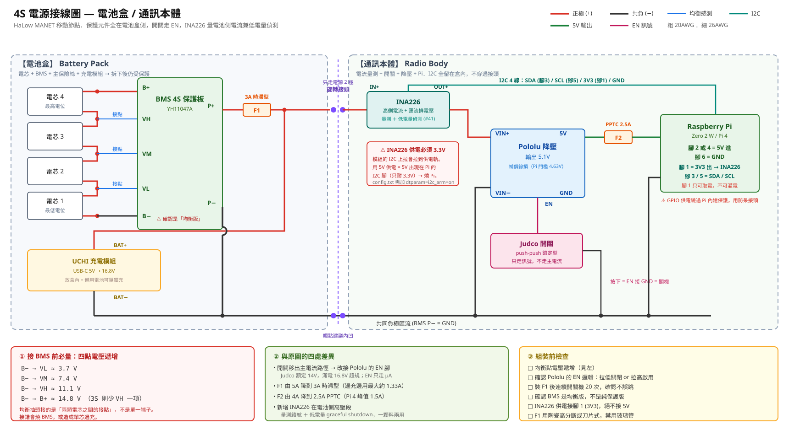

# Hardware

## Stack

| Layer | Part |
|---|---|
| Host | Raspberry Pi 4 Model B Rev 1.5 (BCM2711) |
| Carrier | Seeed **WM1302 Pi HAT** (mPCIe → 40-pin) |
| Radio card | Seeed **Wio-WM6108** (mPCIe form factor) |
| Module | Quectel **FGH100M-H** |
| SoC | Morse Micro **MM6108A1** |
| Band | 902–928 MHz (S1G / 802.11ah) |
| Bus | **SPI** (not SDIO) |

The mPCIe connector here carries SPI, not PCIe — the WM1302 HAT reroutes it to the
Pi's 40-pin header. This matters: most Morse Micro documentation and most community
reports assume SDIO.

**Practical consequence of choosing SPI:** on SDIO-based HaLow builds the Pi's onboard
Wi-Fi usually shares the SDIO bus and becomes unusable. On SPI builds it stays free,
so the onboard radio can run as a 2.4/5 GHz AP while HaLow carries the backhaul.

## GPIO map

This is the mapping that works. It is also, independently, the mapping OpenMANET's
`mm610x-spi.dtbo` uses.

| Signal | GPIO | Notes |
|---|---|---|
| `reset-gpios` | **17** | active high in DT (`0x11`) |
| `power-gpios` (wake) | **23** | pinctrl: pull-up |
| `power-gpios` (busy) | **24** | pinctrl: pull-down |
| `spi-irq-gpios` | **5** | pinctrl: pull-up |
| SPI CS | **8** | CE0, `<&gpio 8 1>` = active low |
| SPI MOSI / MISO / SCLK | **10 / 9 / 11** | `brcm,function = <4>` (ALT0) |

Note: an earlier vendor overlay shipped for the **EKH01** eval board also drove
`gpio_mm_jtag` on GPIO4. That is EKH01-only — the mPCIe card does not route JTAG —
and leaving it in causes no benefit. Removing it is correct.

## Device tree node

```dts
mm6108@0 {
    compatible = "morse,mm610x-spi";
    reg = <0x00>;
    reset-gpios     = <&gpio 0x11 0x00>;                  /* GPIO17 */
    power-gpios     = <&gpio 0x17 0x00 &gpio 0x18 0x00>;  /* GPIO23, GPIO24 */
    spi-irq-gpios   = <&gpio 0x05 0x00>;                  /* GPIO5  */
    spi-max-frequency = <0x2faf080>;                      /* 50 MHz */
    status = "okay";
};
```

`config.txt`:

```
dtparam=spi=on
dtoverlay=morse-ps
dtoverlay=morse-spi
```

## The SPI clock is a red herring

We lowered `spi-max-frequency` from 50 MHz to 20 MHz, and separately tested 1, 4, 10
and 50 MHz from userspace. **The failure is bit-identical at every frequency.** That
by itself rules out signal integrity and points at the logic layer — see
[`root-cause.md`](root-cause.md).

## Why the chip-select can't be fixed in the device tree

The obvious fix would be to stop using GPIO-descriptor chip-selects and let the
BCM2835 SPI controller drive CS natively. That is not reachable from an overlay:
the base `bcm2711-rpi-4-b.dtb` already contains

```dts
cs-gpios = <&gpio 8 1>, <&gpio 7 1>;
spi0_cs_pins { brcm,pins = <8 7>; brcm,function = <1>; };
```

and a device tree overlay can add or replace properties but cannot cleanly *remove*
`cs-gpios`. Hence the driver-side fix.

## Regulatory note

The Wio-WM6108 is officially a **US-band** card (902–928 MHz). If you are outside the
US, check your local sub-GHz allocation before transmitting — e.g. Taiwan's ISM
allocation is 920–925 MHz, a subset. OpenMANET additionally ships a custom BCF that
raises TX power to roughly **27 dBm**, which may exceed local limits.

Be aware that the regulatory domain can be set in three places that do not
automatically agree: the `country=` module parameter (defaults to `AU`), the kernel
command line (`cfg80211.ieee80211_regdom=`), and whatever `iw reg get` reports.

## Resource budget — how much board do you actually need

Measured 2026-09-09 on a live 4 MHz mesh (Pi 500 <-> manet01), saturated with iperf.
Numbers are for **selecting node hardware**, so the reference is manet01: a Pi 4B running
OpenMANET headless, i.e. exactly what a field node is.

### RAM

manet01, up 6 h 52 m, full stack running (`wpa_supplicant`, `hostapd`, `dnsmasq`, `ntpd`,
`dropbear`, `meshled`, `dpp-handler`, batman-adv):

```
              total        used        free   buff/cache   available
Mem:        7966952      109048     7691488       166416     7763392
```

**109 MB used.** That is the whole system, not just the mesh.

Component breakdown measured on the Pi 500:

| item | RAM |
|---|---|
| kernel modules: `morse` + `dot11ah` + `mac80211` + `cfg80211` + `batman_adv` | 3.2 MB |
| `wpa_supplicant_s1g` RSS | 9.8 MB |
| slab growth under saturated traffic | +0.3 MB |
| **HaLow mesh stack total** | **~15 MB** |

Driver buffering is small by configuration: `max_txq_len=256`, `virtual_sta_max=0`.

**No leak.** Three minutes of saturated UDP, sampled every 30 s:

```
t=  0s  Pi500 Slab=215792 kB   node Slab=78324 kB
t= 60s  Pi500 Slab=215888 kB   node Slab=78352 kB
t=120s  Pi500 Slab=215888 kB   node Slab=78712 kB
t=180s  Pi500 Slab=215936 kB   node Slab=78656 kB
```

Pi 500 grew 144 kB over three minutes, the node 332 kB, and `MemAvailable` oscillated with
no trend on either.

Bandwidth-delay product at 11 Mbps and ~5 ms RTT is about **7 kB**, so socket and queue
buffers are irrelevant at this scale. A 2 GB board sizes its autotuned network buffers
smaller than an 8 GB one, but it errs in the safe direction and there is nothing to size for.

### CPU

manet01 (Pi 4B, BCM2711) during a saturated 8.63 Mbps transfer:

```
cpu0 13.0%   cpu1 16.2%   cpu2 16.5%   cpu3 20.6%   ->  16.6% average
```

The Pi 500 (BCM2712, faster) averaged 7%. The radio is a 4 MHz S1G link with a ~16.65 Mbps
PHY ceiling — there is not enough traffic here to trouble any four-core ARM.

### Verdict

**A 1 GB Pi 4 is comfortable**, and the CPU figure above is measured on that exact SoC.
109 MB of 1024 MB is 11%.

What actually decides the board is the userspace image, not the mesh:

| image | resident | headroom on 1 GB |
|---|---|---|
| OpenWrt headless (= manet01 today) | ~110 MB | 89% |
| Raspberry Pi OS Lite headless | ~250-350 MB | ~70% |
| Raspberry Pi OS Desktop | 1.2 GB+ | does not fit |

The Pi 500 in this repo reads as 2.2 GB used, but 1.4 GB of that is the desktop session and
development tooling. It is a debug station, not a node.

### What would actually push a small node over

- **Anything else you put on it.** The roadmap adds WireGuard (#16, small), broadcast
  governance (#12, small) and a decentralised aggregation console (#14, potentially not
  small — if that grows a database or a web stack, size for it explicitly).
- **Node count.** batman-adv memory scales with originators and translation-table entries.
  Today: 1 originator, 6 TT entries. The per-entry structures are on the order of hundreds
  of bytes, so even a hundred nodes stays under a megabyte — but measure rather than assume
  once the mesh is large.
- **Do not build the driver on the node.** Kernel headers plus a compile needs far more than
  1 GB. Cross-compile, or build on a bigger box — see `docs/building-the-driver.md`.
- **Page cache on a small board.** Less RAM means less cache and more SD reads. Irrelevant
  for forwarding, relevant if the node logs heavily.

## Can a smaller board do it? Measured, by underclocking a real node

The RAM figures above already say yes on memory. The open question was CPU, so rather than
guess at a Pi 3, manet01 (a real Pi 4B node) was **underclocked** and re-measured. An A72 at
600 MHz is roughly an A53 at 1.4 GHz, i.e. a Pi 3B+.

```
  freq       throughput        node CPU (4-core avg)
  1500 MHz   7.83 Mbits/sec    15.7%
   900 MHz   8.73 Mbits/sec    17.2%
   600 MHz   8.72 Mbits/sec    18.8%
```

**Throughput is unaffected by a 2.5x cut in clock speed** — the spread is inside this link's
normal +/-1 Mbps run-to-run noise. CPU rose only from 15.7% to 18.8%.

That small rise is the interesting part. If the 15.7% were real computation, a 2.5x slower
clock would push it to ~39%. Solving

```
  X + Y   = 15.7     (1500 MHz)
  2.5X + Y = 18.8    (600 MHz)
  ->  X ~ 2%,  Y ~ 13.6%
```

**Only about 2% is clock-dependent work; the other ~13.6% is waiting** — SPI transfers,
interrupt latency, softirq. This workload is not CPU-bound, so CPU headroom is not the
constraint when choosing a board.

### Board comparison

| | RAM used | CPU | HAT fits | SPI controller | image exists |
|---|---|---|---|---|---|
| Pi 4B (manet01, today) | 109 MB / 1-8 GB | 15.7% | yes | bcm2835 | **yes** |
| Pi 5 / Pi 500 | as above | 7% | yes | RP1 — needed a bring-up, see `pi5-rp1-bringup.md` | built by hand |
| Pi 3B+ | fits (11% of 1 GB) | ~19% equivalent | yes, same 40-pin | **bcm2835, same as Pi 4** | **no — must be built** |
| Pi Zero 2 W | 21% of 512 MB | ~20% estimated | yes | bcm2835 | no, and unverified |

Pi 3 is architecturally the *easier* target than Pi 5: it uses the same bcm2835 SPI
controller as the Pi 4 that already works, so none of the RP1 bring-up work applies.

### What a Pi 3 port actually costs

Not capability — integration time:

1. Build an OpenWrt/OpenMANET image for `bcm27xx/bcm2710`. The target exists upstream;
   OpenMANET only publishes `rpi4-mm6108-spi`.
2. Rebuild the morse driver against that kernel.
3. Port the overlays. GPIO numbering is unchanged on the 40-pin header, so this is mostly
   mechanical.

### One thing to verify before committing, not just schedule

On BCM283x the SPI clock is derived from `core_freq`, and on a Pi 3 `core_freq` scales
dynamically with load (down to `core_freq_min`, default 250 MHz against a 400 MHz default
core). A drifting core clock means a drifting SPI clock.

This is probably survivable rather than fatal — the SPI sweep in issue #34 ran this link at
16.67 MHz and it still worked, so a clock wandering between roughly 12.5 and 20 MHz would
degrade margin rather than break the link. But pin `core_freq_min = core_freq` in
`config.txt` and confirm the achieved SPI rate before building anything on top of it.


## Power chain



Battery pack and radio body are separate enclosures joined by a twist-lock pogo connector.
Three decisions in that diagram are not obvious:

- **All protection lives in the battery pack**, downstream of the BMS. Put it in the body and
  the connector and the pack's own wiring are unprotected, and a detached pack has bare
  contacts fed by cells that can each source 45 A.
- **The switch drives the regulator's `EN` pin, not the main current path.** The Judco
  40-4325-00 is rated 14 V DC and a full 4S pack is 16.8 V. On `EN` it carries microamps and
  the rating stops mattering. It is a push-push latching type, so it holds the state without
  extra circuitry.
- **Fuses are sized to the load, not to the battery.** Worst case is charging while running,
  about 1.33 A. The original 5 A PTC plus 7.5 A blade left everything between 0.3 A and 5 A
  unprotected — which is exactly the range a chafed wire or a partly failed regulator sits in,
  and 4x 45T cells will feed that indefinitely.

`INA226` sits on the high side between the connector and the regulator, so it measures pack
current including regulator losses. It stays in the **body**: I2C must not cross a pogo
connector, where contact bounce on insertion can hang the bus. The same part later provides
the low-battery detection that #41 needs for a graceful shutdown.

Balance taps connect to the **junctions between cells**, not to individual terminals. Measure
B− to each tap before connecting the BMS and confirm the voltages increase; getting this wrong
destroys the BMS or overcharges a cell.
