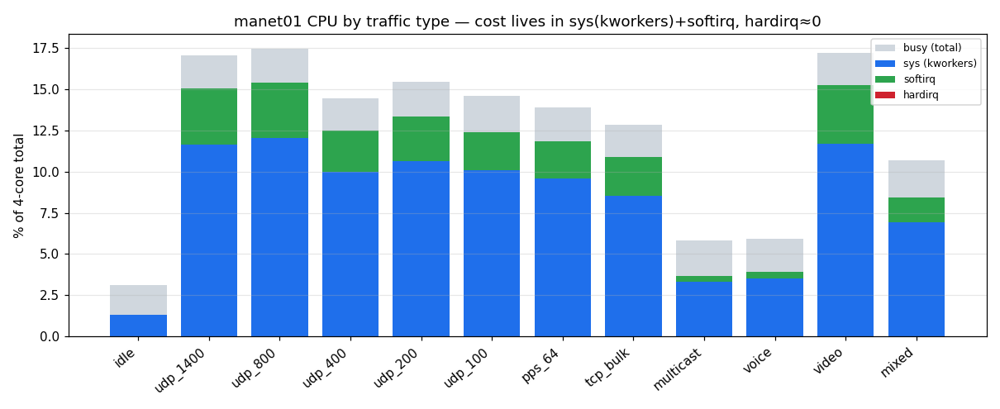
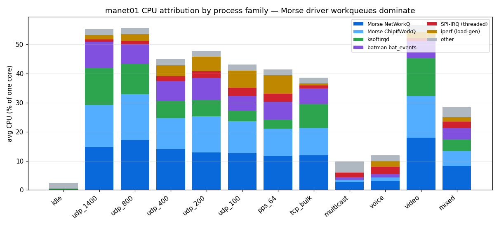
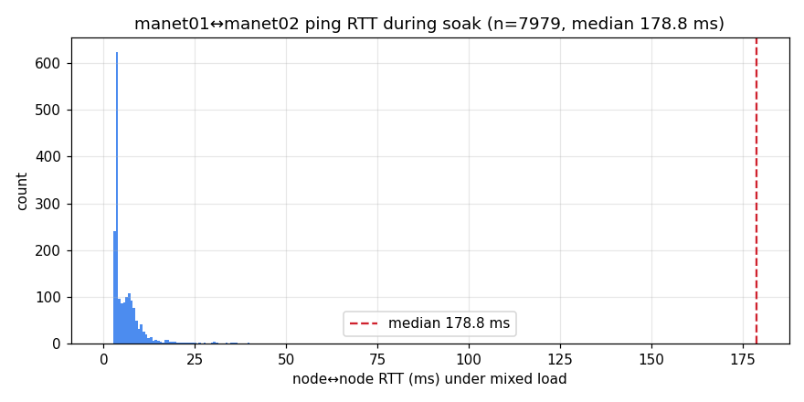
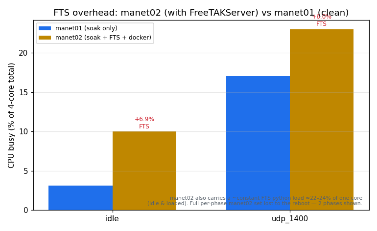

# CPU-attribution soak — where the HaLow packet path spends CPU

A mixed-traffic soak on the live `manet01 ↔ manet02` HaLow mesh, sampling **per
process / per hardware-IRQ / per softirq** every 10 s, to see *where* the CPU goes
under load and whether there is room to optimise. Follow-on to the earlier 12 h soak,
which established the cost is in `sys` not `softirq` but couldn't say *which* code.

## Method

- **Traffic** (`scripts/soak-mixed.sh`): 12 traffic types cycled 5 min each — `idle,
  udp_1400/800/400/200/100, pps_64, tcp_bulk, multicast, voice, video, mixed` — driven
  bidirectionally between the two nodes.
- **Sampler** (`scripts/deep-sample.sh`, busybox ash+awk — nodes have no python):
  every 10 s reads `/proc/stat` (per-CPU), `/proc/interrupts`, `/proc/softirqs` and
  every `/proc/<pid>/stat`, emits deltas to CSV on tmpfs. Pinned to **cpu3** (off the
  HaLow packet core). **Self-measured overhead ≈ 1.2 % of one core**, recorded in the
  data and subtracted.
- **manet01 = clean reference** (soak only). **manet02 = same soak + FreeTAKServer +
  docker** (so its numbers carry FTS overhead — manet01 is authoritative).
- Dataset: ~2 h 55 m of manet01 (5–6 full cycles). The run was stopped early after a
  manet02 reboot — see **Stability finding**.

## Findings

### 1. The cost is `sys` (kworkers) + `softirq`; hardirq ≈ 0

Across every load type, `hardirq` is ~0 — the SPI hard-IRQ handler is cheap (it only
schedules work). The cost lands in **`sys` + `softirq`**. Mechanism: **the Morse SPI
driver processes packets in kernel workqueues (process context = `sys`), not NAPI /
softirq** — which is exactly why the earlier soak saw "cost in `sys`, not `softirq`."

### 2. Attribution: the Morse driver workqueues dominate

The top consumers under load are **`MorseNetWorkQ`** and **`MorseChipIfWorkQ`** (the
driver's RX/TX and chip-interface workqueues), then **`ksoftirqd`** and batman-adv
**`bat_events`**. As payload shrinks (1400→64 B) the per-packet cost surfaces:
**`iperf` and the threaded `SPI-IRQ` climb** because more, smaller packets = more SPI
transactions. → **Optimisation targets:** the two Morse workqueues (batching,
workqueue-vs-NAPI, CPU affinity — they currently spread across all 4 cores) and
per-SPI-transaction overhead for small packets.

### 3. TCP is far cheaper than oversubscribed UDP

`tcp_bulk` sits at **~6 % busy** vs **~17 %** for `udp_1400`. TCP's congestion control
self-clocks to link capacity; the UDP phases were offered above capacity, so part of
the UDP cost is **wasted work on dropped packets**. Real apps (TCP) cost much less per
delivered byte — read the UDP numbers as a stress ceiling, not steady-state cost.

### 4. Not CPU-bound

Everything stays **< 20 % busy on a 4-core Pi 4**. HaLow throughput is the bottleneck,
not CPU. So the optimisation goal is **efficiency / heat / battery**, not capacity.

### 5. Latency under load

Node↔node RTT stayed low (single-digit ms median) throughout the mixed load — the
occasional tens-of-ms tail correlates with the heaviest phases.

## Stability finding — manet02 rebooted under load

The **heaviest-loaded node** — manet02 (soak **+ FTS + docker**) — **rebooted ~2 h 45 m
in**, while manet01 (soak only) ran **14 h+ with no issue**. `pstore` was empty → **not
a kernel panic**, i.e. a **hang → hardware-watchdog reset**; `dmesg` showed recurring
`morse_spi SPI transfer timed out`, making the **Morse SPI stack under sustained load**
the prime suspect. Two open questions this raises:

- **Does running FreeTAKServer on a field node stress it into instability?** (bears on
  the "FTS at the edge" integration plan.)
- **Morse SPI driver robustness under sustained heavy load.**

Crash-debug capture is now in place (persistent syslog to `/root`, live log stream to
the desktop). The kernel lacks hung-task/softlockup detectors, so a **serial console**
is the definitive next step — see the upgrade-recommendation issue.

## manet02 — the cost of running FreeTAKServer on a node

manet02 ran the same soak **plus FreeTAKServer + docker**, so it shows the standing
cost of putting a TAK server on a field node: **~+7 % system busy at idle** vs the
clean node, driven by a roughly **constant FTS python load of ≈22–24 % of one core**
whether idle or loaded. This is the quantitative side of the "should FTS live on a
field node" question the reboot raises.

> ⚠️ **Data-handling note (honest):** manet02's *full* per-phase dataset was **lost**.
> After the reboot cleared its tmpfs, the recovery snapshots **overwrote** the earlier
> (good) manet02 capture because snapshots were written to a fixed path rather than
> versioned by time — only two phases (idle, udp_1400) were characterised beforehand,
> shown above. Two process fixes came out of this: (1) **version snapshots** by
> timestamp, and (2) a **`deep-sample.sh` STOP bug** — an empty `touch`ed STOP file
> didn't stop the sampler (`getline>0` is false on an empty file); fixed to `>=0`.
> A clean manet02 dataset needs a re-run.

## Artifacts

`scripts/deep-sample.sh`, `scripts/soak-mixed.sh`, `scripts/deep-cpu-sample.py` (python
variant), `scripts/soak-cpu-plot.py`. Raw CSVs collected off-node (tmpfs) during the run.
