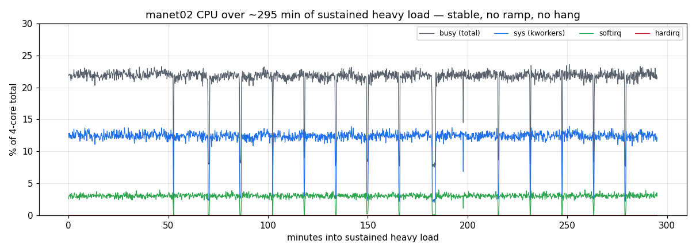
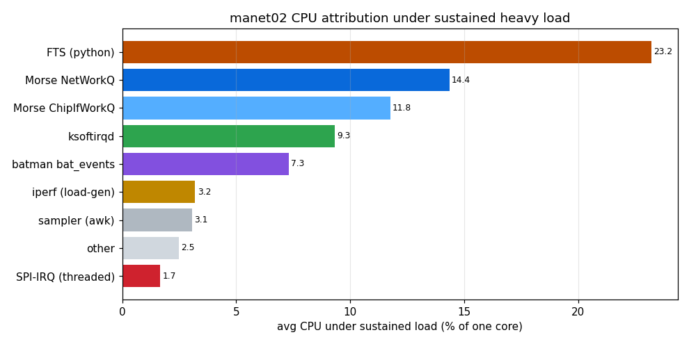
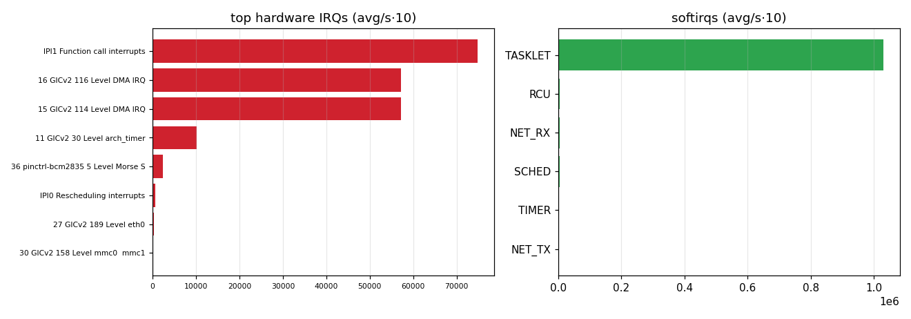

# manet02 reboot-repro under sustained heavy load — report

Follow-up to the CPU soak: manet02 (the FTS-loaded node) rebooted once ~2h45m into the
mixed soak (empty pstore → watchdog hang, `morse_spi` suspected). This run tried to
**reproduce it under heavier sustained load** and capture the cause. Tooling:
`scripts/soak-stress.sh` (sustained bidirectional UDP, ~2.6× link oversubscription +
64 B small-packet SPI pressure, FTS left running), `scripts/deep-sample.sh` on manet02,
btime-versioned snapshots, persistent syslog + live syslog stream.

## Result: **not reproduced** — the node stayed up

manet02 ran **~4 h 55 m of sustained heavy load with no reboot and no hang** (uptime
5 h 55 m; manet01 the load partner ran clean throughout). CPU was **flat and stable** —
no ramp, no drift, no degradation.

busy ~22 %, sys ~12 %, softirq ~3 %, hardirq ~0 for the whole run. The periodic dips are
the 15-min `killall iperf` monitoring ticks (load re-populates within 120 s).

**Conclusion:** the earlier reboot was almost certainly a **rare/transient `morse_spi`
fault**, not a deterministic load-triggered failure. Against the carrier-grade
"**a node must not fall over**" requirement (#67), manet02 **passes** under this load —
including with FreeTAKServer + docker running.

## CPU budget under sustained heavy load

Avg CPU (% of one core) attributed by process family:

| Consumer | avg %/core | note |
|---|---|---|
| **FTS (python)** | **23.2** | **#1 — the TAK server, not the packet path** |
| Morse NetWorkQ | 14.4 | driver RX/TX workqueue |
| Morse ChipIfWorkQ | 11.8 | driver chip-interface workqueue |
| ksoftirqd | 9.3 | softirq processing |
| batman bat_events | 7.3 | mesh routing |
| iperf (load-gen) | 3.2 | the offered load itself |
| SPI-IRQ (threaded) | 1.7 | per-transaction |

**Key finding:** on manet02, **FTS python is the single biggest CPU consumer under load**
(~23 % of one core), ahead of the Morse driver. FTS isn't just idle overhead — under load
it dominates. This reinforces that **a field node hosting FTS must budget for it and
apply per-tenant resource limits** (payload-platform #68 / carrier-grade EMS #67), and
that heavy collaborative TAK belongs at the command echelon, not the edge.

hardirq stays ~0 (cheap handlers); the packet cost is in the driver workqueues + softirq,
consistent with the soak report.

## Debug capture — proven ready, unused this time

No hang → no death cause to capture. But the capture chain is validated and ready for a
recurrence: btime-versioned snapshots (no data lost this run), persistent syslog to
`/root`, and a reconnecting live syslog stream to the desktop. To make a *next* hang
definitively diagnosable (the kernel lacks hung-task/softlockup detectors):

- **#61** — USB-UART serial console (captures a hard hang's last kernel output).
- **#47** — dm-verity/immutable rootfs; and consider a kernel with
  `CONFIG_DETECT_HUNG_TASK` so a hang converts to a captured panic.

## Artifacts

`scripts/soak-stress.sh`, `scripts/deep-sample.sh`, `scripts/stress-plot.py`; raw CSVs
in `soak-data/manet02-stress/boot-1789010950/` (~5 h, versioned by boot).
