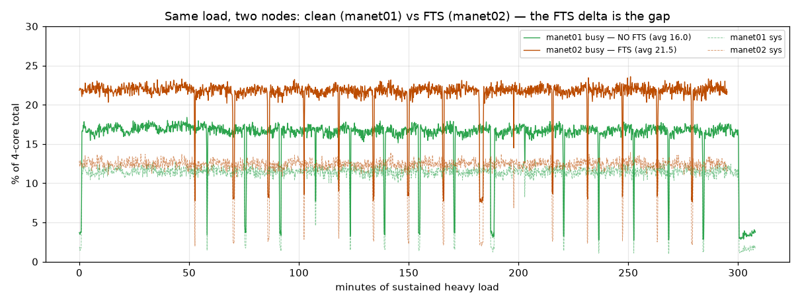
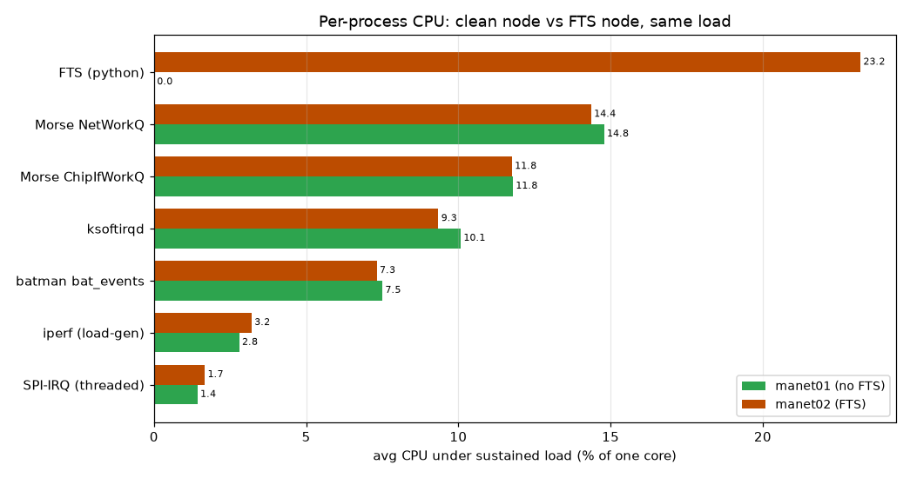

# manet02 reboot-repro under sustained heavy load — report

Follow-up to the CPU soak: manet02 (the FTS-loaded node) rebooted once ~2h45m into the
mixed soak (empty pstore → watchdog hang, `morse_spi` suspected). This run tried to
**reproduce it under heavier sustained load** and capture the cause. Tooling:
`scripts/soak-stress.sh` (sustained bidirectional UDP, ~2.6× link oversubscription +
64 B small-packet SPI pressure, FTS left running), `scripts/deep-sample.sh` on manet02,
btime-versioned snapshots, persistent syslog + live syslog stream.

## Result: **not reproduced** — the node stayed up

manet02 ran **~4 h 55 m of sustained heavy load with no reboot and no hang** (uptime
5 h 55 m; manet01 the load partner ran clean throughout). CPU was **flat and stable** —
no ramp, no drift, no degradation.

busy ~22 %, sys ~12 %, softirq ~3 %, hardirq ~0 for the whole run. The periodic dips are
the 15-min `killall iperf` monitoring ticks (load re-populates within 120 s).

**Conclusion:** the earlier reboot was almost certainly a **rare/transient `morse_spi`
fault**, not a deterministic load-triggered failure. Against the carrier-grade
"**a node must not fall over**" requirement (#67), manet02 **passes** under this load —
including with FreeTAKServer + docker running.

## CPU budget under sustained heavy load

Avg CPU (% of one core) attributed by process family:

| Consumer | avg %/core | note |
|---|---|---|
| **FTS (python)** | **23.2** | **#1 — the TAK server, not the packet path** |
| Morse NetWorkQ | 14.4 | driver RX/TX workqueue |
| Morse ChipIfWorkQ | 11.8 | driver chip-interface workqueue |
| ksoftirqd | 9.3 | softirq processing |
| batman bat_events | 7.3 | mesh routing |
| iperf (load-gen) | 3.2 | the offered load itself |
| SPI-IRQ (threaded) | 1.7 | per-transaction |

**Key finding:** on manet02, **FTS python is the single biggest CPU consumer under load**
(~23 % of one core), ahead of the Morse driver. FTS isn't just idle overhead — under load
it dominates. This reinforces that **a field node hosting FTS must budget for it and
apply per-tenant resource limits** (payload-platform #68 / carrier-grade EMS #67), and
that heavy collaborative TAK belongs at the command echelon, not the edge.

hardirq stays ~0 (cheap handlers); the packet cost is in the driver workqueues + softirq,
consistent with the soak report.

## The other half — a free clean-node control (manet01, no FTS)

manet01 (the load partner) had its 12 h-soak sampler still running the whole time, so it
gives a **controlled counterpart**: identical Morse driver + batman-adv + iperf load, the
one difference being that it runs **no FTS**. Same window, both nodes:

| | manet01 (no FTS) | manet02 (FTS) | delta |
|---|---|---|---|
| busy (% of 4-core) | **16.0** | 21.5 | **+5.4** |

The **+5.4-point gap is entirely FTS**: FTS measured directly as 23.2 %/core = **5.8 %**
of the 4-core total — it lands right on the busy delta. The two nodes' packet-path
families are otherwise near-identical (Morse NetWorkQ 14.8 vs 14.4, ChipIf 11.8 vs 11.8,
ksoftirqd 10.1 vs 9.3, batman 7.5 vs 7.3, iperf 2.8 vs 3.2), confirming the load itself was
the same on both.

This upgrades the FTS-cost finding from a single-node attribution to a **controlled
measurement**: on this hardware, hosting FreeTAKServer costs about **one-quarter of a
core** on top of the mesh baseline, sustained, even with no CoT clients connected. That is
the budget a field node must reserve for it (#67/#68), and the argument for keeping heavy
collaborative TAK at the command echelon.

## Caveats — two confounds in this run

Two things narrow how far "not reproduced" generalizes:

- **Periodic `killall iperf` may flush accumulating state.** The 15-min monitoring ticks
  restart the load, so any driver/socket state that builds up between packets gets a
  regular reset. This *could* mask a slow-accumulation hang. Evidence argues against it,
  though: the run that *did* reboot (the mixed soak) had *more* frequent teardowns (a fresh
  iperf every 5-min phase) and still fell over — so periodic flushing is not clearly
  protective. killall's real effect here was preventing `iperf -t` **process** pile-up
  (ps 30→64), a RAM/process-count issue, not the driver path (free stayed >6 GB, no OOM).
  To remove the confound entirely, a future run should use clean self-terminating `-t`
  loads and **no periodic killall**.
- **Narrower traffic than the mixed soak.** This run was sustained bidirectional UDP
  (1400 B + 64 B). The soak that rebooted also carried multicast / voice / video / TCP /
  mixed phases. If the earlier fault was traffic-shape-specific rather than
  intensity-specific, this run would not surface it.

No hang → no death cause to capture. But the capture chain is validated and ready for a
recurrence: btime-versioned snapshots (no data lost this run), persistent syslog to
`/root`, and a reconnecting live syslog stream to the desktop. To make a *next* hang
definitively diagnosable (the kernel lacks hung-task/softlockup detectors):

- **#61** — USB-UART serial console (captures a hard hang's last kernel output).
- **#47** — dm-verity/immutable rootfs; and consider a kernel with
  `CONFIG_DETECT_HUNG_TASK` so a hang converts to a captured panic.

## Artifacts

`scripts/soak-stress.sh`, `scripts/deep-sample.sh`, `scripts/stress-plot.py`,
`scripts/clean-vs-fts-plot.py`; raw CSVs in `soak-data/manet02-stress/boot-1789010950/`
(FTS node, ~5 h, versioned by boot) and `soak-data/manet01-full/` (clean node, ~9 h
continuous — its soak sampler never stopped, which is how we got the control).
