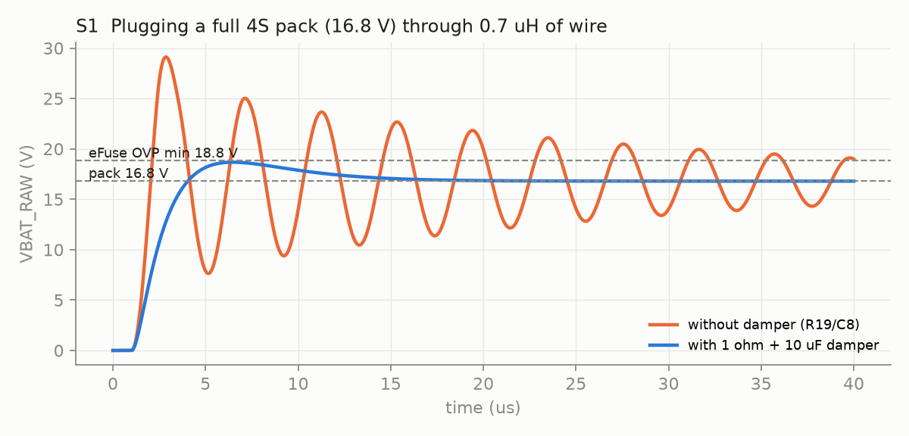
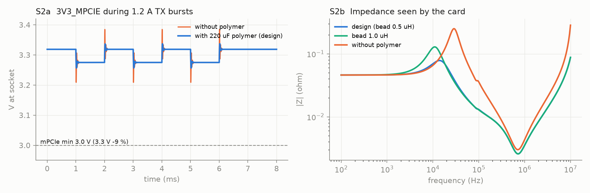
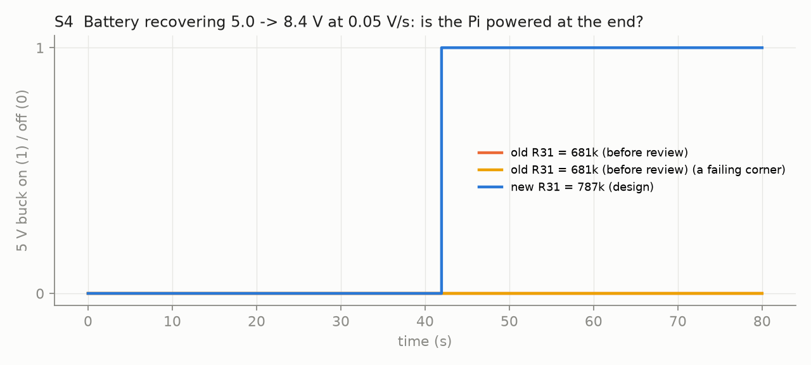

# Batman HAT v1 - pre-fab simulation report

Generated by `hardware/hat-v1/sim/run_all.py`. S1/S2 use ngspice (the engine inside KiCad); S3/S4 use a behavioural model written from the LTC2955, LMR33640 and TPS2663 datasheets, because no vendor SPICE model runs in ngspice. **A simulation is only as good as its assumptions** - they are listed at the end.

## Summary

- S1 hot-plug: with the damper, the peak exceeds the OVP minimum in 1 of 9 cases (16.8 V / 1.5 uH). A trip also needs >= 8.5 us above the threshold; a trip only delays start-up (auto-recovery), it does not damage anything.
- S2 HaLow rail: minimum 3.257 V at the socket during 1.2 A bursts; filter resonance 78 mOhm at 13.8 kHz.
- S3 sequencing: 0 scenario(s) behave differently from the design intent.
- S4 slow recovery: node stuck OFF in 0 runs with the current divider (was 274 with the pre-review 681k).

## S1 Hot-plug ringing (ngspice)

eFuse OVP trips at 18.82 V minimum (R3/R4, OVPR min 1.176 V). Peak VBAT_RAW when the pack is plugged in:

Damper in the design: R19 = 0.47 Ohm + 2 x 10 uF (~10 uF under DC bias). The eFuse needs the overvoltage to last 8.5 us (min, OVP_tOFF(dly)) before it reacts.

| pack | lead L | damper | peak | margin to OVP min | time above OVP |
|---|---|---|---|---|---|
| 8.4 V | 0.3 uH | no | 15.9 V | +3.0 V | 0.0 us |
| 8.4 V | 0.3 uH | yes | 8.7 V | +10.1 V | 0.0 us |
| 8.4 V | 0.7 uH | no | 16.2 V | +2.6 V | 0.0 us |
| 8.4 V | 0.7 uH | yes | 9.3 V | +9.5 V | 0.0 us |
| 8.4 V | 1.5 uH | no | 16.4 V | +2.4 V | 0.0 us |
| 8.4 V | 1.5 uH | yes | 10.2 V | +8.6 V | 0.0 us |
| 12.6 V | 0.3 uH | no | 23.8 V | -5.0 V | 1.9 us |
| 12.6 V | 0.3 uH | yes | 13.1 V | +5.7 V | 0.0 us |
| 12.6 V | 0.7 uH | no | 24.2 V | -5.4 V | 4.3 us |
| 12.6 V | 0.7 uH | yes | 14.0 V | +4.8 V | 0.0 us |
| 12.6 V | 1.5 uH | no | 24.5 V | -5.7 V | 9.1 us |
| 12.6 V | 1.5 uH | yes | 15.3 V | +3.6 V | 0.0 us |
| 16.8 V | 0.3 uH | no | 29.5 V | -10.7 V | 6.6 us |
| 16.8 V | 0.3 uH | yes | 17.5 V | +1.3 V | 0.0 us |
| 16.8 V | 0.7 uH | no | 29.1 V | -10.3 V | 13.6 us |
| 16.8 V | 0.7 uH | yes | 18.7 V | +0.1 V | 0.0 us |
| 16.8 V | 1.5 uH | no | 28.5 V | -9.7 V | 15.7 us |
| 16.8 V | 1.5 uH | yes | 20.3 V | -1.5 V | 7.8 us |

## S2 HaLow 3.3 V rail: pi filter + TX bursts (ngspice)

- Voltage at the socket during 1.2 A bursts: **3.257-3.336 V** (without the polymer cap: 3.209 V min). mPCIe allows 3.0-3.6 V.
- Resonance of bead + bulk caps: **78 mOhm at 13.8 kHz** (without polymer: 251 mOhm at 28.8 kHz). A 1 A step at that frequency would move the rail by about 0.08 V.

## S3 Power sequencing scenarios (behavioural model, nominal values)

| scenario | expected | LTC2955 on | 5 V buck on | result |
|---|---|---|---|---|
| 2S pack inserted (7.4 V), AUTO-ON closed | on | True | True | OK |
| 2S pack inserted (7.4 V), AUTO-ON open | off | False | False | OK |
| AUTO-ON open, button pressed at 1 s | on | True | True | OK |
| running, Linux halt at 3 s | off | False | False | OK |
| 4S full pack (16.8 V), AUTO-ON closed | on | True | True | OK |
| 12 V adapter, AUTO-ON closed | on | True | True | OK |
| battery sags to 5.7 V for 5 s, then recovers to 7.4 V | on | True | True | OK |
| pack 6.6 V (2S nearly empty), AUTO-ON closed | off | False | False | OK |

Note: 6.6 V is below AUTO-ON (7.10 V typ) by design, so a nearly empty 2S pack does not start by itself; a button press still starts it if VSYS > 6.40 V.

USB-C-only bench mode: LTC2955 has no supply, EN-bar = 0 V, so Q8 is off and the HaLow 3.3 V buck runs; the 5 V buck has no input. (Direct consequence of the schematic, not simulated in time.)

## S4 Slowly recovering battery, AUTO-ON closed (behavioural model, Monte Carlo)

Ramp 5.0 -> 8.4 V at 0.05 V/s (solar / cold pack warming up). Each run samples the resistor tolerances (1 %), LTC2955 ON threshold (0.76-0.84 V), LMR33640 EN threshold (1.20-1.26 V), blanking (304-720 ms), lockout (0.6-1.4 s) and the Pi 3.3 V delay.

| AUTO-ON divider | runs that end with the node OFF |
|---|---|
| old R31 = 681k (before review) | **274 / 400** |
| new R31 = 787k (design) | **0 / 400** |

## Assumptions

| item | value used |
|---|---|
| battery source resistance (pack + BMS FETs) | 30 mOhm |
| battery lead inductance (wire pair) | 0.3 / 0.7 / 1.5 uH (~0.3 / 0.7 / 1.5 m of wire) |
| MLCC capacitance left under DC bias | 50 % for 50 V X7R at 17 V; 60 % for 6.3-10 V parts at 3.3 V |
| SMBJ20CA model | breakdown 23.3 V, dynamic R 0.49 Ohm (Vc 32.4 V @ 18.5 A) |
| ferrite FB1 low-frequency model | 20 mOhm + (0.5 uH || 600 Ohm) |
| TPS62933F closed loop | 3.33 V behind 5 mOhm + 84 nH (~100 kHz crossover with 30 uF) |
| HaLow TX burst on 3V3_MPCIE | 0.25 A idle -> 1.2 A, 1 us edge, 1 ms bursts every 2 ms (27 dBm FEM via on-card boost; pessimistic) |
| Pi 4 3.3 V rail delay after 5 V is valid | 2-50 ms |
| LTC2955 ON edge during the 0.6-1.4 s enable lockout | ignored (worst case; datasheet silent) |
